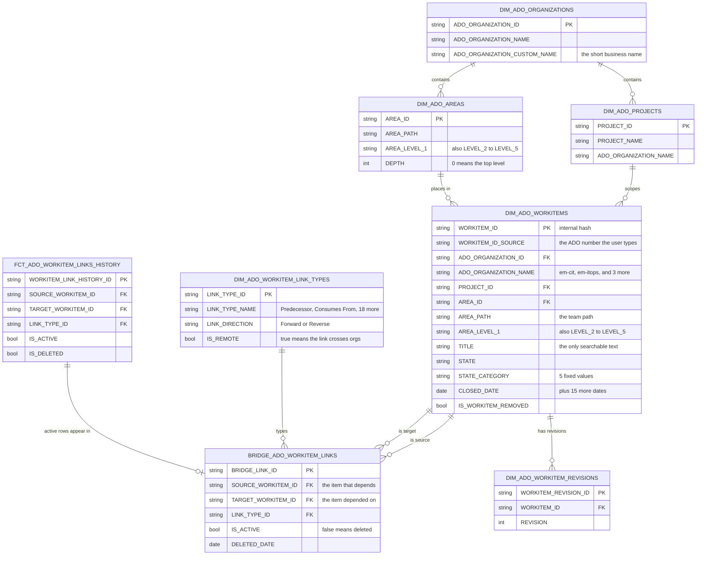

# Project Dependency: EDA and Data Mapping Working Doc

---

## Table of contents

- [1. ADO table inventory](#1-ado-table-inventory)
- [2. Use case to data source mapping](#2-use-case-to-data-source-mapping)
  - [2.1 Five rules for the SQL agent](#21-five-rules-for-the-sql-agent)
  - [2.2 The one query that answers nine of the ten features](#22-the-one-query-that-answers-nine-of-the-ten-features)
  - [2.3 Verified walkthroughs for all twenty prompts](#23-verified-walkthroughs-for-all-twenty-prompts)
  - [2.4 Performance](#24-performance)
- [3. Table field dictionary](#3-table-field-dictionary)
  - [3.1 DIM_ADO_WORKITEMS](#31-dim_ado_workitems)
  - [3.2 BRIDGE_ADO_WORKITEM_LINKS (dependency graph)](#32-bridge_ado_workitem_links-dependency-graph)
  - [3.3 DIM_ADO_WORKITEM_LINK_TYPES](#33-dim_ado_workitem_link_types)
  - [3.4 DIM_ADO_AREAS (team list)](#34-dim_ado_areas-team-list)
  - [3.5 DIM_ADO_ORGANIZATIONS](#35-dim_ado_organizations)
  - [3.6 DIM_ADO_PROJECTS](#36-dim_ado_projects)
  - [3.7 FCT_ADO_WORKITEM_LINKS_HISTORY](#37-fct_ado_workitem_links_history)
  - [3.8 FCT_ADO_WORKITEM_LINKS_ENRICHED (do not use)](#38-fct_ado_workitem_links_enriched-do-not-use)
  - [3.9 DIM_ADO_WORKITEM_REVISIONS (do not use)](#39-dim_ado_workitem_revisions-do-not-use)
  - [3.10 Azure SQL dbo.WorkItems (Description and Acceptance Criteria)](#310-azure-sql-dboworkitems-description-and-acceptance-criteria)
- [4. ERD](#4-erd)
  - [4.1 Legend](#41-legend)
  - [4.2 The diagram](#42-the-diagram)
  - [4.3 What the diagram tells the SQL agent](#43-what-the-diagram-tells-the-sql-agent)
- [5. Needs confirmation](#5-needs-confirmation)

---

## 1. ADO table inventory

| Table | Rows | One row means | Why it matters |
|---|---|---|---|
| `DIM_ADO_WORKITEMS` | 6,433,466 | One work item | Start of every query. Holds the title, the team, and the dates. |
| `BRIDGE_ADO_WORKITEM_LINKS` | 25,353,292 | One link between two work items | The dependency graph. |
| `DIM_ADO_WORKITEM_LINK_TYPES` | 20 | One kind of link | Separates a dependency from a parent link or a test link. |
| `DIM_ADO_AREAS` | 10,606 | One team folder | The list of all teams. |
| `DIM_ADO_ORGANIZATIONS` | 5 | One ADO tenant | Separates the five orgs. Work item numbers repeat across orgs. |
| `DIM_ADO_PROJECTS` | 383 | One ADO project | Groups work items under an org. |
| `FCT_ADO_WORKITEM_LINKS_HISTORY` | 30,032,150 | One link, alive or deleted | Shows when a link appeared and when a link was removed. |
| `FCT_ADO_WORKITEM_LINKS_ENRICHED` | 21,389,149 | One link, pre-joined | Loses rows. Do not use it. See section 3.8. |
| `DIM_ADO_WORKITEM_REVISIONS` | 65,552,631 | One saved edit of a work item | The full edit history. No current feature needs it. |
| `FCT_ADO_USER_ENTITLEMENTS_SNAPSHOT` | 27,022,550 | One user license snapshot | Not used by current features. |
| `DIM_ADO_ITERATIONS` | 45,613 | One sprint | Not used by current features. |
| `DIM_ADO_WORKITEM_TYPES` | 142 | One work item type | Not used by current features. |
| `DIM_ADO_STATE_AND_CATEGORIES` | 161 | One state value | Not used by current features. |
| `DIM_ADO_USERS` | 96,246 | One ADO user | Not used by current features. |
| `DIM_ADO_INVESTMENT_DIMENSIONS` | 7 | One investment category | Not used by current features. |
| `DIM_ADO_LICENSE_TYPES` / `DIM_ADO_LICENSE_PRICE_HISTORY` | 8 / 2 | One license type or price record | Not used by current features. |

Most important tables first.

---

## 2. Use case to data source mapping

Every statement in this section comes from a live query, run on 2026-08-27. Field-level
facts live in section 3.

### 2.1 Five rules for the SQL agent

- **Rule 1. Filter to the current revision.**
  - `DIM_ADO_WORKITEMS` holds 6,433,466 rows, one row per work item, not per revision.
  - Every row already carries `IS_CURRENT = TRUE`.
  - Add the filter anyway. It will protect the query if a future load adds older
    revisions **(needs confirmation)**.

- **Rule 2. Filter to the org.**
  - Five ADO organizations exist. One work item number can name a different item in
    each organization.
  - The number `1757194` names three different items. In
    [`em-itops`](https://dev.azure.com/em-itops/_workitems/edit/1757194) it is a Splunk
    request. In [`em-cit`](https://dev.azure.com/em-cit/_workitems/edit/1757194) it is an
    accruals fix. In
    [`emit-flcit`](https://dev.azure.com/emit-flcit/_workitems/edit/1757194) it is a
    deadlock fix.
  - Always add `ADO_ORGANIZATION_NAME = '<org>'` to the query. This keeps the item you
    want and drops the other two.
  - The five organizations, with current item counts, are `em-itops` (1,661,579),
    `emit-flcit` (1,391,367), `em-projects` (1,258,998), `em-uit` (1,132,829), and
    `em-cit` (988,693).
  - **Use case example:** prompt F08.1 names item `1757194` with no org. The query
    returns three unrelated items: a Splunk access request in `em-itops`, an accruals fix
    in `em-cit`, and "PROD: Fix cascading deadlock issue" in `emit-flcit`. The prompt's
    own qualifier, "Trading IT / Allegro", matches only the `emit-flcit` item's area
    path, so the org comes from the prompt itself, not from an assumption. Section 2.3,
    row F08.1, has the full result.

- **Rule 3. Join on the source side only.**
  - The junction table stores each link twice, once from each end.
  - `Predecessor` has 77,786 active links. `Successor` has the same 77,786.
    `Consumes From` has 1,623. `Produces For` has the same 1,623.
  - Join with `b.SOURCE_WORKITEM_ID = s.WORKITEM_ID`. Never join with
    `(b.SOURCE_WORKITEM_ID = s.WORKITEM_ID OR b.TARGET_WORKITEM_ID = s.WORKITEM_ID)`. The
    OR form returns each dependency twice, once under each name.
  - **Use case example:** a probe on item `1079531` used the OR form. It returned
    143 rows. Only one pair of those rows was the real dependency. The other 141 rows
    were `Related`, `Parent`, and `Child` links, all noise.

- **Rule 4. Query two link types, not one.**
  - The data uses two separate mechanisms. The split between them is absolute.

    | Link type | Active links | Org scope | Meaning |
    |---|---|---|---|
    | `Predecessor` | 77,786 | 100% same org, 0 cross org | The target must finish first. |
    | `Consumes From` | 1,623 | 100% cross org, 0 same org | The target team supplies something. |

  - A query that reads only `Predecessor` misses every cross-org dependency.
  - Use `LINK_TYPE_NAME IN ('Predecessor','Consumes From')`.
  - **Use case example:** prompt F02.2 asks about item `1627170` in `em-cit`. The
    answer is 4 `Consumes From` links, all crossing into `emit-flcit`, naming teams
    `Portfolio-Procurement IT` / `Payables Train` / `NASA` and `Customer Service IT` /
    `SAP Order to Cash RPA` / `OTC Chem` / `ChemSquad`. A query that reads only
    `Predecessor` returns zero links for this item. Section 2.3 shows the same pattern
    for three more prompts, rows F03.1, F04.2, and F09.1.

- **Rule 5. Filter to active links.**
  - `BRIDGE_ADO_WORKITEM_LINKS.IS_ACTIVE` is a stored BOOLEAN.
  - Add `b.IS_ACTIVE = TRUE`.
  - A deleted link keeps its row and carries a `DELETED_DATE`.

### 2.2 The one query that answers nine of the ten features

This is the reusable query the whole section builds toward. It applies Rules 1 through
5 together in one statement. Give it one work item number and its org. It returns every
dependency linked to that item: the link type, and the linked item's number, title,
team, status, close date, and citation link. It also returns the asked item's own
citation link, so the answer can cite both ends of the dependency.

```sql
SELECT t.LINK_TYPE_NAME,
       s.WORKITEM_ID_SOURCE, s.URL_TO_WORKITEM,
       c.WORKITEM_ID_SOURCE, c.ADO_ORGANIZATION_NAME, c.TITLE,
       c.AREA_LEVEL_1, c.AREA_LEVEL_2, c.AREA_LEVEL_3, c.AREA_LEVEL_4,
       c.STATE, c.CLOSED_DATE, c.URL_TO_WORKITEM
FROM DIM_ADO_WORKITEMS s
JOIN BRIDGE_ADO_WORKITEM_LINKS b   ON b.SOURCE_WORKITEM_ID = s.WORKITEM_ID
JOIN DIM_ADO_WORKITEM_LINK_TYPES t ON b.LINK_TYPE_ID = t.LINK_TYPE_ID
JOIN DIM_ADO_WORKITEMS c           ON c.WORKITEM_ID = b.TARGET_WORKITEM_ID
WHERE s.WORKITEM_ID_SOURCE = :work_item_number
  AND s.ADO_ORGANIZATION_NAME = :org
  AND s.IS_CURRENT = TRUE
  AND c.IS_CURRENT = TRUE
  AND b.IS_ACTIVE = TRUE
  AND t.LINK_TYPE_NAME IN ('Predecessor','Consumes From')
```

The query joins four tables: `DIM_ADO_WORKITEMS` twice (once for the item, once for the
linked item), `BRIDGE_ADO_WORKITEM_LINKS`, and `DIM_ADO_WORKITEM_LINK_TYPES`. Section 3
gives the full definition of every field, plus a "Read in the 2.2 query" column that
states whether this exact query reads it, and as which alias (`s`, `b`, `t`, or `c`).

### 2.3 Verified walkthroughs for all twenty prompts

Each entry runs one Golden Dataset prompt against live data and shows the complete SQL at
every step. First tested 2026-08-28.

**What counts as a step.** A numbered step is one the agent could run knowing only the
prompt text. A query using a work item number the prompt never gave is not a step, because
the agent has no way to know that number. Those sit under **Verify data**, which answers a
different question: does the data hold the expected answer at all?

**Data sources.** Snowflake's `DIM_ADO_WORKITEMS` (title, team, dates) and Azure SQL's
`dbo.WorkItems` (description, acceptance criteria, section 3.10). No cross-database join
exists, so each gets its own query.

**Applied rules.** Each step lists which of section 2.1's five rules its query applies. A
pure title search applies at most Rule 1. A corpus-wide aggregate, or a cross-team search
with no single starting item, does not apply every rule. That is expected, not an
omission.

**How the verdict is decided.** The prompt break down records whether the agent can use
each term the prompt supplies. The requirements checklist records whether step output
produced each deliverable the expected answer names. All met is Yes, some met is Partly,
the core deliverable missing is No. A term the agent cannot use does not by itself fail
the verdict, but the verdict must say the agent answered on narrower grounds than the
prompt gave it.

The entries model a Text2SQL agent that runs one SQL statement per question rather than a
multi-turn tool loop. Numbered steps make each search visible on its own; either shape,
separate queries or one statement with subqueries, matches how that agent works.

#### F01.1

> **Question:** "For ADO work item 1079531, what dependency should I be aware of?"
>
> **Work items:**
> - Successor: [1079531](https://dev.azure.com/em-projects/_workitems/edit/1079531)
> - Predecessor: [1079529](https://dev.azure.com/em-projects/_workitems/edit/1079529)
>
> **Potential answer:** Work Delivery Systems / Data Modernization is delivering a
> Product Roadmap dashboard update. It depends on Data and Analytics / Mercury preparing
> the required Snowflake data first.
>
> **Confidence:** High, because the dependency is explicitly linked.

**1. Prompt break down**

| Term in the prompt | What to find | Which field the agent searches |
|---|---|---|
| "1079531" | The work item | `WORKITEM_ID_SOURCE`. A number can repeat across orgs (Rule 2). |
| "dependency" | What the item waits on | `BRIDGE_ADO_WORKITEM_LINKS`, link types `Predecessor` and `Consumes From` (Rule 4). |

**2. Plan**

1. List every current item numbered 1079531. The prompt names no org, so the query
   cannot assume one.
2. Walk the dependency links of those items. Only an item that has a dependency can be
   the item the prompt asks about.

**3. Execution**

1. Input: the prompt only.
   Goal: find "1079531" in `WORKITEM_ID_SOURCE`. Rule 2 warns one number can name a
   different item in each org, and the prompt names no org.
   ```sql
   SELECT ADO_ORGANIZATION_NAME, WORKITEM_ID_SOURCE, STATE, CLOSED_DATE,
          AREA_LEVEL_1, AREA_LEVEL_2, AREA_LEVEL_3, AREA_LEVEL_4, TITLE
   FROM DIM_ADO_WORKITEMS
   WHERE IS_CURRENT = TRUE
     AND WORKITEM_ID_SOURCE = '1079531'
   ```
   Output: 5 rows, one in each of the corpus's 5 orgs. The five items are unrelated to
   each other.

   | `ADO_ORGANIZATION_NAME` | `STATE` | `TITLE` | area path |
   |---|---|---|---|
   | em-itops | Done | Repo Story - Setup access token to get data from ADO | Portfolio-HP / Platforms / Azure / Azure Shared Services East |
   | em-cit | Closed | INC6035824: [Failure] [CRITICAL] AEMON - ''UPJ02/206'' - JSF: 0312475 - Identifier: US1234 - Host Name | Portfolio-HRIT / HR WFE West / [Default Backlog] / [Default Backlog] |
   | emit-flcit | Closed | Master data execution or correction | Business-FixMyProject / [Default Backlog] / [Default Backlog] / [Default Backlog] |
   | em-projects | Done | Product Roadmap - Create the Investment Dimensions tab of dashboard and connect to Snowflake data | Portfolio-EE / PDSS / Work Delivery Systems / Data and Analytics - Data Modernization |
   | em-uit | Closed | (MIDXMIGNEDGP009) Coriolis meters leak detection L3 ROC driver setup - Strain CTB | Portfolio-Unconventional / Unconventional IT / Field and Remote Ops / Sparkplug |

   The number alone does not identify one item. The prompt supplies no org, so no org
   filter goes in the query.
   (Applied rules: 1)
2. Input: the 5 items from step 1.
   Goal: walk the dependency links of every item numbered 1079531, link types
   `Predecessor` and `Consumes From` (Rule 4). Only an item with a dependency link can
   be the one the prompt asks about.
   ```sql
   SELECT t.LINK_TYPE_NAME,
          s.WORKITEM_ID_SOURCE, s.URL_TO_WORKITEM,
          c.WORKITEM_ID_SOURCE, c.ADO_ORGANIZATION_NAME, c.TITLE,
          c.AREA_LEVEL_1, c.AREA_LEVEL_2, c.AREA_LEVEL_3, c.AREA_LEVEL_4,
          c.STATE, c.CLOSED_DATE, c.URL_TO_WORKITEM
   FROM DIM_ADO_WORKITEMS s
   JOIN BRIDGE_ADO_WORKITEM_LINKS b   ON b.SOURCE_WORKITEM_ID = s.WORKITEM_ID
   JOIN DIM_ADO_WORKITEM_LINK_TYPES t ON b.LINK_TYPE_ID = t.LINK_TYPE_ID
   JOIN DIM_ADO_WORKITEMS c           ON c.WORKITEM_ID = b.TARGET_WORKITEM_ID
   WHERE s.WORKITEM_ID_SOURCE = '1079531'
     AND s.IS_CURRENT = TRUE
     AND c.IS_CURRENT = TRUE
     AND b.IS_ACTIVE = TRUE
     AND t.LINK_TYPE_NAME IN ('Predecessor','Consumes From')
   ```
   Output: 1 row
   - `LINK_TYPE_NAME`: Predecessor, active
   - source: `em-projects` 1079531; target: `em-projects` 1079529
   - `TITLE` (target): "Product Roadmap - Assess and create all needed data Investment
     Dimension tab for Product Roadmap Dashboard in Snowflake"
   - target area path: `Portfolio-EE` / `PDSS` / `Work Delivery Systems` /
     `Data and Analytics - Mercury`
   - `STATE` (target): Done, `CLOSED_DATE` 2025-11-18
   - Citations: [edit/1079531](https://dev.azure.com/em-projects/_workitems/edit/1079531),
     [edit/1079529](https://dev.azure.com/em-projects/_workitems/edit/1079529)

   One of the five items has a dependency link and the other four have none, so the link
   itself identifies the item the prompt means. No org filter is needed. Rule 4's filter
   excludes 70 other active links on this item (62 `Related`, 4 `Child`, 4 `Parent`):
   hierarchy and cross-references, not dependencies.
   (Applied rules: 1, 3, 4, 5)

Result:
- Step 1: the number names 5 current items, one in each of the corpus's 5 orgs.
- Step 2: one dependency link across all five. `em-projects` 1079531 waits on
  `em-projects` 1079529, `Data and Analytics - Mercury`, closed 2025-11-18.

**4. Verify data**

Read the Golden Dataset's own pair directly. This uses its item numbers, so it is not an
agent step:
```sql
SELECT t.LINK_TYPE_NAME,
       s.WORKITEM_ID_SOURCE AS succ, s.ADO_ORGANIZATION_NAME AS succ_org,
       s.TITLE AS succ_title,
       s.AREA_LEVEL_1 AS succ_l1, s.AREA_LEVEL_2 AS succ_l2,
       s.AREA_LEVEL_3 AS succ_l3, s.AREA_LEVEL_4 AS succ_l4,
       s.STATE AS succ_state, s.CLOSED_DATE AS succ_closed,
       c.WORKITEM_ID_SOURCE AS pred, c.ADO_ORGANIZATION_NAME AS pred_org,
       c.TITLE AS pred_title,
       c.AREA_LEVEL_1 AS pred_l1, c.AREA_LEVEL_2 AS pred_l2,
       c.AREA_LEVEL_3 AS pred_l3, c.AREA_LEVEL_4 AS pred_l4,
       c.STATE AS pred_state, c.CLOSED_DATE AS pred_closed
FROM DIM_ADO_WORKITEMS s
JOIN BRIDGE_ADO_WORKITEM_LINKS b   ON b.SOURCE_WORKITEM_ID = s.WORKITEM_ID
JOIN DIM_ADO_WORKITEM_LINK_TYPES t ON b.LINK_TYPE_ID = t.LINK_TYPE_ID
JOIN DIM_ADO_WORKITEMS c           ON c.WORKITEM_ID = b.TARGET_WORKITEM_ID
WHERE s.WORKITEM_ID_SOURCE = '1079531'
  AND c.WORKITEM_ID_SOURCE = '1079529'
  AND s.IS_CURRENT = TRUE
  AND c.IS_CURRENT = TRUE
```
- One row: `Predecessor`, `IS_ACTIVE = TRUE`, same org both ends (`em-projects`). Rule 4
  says `Predecessor` never crosses orgs, and this pair does not. The only other row on
  this pair is the mirrored `Successor` entry Rule 3 describes, which is the same link
  read from the other end.
- Predecessor closed 2025-11-18, successor closed 2025-11-20. The dependency finished 2
  days before the item that waited on it, so nothing is still open to be aware of.
- The successor's own row carries the answer's first half: title "Product Roadmap -
  Create the Investment Dimensions tab of dashboard and connect to Snowflake data",
  area path `Work Delivery Systems` / `Data and Analytics - Data Modernization`.
- Widening tests: dropping `b.IS_ACTIVE = TRUE` adds nothing, since neither item carries
  an inactive dependency link. Nothing waits on 1079531 either, since it has no
  `Successor` link, so the reverse direction is empty. The purpose-built
  `CUSTOM_DEPENDENCY_*` fields are null on both ends, so the link tables are the only
  route to this answer.

**What the expected answer requires:**

| # | Check | Met |
|---|---|---|
| 1 | Delivering team and its work: Work Delivery Systems / Data Modernization delivering a Product Roadmap dashboard update | Yes. Step 1 returns the `em-projects` row with the title "Product Roadmap - Create the Investment Dimensions tab of dashboard and connect to Snowflake data" under `Work Delivery Systems` / `Data and Analytics - Data Modernization`. |
| 2 | The dependency: Data and Analytics / Mercury preparing the required Snowflake data first | Yes. Step 2 returns one link, to 1079529 in `Data and Analytics - Mercury`, titled "Product Roadmap - Assess and create all needed data Investment Dimension tab for Product Roadmap Dashboard in Snowflake". The verify block shows it closed 2 days before the successor. |

**Matches the expected answer:** Yes. Both checks pass with no org filter. Only one of
the five items has a dependency link, so the prompt identifies its item on its own.

**Needs confirmation: yes.**

Functional:
- **What the agent does when one number carries dependency links in two orgs at once.**
  382 of the 46,566 numbers that carry any dependency link have them in two orgs, and no
  number reaches three. 1079531 is not one of the 382, so the walk resolves here. For
  those 382 nothing in the prompt or the schema picks between the two orgs. Decide
  whether the agent asks for the org or answers once per org.

Non-functional:
- **Turnaround time.** Two key lookups on `WORKITEM_ID_SOURCE`, about 2 seconds each
  (section 2.4), no scan.
- **Failure behaviour.** When a number names no item, or no item with a dependency link,
  the agent has no stated rule for what to say. Decide whether it reports that plainly
  rather than answering for a same-numbered item in another org.

**Still open**

1. **The Rule 4 exclusion is counted, not read.** Step 2 excludes 70 active links (62
   `Related`, 4 `Child`, 4 `Parent`). A prompt that reads "dependency" to include the
   parent epic's team would change the answer. Nothing in the data rules that reading
   out.

#### F01.2

> **Question:** "Use the dependency assistant to summarize dependency risks for HPL Rocky
> patching work item 1506367."
>
> **Work items:**
> - Successor: [1506367](https://dev.azure.com/em-uit/_workitems/edit/1506367)
> - Predecessor: [1507412](https://dev.azure.com/em-uit/_workitems/edit/1507412)
>
> **Potential answer:** HPC Systems needs application validation from SubSurface Synergy
> before completing the Rocky Linux 9.7 patching work. Risk exists if validation of
> EMPII, Reveal, Jason, iPi, Sharp Reflections, GeoTomo, and EMPIMB is delayed.
>
> **Confidence:** High.

**1. Prompt break down**

| Term in the prompt | What to find | Which field the agent searches |
|---|---|---|
| "1506367" | The work item | `WORKITEM_ID_SOURCE`. A number can repeat across orgs (Rule 2). |
| "dependency risks" | What the item waits on, and whether it ran late | `BRIDGE_ADO_WORKITEM_LINKS`, link types `Predecessor` and `Consumes From` (Rule 4); the close-date gap on the link. |
| "HPL Rocky patching" | The item's own title | `s.TITLE`, used only to confirm the item after the number finds it. |

**2. Plan**

1. List every current item numbered 1506367. The prompt names no org, so the query
   cannot assume one.
2. Walk the dependency links of those items and read the close-date gap. Only an item
   that has a dependency can be the item the prompt asks about, and the gap is the risk.

**3. Execution**

1. Input: the prompt only.
   Goal: find "1506367" in `WORKITEM_ID_SOURCE`. Rule 2 warns one number can name a
   different item in each org, and the prompt names no org.
   ```sql
   SELECT ADO_ORGANIZATION_NAME, WORKITEM_ID_SOURCE, STATE, CLOSED_DATE,
          AREA_LEVEL_1, AREA_LEVEL_2, AREA_LEVEL_3, AREA_LEVEL_4, TITLE
   FROM DIM_ADO_WORKITEMS
   WHERE IS_CURRENT = TRUE
     AND WORKITEM_ID_SOURCE = '1506367'
   ```
   Output: 4 rows. The number reaches 4 of the corpus's 5 orgs: `em-projects` holds no
   current item numbered 1506367. The four items are unrelated to each other.

   | `ADO_ORGANIZATION_NAME` | `STATE` | `TITLE` | area path |
   |---|---|---|---|
   | em-itops | Done | Supervision - Installation and Cabling of Racks At Karaa Place Server | Portfolio-SITS / CX-EAME / AEM / Nigeria |
   | em-uit | Closed | HPL Rocky patching to version 9.{6,7} | Portfolio-HPCS / HPC Systems / [Default Backlog] / [Default Backlog] |
   | em-cit | Removed | 10 Site Endorses Loading Their FM Update & Loaded | Portfolio-OE-SSHE-EPS / EPS and GOS teams / OE_SSHE / Physical Security |
   | emit-flcit | Closed | Review - VF | Sales and Marketing IT / Non-Program / Testing / Fuels Retail POS Lab |

   Only the `em-uit` row's title matches "HPL Rocky patching". Whether the walk
   confirms that row is step 2's question, not this step's.
   (Applied rules: 1)
2. Input: the 4 items from step 1.
   Goal: walk the dependency links of every item numbered 1506367, link types
   `Predecessor` and `Consumes From` (Rule 4), and read the predecessor's team and the
   close-date gap. Only an item with a dependency link can be the one the prompt asks
   about.
   ```sql
   SELECT t.LINK_TYPE_NAME,
          s.WORKITEM_ID_SOURCE, s.URL_TO_WORKITEM,
          c.WORKITEM_ID_SOURCE, c.ADO_ORGANIZATION_NAME, c.TITLE,
          c.AREA_LEVEL_1, c.AREA_LEVEL_2, c.AREA_LEVEL_3, c.AREA_LEVEL_4,
          c.STATE, c.CLOSED_DATE, c.URL_TO_WORKITEM,
          DATEDIFF('day', s.CLOSED_DATE, c.CLOSED_DATE) AS gap_days
   FROM DIM_ADO_WORKITEMS s
   JOIN BRIDGE_ADO_WORKITEM_LINKS b   ON b.SOURCE_WORKITEM_ID = s.WORKITEM_ID
   JOIN DIM_ADO_WORKITEM_LINK_TYPES t ON b.LINK_TYPE_ID = t.LINK_TYPE_ID
   JOIN DIM_ADO_WORKITEMS c           ON c.WORKITEM_ID = b.TARGET_WORKITEM_ID
   WHERE s.WORKITEM_ID_SOURCE = '1506367'
     AND s.IS_CURRENT = TRUE
     AND c.IS_CURRENT = TRUE
     AND b.IS_ACTIVE = TRUE
     AND t.LINK_TYPE_NAME IN ('Predecessor','Consumes From')
   ```
   Output: 1 row
   - `LINK_TYPE_NAME`: Predecessor, active
   - source: `em-uit` 1506367; target: `em-uit` 1507412
   - `TITLE` (target): "Test EMPII, Reveal, Jason, iPi, Sharp Reflections, GeoTomo and
     EMPIMB production versions on Rocky 9.7 on HPL to ensure business continuity"
   - target area path: `Portfolio-HPCS` / `SI` / `SubSurface Synergy` /
     `[Default Backlog]`
   - `STATE` (target): Closed, `CLOSED_DATE` 2026-05-05; `gap_days` +1
   - Citations: [edit/1506367](https://dev.azure.com/em-uit/_workitems/edit/1506367),
     [edit/1507412](https://dev.azure.com/em-uit/_workitems/edit/1507412)

   One of the four items has a dependency link and the other three have none, so the link
   itself identifies the item the prompt means. No org filter is needed. The predecessor
   names the seven applications the prompt lists. Rule 4's filter excludes 87 other
   active links on this item (71 `Related`, 12 `Child`, 4 `Parent`): hierarchy and
   cross-references, not dependencies.
   (Applied rules: 1, 3, 4, 5)

Result:
- Step 1: the number names 4 current items, one in each of 4 orgs. `em-projects` has none.
- Step 2: one dependency link across all four. `em-uit` 1506367 (`HPC Systems`) waits on
  `em-uit` 1507412 (`SubSurface Synergy`), gap +1 day.

**4. Verify data**

Read the Golden Dataset's own pair directly. This uses its item numbers, so it is not an
agent step:
```sql
SELECT t.LINK_TYPE_NAME,
       s.WORKITEM_ID_SOURCE AS succ, s.ADO_ORGANIZATION_NAME AS succ_org,
       s.TITLE AS succ_title,
       s.AREA_LEVEL_1 AS succ_l1, s.AREA_LEVEL_2 AS succ_l2,
       s.AREA_LEVEL_3 AS succ_l3, s.AREA_LEVEL_4 AS succ_l4,
       s.STATE AS succ_state, s.CLOSED_DATE AS succ_closed,
       c.WORKITEM_ID_SOURCE AS pred, c.ADO_ORGANIZATION_NAME AS pred_org,
       c.TITLE AS pred_title,
       c.AREA_LEVEL_1 AS pred_l1, c.AREA_LEVEL_2 AS pred_l2,
       c.AREA_LEVEL_3 AS pred_l3, c.AREA_LEVEL_4 AS pred_l4,
       c.STATE AS pred_state, c.CLOSED_DATE AS pred_closed
FROM DIM_ADO_WORKITEMS s
JOIN BRIDGE_ADO_WORKITEM_LINKS b   ON b.SOURCE_WORKITEM_ID = s.WORKITEM_ID
JOIN DIM_ADO_WORKITEM_LINK_TYPES t ON b.LINK_TYPE_ID = t.LINK_TYPE_ID
JOIN DIM_ADO_WORKITEMS c           ON c.WORKITEM_ID = b.TARGET_WORKITEM_ID
WHERE s.WORKITEM_ID_SOURCE = '1506367'
  AND c.WORKITEM_ID_SOURCE = '1507412'
  AND s.IS_CURRENT = TRUE
  AND c.IS_CURRENT = TRUE
```
- One row: `Predecessor`, `IS_ACTIVE = TRUE`, same org both ends (`em-uit`). The only
  other row on this pair is the mirrored `Successor` entry Rule 3 describes, which is
  the same link read from the other end.
- Successor title "HPL Rocky patching to version 9.{6,7}", area path `Portfolio-HPCS` /
  `HPC Systems`. That is the "HPC Systems" the expected answer names.
- Successor closed 2026-05-04, predecessor closed 2026-05-05, gap +1 day.
- Widening tests: dropping `b.IS_ACTIVE = TRUE` adds nothing, since neither item carries
  an inactive dependency link. Nothing waits on 1506367 either, since it has no
  `Successor` link, so the reverse direction is empty. Both ends set
  `CUSTOM_DEPENDENCY_ORG_LEVEL` and `CUSTOM_DEPENDENCY_PROJECT_LEVEL` to "Other - Area
  Path is being used", so the schema's own purpose-built dependency fields point back at
  the area path this entry already reads.

**What the expected answer requires:**

| # | Check | Met |
|---|---|---|
| 1 | The asking team is HPC Systems | Yes. Step 1 returns the `em-uit` row under `Portfolio-HPCS` / `HPC Systems`. |
| 2 | The dependency: SubSurface Synergy validates applications first | Yes. Step 2 returns one link, to 1507412 in `SubSurface Synergy`. |
| 3 | The risk: delay in validating EMPII, Reveal, Jason, iPi, Sharp Reflections, GeoTomo, and EMPIMB | Yes. Step 2's predecessor title names all seven applications. |

**Matches the expected answer:** Yes. All three checks pass with no org filter. Only one
of the four items has a dependency link, so the prompt identifies its item on its own.
The "risk if delayed" is conditional: the patching item closed on 2026-05-04, before the
validation closed on 2026-05-05, so it was never held up waiting.

**Needs confirmation: yes.**

Functional:
- **What the agent does when one number carries dependency links in two orgs at once.**
  Same open decision as F01.1: it affects 382 of the 46,566 numbers that carry any
  dependency link, and no number reaches three orgs. 1506367 is not one of the 382, so
  the walk resolves here. Decide whether the agent asks for the org or answers once per
  org.

Non-functional:
- **Turnaround time.** Two key lookups on `WORKITEM_ID_SOURCE`, about 2 seconds each
  (section 2.4), no scan.
- **Failure behaviour.** When a number names no item, or no item with a dependency link,
  the agent has no stated rule for what to say. Decide whether it reports that plainly
  rather than answering for a same-numbered item in another org.

**Still open**

1. **The Rule 4 exclusion is counted, not read.** Step 2 excludes 87 active links (71
   `Related`, 12 `Child`, 4 `Parent`). A prompt that reads "depends on" to include the
   parent epic's team would change the answer. Nothing in the data rules that reading
   out.
2. **The +1 gap is reported as "no delay" but is also an inverted close order.** The
   patching item closed one day before the validation it waited on, which is the
   out-of-sequence shape F10.1 counts 10,968 times corpus-wide. This pair is one of
   them. Whether that is a data-entry artefact or a real early close is untested, and it
   is the one reading that would turn this entry's "no delay" into a flagged risk.

#### F02.1

> **Question:** "Analyze ADO work item 1107676 and tell me what team it depends on."
>
> **Work items:**
> - Successor: [1107676](https://dev.azure.com/em-projects/_workitems/edit/1107676)
> - Predecessor: [1177081](https://dev.azure.com/em-projects/_workitems/edit/1177081)
>
> **Potential answer:** PEC Tools and Interfaces / Bees needs to build the IT Cash MVP
> access model. It depends on Enabling Services completing requirements gathering first.
>
> **Confidence:** High.

**1. Prompt break down**

| Term in the prompt | What to find | Which field the agent searches |
|---|---|---|
| "ADO work item 1107676" | The item itself | `WORKITEM_ID_SOURCE`. A number can repeat across orgs (Rule 2). |
| "what team it depends on" | The item this one waits on, and that item's team | `BRIDGE_ADO_WORKITEM_LINKS`, link types `Predecessor` and `Consumes From` (Rule 4). The team is the linked item's area path. |

**2. Plan**

1. Find every current item numbered 1107676. The prompt gives a number and no org, and
   one number can name a different item in each org (Rule 2).
2. Walk dependency links from all of them in one query. Only an item that has
   dependency links can be the one the prompt asks about, so the walk settles the
   ambiguity step 1 found, with no org filter.

**3. Execution**

1. Input: the prompt only.
   Goal: find "1107676" in `WORKITEM_ID_SOURCE`, across all orgs. Rule 2 warns one
   number can name a different item per org, and the prompt names no org.
   ```sql
   SELECT ADO_ORGANIZATION_NAME, WORKITEM_ID_SOURCE, STATE,
          AREA_LEVEL_1, AREA_LEVEL_2, AREA_LEVEL_3, AREA_LEVEL_4, TITLE
   FROM DIM_ADO_WORKITEMS
   WHERE IS_CURRENT = TRUE
     AND WORKITEM_ID_SOURCE = '1107676'
   ```
   Output: 4 rows, four unrelated items.

   | `ADO_ORGANIZATION_NAME` | `STATE` | `TITLE` | `AREA_LEVEL_1` to `AREA_LEVEL_4` |
   |---|---|---|---|
   | em-projects | Done | ITCash - Develop basic Access Model - DEV | Portfolio-EE / PDSS / Work Delivery Systems / PEC Tools and Interfaces - Bees |
   | emit-flcit | Closed | China1 - Polymers | Portfolio-MOIT / Quality Management Program / Arch QM / [Default Backlog] |
   | em-itops | Done | EAME - AO - ACM2022  - LUA AP replacement | Portfolio-SITS / zArchive / Upstream / Langosch |
   | em-uit | Closed | Daily check - Guy, CAE , Email | Portfolio-ProdTech / SnO / VIkings / [Default Backlog] |

   The number alone does not identify one item, and the prompt supplies no org to
   break the tie.

   This step reads `ADO_ORGANIZATION_NAME`, `STATE`, `TITLE`, and `AREA_LEVEL_1` to
   `AREA_LEVEL_4` only, to find which items carry the number 1107676. Its output feeds
   step 2, which walks the dependency links to find which of the four the prompt means.
   (Applied rules: 1)
2. Input: the 4 items from step 1.
   Goal: walk the dependency links of every item numbered 1107676, link types
   `Predecessor` and `Consumes From` (Rule 4). The prompt supplies no org, so the walk
   runs without one.
   ```sql
   SELECT t.LINK_TYPE_NAME,
          s.WORKITEM_ID_SOURCE, s.URL_TO_WORKITEM,
          c.WORKITEM_ID_SOURCE, c.ADO_ORGANIZATION_NAME, c.TITLE,
          c.AREA_LEVEL_1, c.AREA_LEVEL_2, c.AREA_LEVEL_3, c.AREA_LEVEL_4,
          c.STATE, c.CLOSED_DATE, c.URL_TO_WORKITEM
   FROM DIM_ADO_WORKITEMS s
   JOIN BRIDGE_ADO_WORKITEM_LINKS b   ON b.SOURCE_WORKITEM_ID = s.WORKITEM_ID
   JOIN DIM_ADO_WORKITEM_LINK_TYPES t ON b.LINK_TYPE_ID = t.LINK_TYPE_ID
   JOIN DIM_ADO_WORKITEMS c           ON c.WORKITEM_ID = b.TARGET_WORKITEM_ID
   WHERE s.WORKITEM_ID_SOURCE = '1107676'
     AND s.IS_CURRENT = TRUE
     AND c.IS_CURRENT = TRUE
     AND b.IS_ACTIVE = TRUE
     AND t.LINK_TYPE_NAME IN ('Predecessor','Consumes From')
   ```
   Output: 1 row
   - `LINK_TYPE_NAME`: Predecessor, active
   - source: `em-projects` 1107676; target: `em-projects` 1177081
   - `TITLE` (target): "Requirement gathering for MVP"
   - target `AREA_LEVEL_1` to `AREA_LEVEL_4`: Portfolio-EE / PDSS / Enabling Services
     and Advisors / EnablingServices
   - `STATE` (target): Done, `CLOSED_DATE` 2026-02-03
   - Citations: [edit/1107676](https://dev.azure.com/em-projects/_workitems/edit/1107676),
     [edit/1177081](https://dev.azure.com/em-projects/_workitems/edit/1177081)

   Does the missing org filter change the answer?
   - items numbered 1107676, all orgs: 4
   - of those, holding a `Predecessor` or `Consumes From` link: 1 (`em-projects`)

   An org filter could only drop three items that hold no dependency link, so the
   answer is the same with or without it.

   Does Rule 4's link-type filter drop links the prompt would count? Active links
   across all four items:
   - `Predecessor`, kept: 1
   - `Related`, excluded: 8
   - `Parent`, excluded: 4

   The prompt asks what the item depends on. `Parent` and `Related` record hierarchy
   and cross-reference, not waiting.
   (Applied rules: 1, 3, 4, 5)

Result:
- Step 1: the number names 4 current items in 4 orgs, none related.
- Step 2: across all four, one dependency link exists. The `em-projects` item waits on
  1177081 "Requirement gathering for MVP", team `Enabling Services and Advisors /
  EnablingServices`, closed 2026-02-03.

**4. Verify data**

Read the Golden Dataset's own pair directly. This uses its item numbers, so it is not
an agent step:
```sql
SELECT t.LINK_TYPE_NAME, b.IS_ACTIVE,
       s.WORKITEM_ID_SOURCE AS succ, s.ADO_ORGANIZATION_NAME AS succ_org,
       s.TITLE AS succ_title, s.AREA_LEVEL_4 AS succ_l4,
       c.WORKITEM_ID_SOURCE AS pred, c.ADO_ORGANIZATION_NAME AS pred_org,
       c.TITLE AS pred_title, c.AREA_LEVEL_3 AS pred_l3, c.AREA_LEVEL_4 AS pred_l4,
       c.STATE AS pred_state, c.CLOSED_DATE AS pred_closed
FROM DIM_ADO_WORKITEMS s
JOIN BRIDGE_ADO_WORKITEM_LINKS b   ON b.SOURCE_WORKITEM_ID = s.WORKITEM_ID
JOIN DIM_ADO_WORKITEM_LINK_TYPES t ON b.LINK_TYPE_ID = t.LINK_TYPE_ID
JOIN DIM_ADO_WORKITEMS c           ON c.WORKITEM_ID = b.TARGET_WORKITEM_ID
WHERE s.WORKITEM_ID_SOURCE = '1107676'
  AND c.WORKITEM_ID_SOURCE = '1177081'
  AND s.IS_CURRENT = TRUE
  AND c.IS_CURRENT = TRUE
```
- One row: `Predecessor`, `IS_ACTIVE = TRUE`, same org both ends (`em-projects`). The
  pair carries no second link of any type.
- The successor's row carries the answer's first half: `TITLE` "ITCash - Develop basic
  Access Model - DEV", `AREA_LEVEL_4` `PEC Tools and Interfaces - Bees`, the expected
  answer's "PEC Tools and Interfaces / Bees needs to build the IT Cash MVP access
  model".
- The predecessor is `Done`, closed 2026-02-03: the requirements gathering the answer
  mentions is finished.
- The other three items numbered 1107676 (`emit-flcit`, `em-itops`, `em-uit`) hold no
  dependency links, so no org filter can change step 2's answer.

**What the expected answer requires:**

| # | Check | Met |
|---|---|---|
| 1 | The asking side: PEC Tools and Interfaces / Bees building the IT Cash MVP access model | Yes. Step 1's `em-projects` row is "ITCash - Develop basic Access Model - DEV" under `Work Delivery Systems / PEC Tools and Interfaces - Bees`; the verify block ties the same row to the golden pair. |
| 2 | The dependency: Enabling Services completes requirements gathering first | Yes. Step 2's one link ends at 1177081 "Requirement gathering for MVP", area levels 3 to 4 `Enabling Services and Advisors / EnablingServices`, state `Done`. |

**Matches the expected answer:** **Yes.** The assessment marked this case "does not
align". Both checks pass with no org filter. The number names one item per org, and
only one of the four has a dependency link.

**Needs confirmation: yes.**

Functional:
- **Which area level names the team.** Level 3 reads `Enabling Services and Advisors`,
  level 4 reads `EnablingServices`, and the expected answer says "Enabling Services".
  No level has a fixed meaning (section 3.4). Decide which level the answer quotes, or
  quote the full path.
- **What the agent does when a number has dependencies under two or more orgs.** Only
  one org's 1107676 has a dependency link, so the unscoped walk returns one row here.
  A different number can name items that each carry dependencies, and nothing in the
  prompt or the schema picks between them. Decide whether the agent asks for the org
  or answers once per org.

Non-functional:
- **Turnaround time.** Two key lookups on `WORKITEM_ID_SOURCE`, about 2 seconds each
  (section 2.4), no scan. No Azure SQL read: the prompt asks for a team, and the team
  lives in the area path.
- **Failure behaviour.** If none of the items sharing a number has a dependency link,
  the agent has no stated rule for what to say. Decide whether it reports that plainly
  rather than answering for a same-numbered item in another org.

**Still open**

1. **The 12 excluded links are counted, not read.** Step 2 keeps 1 `Predecessor` link
   and excludes 8 `Related` and 4 `Parent`. A reading of "depends on" that includes the
   parent epic's team would change the answer. Nothing in the data rules that reading
   out.
2. **No currency bound.** The prompt is present tense and the only link's target closed
   2026-02-03. Whether a reading restricted to open work empties the answer is untested.
3. **`IS_ACTIVE` and `IS_CURRENT` are never widened.** Both filters are applied and
   neither is counted, so how many deleted or superseded links these four items carry is
   unknown.
4. **The purpose-built dependency fields go untouched.** `CUSTOM_DEPENDENCY_CONTACT` and
   `CUSTOM_DEPENDENCY_TYPE` (section 3.1) name the same relationship this entry reaches
   through the bridge table. Whether they give a shorter route is untested.

#### F02.2

> **Question:** "I am working on Brazil Tax Reform for Chemicals in SAP. Which teams may I
> need to coordinate with?"
>
> **Work items:**
> - Successor: [1627170](https://dev.azure.com/em-cit/_workitems/edit/1627170)
> - Predecessor: [1484573](https://dev.azure.com/emit-flcit/_workitems/edit/1484573)
> - Predecessor: [1710793](https://dev.azure.com/emit-flcit/_workitems/edit/1710793)
> - Predecessor: [1746515](https://dev.azure.com/emit-flcit/_workitems/edit/1746515)
>
> **Potential answer:** You likely need Customer Service IT / OTC Chem for Nota Fiscal /
> electronic billing changes and Procurement IT / NASA for Brazil tax reform impacts.
>
> **Confidence:** High, based on historical linked dependencies.

**1. Prompt break down**

| Term in the prompt | What to find | Which field the agent searches |
|---|---|---|
| "Brazil Tax Reform for Chemicals" | The initiative's work items | `TITLE`: 10 current items match. A wider form of the same words matches 32 (step 1). |
| "in SAP" | The SAP-track items among them | `TITLE`: 4 of the 10 start with "Tax SAP:". The other 6 start with "Tax Non-SAP:". |
| "which teams may I need to coordinate with" | The teams on the other end of those items' dependency links | `BRIDGE_ADO_WORKITEM_LINKS` with the Rule 4 link types; team from the linked item's area path. What the coordination is about lives in Azure SQL free text (section 3.10). |

**2. Plan**

1. Find the initiative's items by title. The prompt names no work item number, so the
   title is the only way in.
2. Walk the dependency links of every item the search returns, one query. "In SAP"
   marks 4 of the 10 as SAP-track, and nothing in the prompt ranks those 4. No candidate
   gets picked. All 10 go into the walk, and step 2 reports which teams repeat.
3. Read the free text of the linked items and of the SAP-track candidates from Azure
   SQL, one org-scoped query per org. Snowflake carries no free text (section 3.10),
   and "coordinate with" is about scope, which only the free text states.

**3. Execution**

1. Input: the prompt only.
   Goal: find "Brazil Tax Reform" and "Chemicals" in `TITLE`. The prompt's own phrase;
   there is no item number to look up.
   ```sql
   SELECT WORKITEM_ID_SOURCE, ADO_ORGANIZATION_NAME, STATE, TITLE
   FROM DIM_ADO_WORKITEMS
   WHERE IS_CURRENT = TRUE
     AND UPPER(TITLE) LIKE '%BRAZIL TAX REFORM%CHEMICALS%'
   ```
   Output: 10 rows, in two groups.

   Group 1, four rows, `TITLE` starts "Tax SAP:":
   - `WORKITEM_ID_SOURCE`: 1617863, 1627170, 1714242, 1714243
   - `ADO_ORGANIZATION_NAME`: em-cit
   - `STATE`: Done on all four
   - `TITLE`: all begin "Tax SAP: Brazil Tax Reform Chemicals - ", then "ASPEN/SATI
     COMPLY Migration & ECC Integration DEV - PI3 2025" (1617863), "New Taxes - PI3
     2025" (1627170), "ASPEN/SATI COMPLY Migration go live - PI4 2025" (1714242), "New
     Taxes - PI4 2025" (1714243)

   Group 2, six rows, `TITLE` starts "Tax Non-SAP:":
   - `WORKITEM_ID_SOURCE`: 1592325, 1615641, 1665431, 1665432, 1716689, 1763874
   - `ADO_ORGANIZATION_NAME`: em-cit
   - `STATE`: Removed on 1665432, Done on the other five
   - `TITLE`: all begin "Tax Non-SAP: Brazil Tax Reform Chemicals - ASPEN/SATI ", then
     either "COMPLY Migration & ECC Integration" or "Archiving and Data Migration
     Process", each carrying its own PI wave from "PI2 2025" to "PI1 2026"

   Does the prompt's wording miss rows a wider form would catch?
   - `%BRAZIL TAX REFORM%CHEMICALS%`: 10 rows
   - `%BRAZIL%TAX%` with `%CHEMICALS%`: 32 rows
   - rows only the wider form returns: 22 (`emit-flcit` 16, `em-cit` 5, `em-projects` 1)

   The wider form catches "Brazilian TAX Reform", which is how all 16 `emit-flcit` rows
   spell it. The prompt's own wording returns none of those 16.

   This step reads `WORKITEM_ID_SOURCE`, `ADO_ORGANIZATION_NAME`, `STATE`, and `TITLE`
   only, to find which items name the initiative and which of them are SAP-track. Its
   output feeds step 2, which walks all 10 items' dependency links to find the teams on
   the other end.
   (Applied rules: 1)
2. Input: the 10 items from step 1.
   Goal: walk the dependency links of all 10 and read each linked item's team off its
   area path. Walk all 10, since nothing in the prompt ranks the 4 SAP-track items. The
   org filter on the asked side is `em-cit`, the only org step 1 returned.
   ```sql
   SELECT s.WORKITEM_ID_SOURCE AS candidate, t.LINK_TYPE_NAME,
          c.WORKITEM_ID_SOURCE AS target, c.ADO_ORGANIZATION_NAME AS target_org,
          COALESCE(
            NULLIF(c.AREA_LEVEL_5, '[Default Backlog]'),
            NULLIF(c.AREA_LEVEL_4, '[Default Backlog]'),
            NULLIF(c.AREA_LEVEL_3, '[Default Backlog]'),
            NULLIF(c.AREA_LEVEL_2, '[Default Backlog]'),
            c.AREA_LEVEL_1
          ) AS target_team,
          c.STATE, c.TITLE
   FROM DIM_ADO_WORKITEMS s
   JOIN BRIDGE_ADO_WORKITEM_LINKS b   ON b.SOURCE_WORKITEM_ID = s.WORKITEM_ID
   JOIN DIM_ADO_WORKITEM_LINK_TYPES t ON b.LINK_TYPE_ID = t.LINK_TYPE_ID
   JOIN DIM_ADO_WORKITEMS c           ON c.WORKITEM_ID = b.TARGET_WORKITEM_ID
   WHERE s.WORKITEM_ID_SOURCE IN ('1592325','1615641','1617863','1627170','1665431',
                                  '1665432','1714242','1714243','1716689','1763874')
     AND s.ADO_ORGANIZATION_NAME = 'em-cit'
     AND s.IS_CURRENT = TRUE
     AND c.IS_CURRENT = TRUE
     AND b.IS_ACTIVE = TRUE
     AND t.LINK_TYPE_NAME IN ('Predecessor','Consumes From')
   ORDER BY candidate, target
   ```
   Output: 8 links, from 3 of the 10 candidates.

   | candidate | `LINK_TYPE_NAME` | target | target_org | target_team | `STATE` |
   |---|---|---|---|---|---|
   | 1617863 | Predecessor | 1665431 | em-cit | Tax_BA | Done |
   | 1617863 | Predecessor | 1716689 | em-cit | Tax_BA | Done |
   | 1627170 | Consumes From | 1484573 | emit-flcit | ChemSquad | Closed |
   | 1627170 | Consumes From | 1710793 | emit-flcit | NASA | Closed |
   | 1627170 | Consumes From | 1746515 | emit-flcit | ChemSquad | Closed |
   | 1627170 | Consumes From | 1773259 | emit-flcit | NASA | Removed |
   | 1714243 | Consumes From | 1710793 | emit-flcit | NASA | Closed |
   | 1714243 | Consumes From | 1746515 | emit-flcit | ChemSquad | Closed |

   `TITLE`, per target:
   - 1484573: "OTC | PI3 | WEST | Brazilian TAX Reform | Electronic Billing | Nota
     Fiscal - Chemicals"
   - 1665431: "Tax Non-SAP: Brazil Tax Reform Chemicals - ASPEN/SATI COMPLY Migration &
     ECC Integration - PI3 2025"
   - 1710793: "[NASA] - PI4 - Brazil Tax Reform to substitute current Indirect Taxes -
     PART2"
   - 1716689: "Tax Non-SAP: Brazil Tax Reform Chemicals - ASPEN/SATI COMPLY Migration &
     ECC Integration - PI4 2025"
   - 1746515: "OTC | PI4 | WEST | Brazilian TAX Reform | Electronic Billing | Nota
     Fiscal - Chemicals - UAT, deployment, go-live support, warranty"
   - 1773259: "[NASA] Brazil Tax Reform to substitute current Indirect Taxes - PART2 -
     PI4"

   `ChemSquad` and `NASA` each appear on links from two different candidates, 1627170
   and 1714243. `Tax_BA` appears on two links from one candidate, 1617863, and both of
   its targets are Non-SAP items from step 1.

   The other 7 candidates return no dependency links of their own. Two of them, the
   Non-SAP items 1665431 and 1716689, sit on the receiving end of 1617863's two
   `Predecessor` links. The remaining 5, 1592325, 1615641, 1665432, 1714242, and
   1763874, appear on neither side of any dependency link.

   Does Rule 4's link-type filter drop links the prompt would count? Active links on
   1627170, the candidate carrying the most:
   - `Consumes From`, kept: 4
   - `Child`, excluded: 12
   - `Related`, excluded: 10
   - `Remote Related`, excluded: 2
   - `Parent`, excluded: 1

   The excluded types record hierarchy and cross-reference, not waiting.

   Does a state filter change the answer?
   - link targets, any state: 8
   - `Closed`: 5, `Done`: 2, `Removed`: 1
   - targets in an open state: 0

   Every target is finished, so a filter restricted to open work would empty the answer.
   The Golden Dataset's own confidence note is "based on historical linked
   dependencies", so finished links are what this prompt asks for.

   This step reads the link type and each target's number, org, team, state, and title
   only, to find which teams the initiative's items wait on. Its output feeds step 3,
   which reads `Description` and `AcceptanceCriteria` to find what the coordination is
   about.
   (Applied rules: 1, 2, 3, 4, 5)
3. Input: the 4 `emit-flcit` link targets from step 2 and the 4 SAP-track candidate IDs
   from step 1.
   Goal: read `Description` and `AcceptanceCriteria` from Azure SQL, one org-scoped
   query per org (an unscoped query times out, section 3.10). The orgs come from
   steps 1 and 2. Free text states what the coordination is about; Snowflake carries
   none (section 3.10).
   ```sql
   SELECT WorkItemId, Title, Description, AcceptanceCriteria
   FROM dbo.WorkItems
   WHERE Organization = 'EMIT-FLCIT'
     AND WorkItemId IN (1746515, 1484573, 1710793, 1773259)
   ```
   ```sql
   SELECT WorkItemId, Title, Description, AcceptanceCriteria
   FROM dbo.WorkItems
   WHERE Organization = 'EM-CIT'
     AND WorkItemId IN (1617863, 1627170, 1714242, 1714243)
   ```
   Output:
   - Items asked for: 8 (4 of step 2's 6 link targets, 4 SAP-track candidates from
     step 1)
   - Rows Azure SQL holds: 7
   - Missing: 1773259, state `Removed` (the coverage gap section 3.10 records)
   - Not asked for: 1665431 and 1716689, step 2's two `Tax_BA` targets

   Link targets, 3 of 4 returned:
   - 1484573 and 1746515 carry the same `AcceptanceCriteria`: "SAP Notes regarding TAX
     Reform are apllied. Ini case SAP releases all necessary Notes, perform the UAT."
     1484573 adds "Attention: Follow-up with IDP to deploy Qlik." 1746515 adds "3 + 3
     ate jan 1".
   - 1710793 `Description`: "Brazil Tax Reform to substitute current Indirect Taxes
     (ICMS, IPI, PIS/COFINS, ISS) with new taxes (CBS, IBS)."

   SAP-track candidates, 4 of 4 returned:
   - 1627170 and 1714243 carry the same 2,359-character `Description`: "a TAX renovation
     in Brazil...impacting both Chemicals and Upstream Businesses", the Nota Técnica
     2024.002 electronic-invoicing changes (NF-e and NFC-e), the new IBS/CBS/IS tax
     fields, and contacts by role, including "OTC contacts: Serighelli, Bianca (PO)" and
     "Procurement Product Owner: Marcos Lima".
   - 1617863 and 1714242 `Description` covers the ASPEN/SATI COMPLY migration. Neither
     contains the string "OTC" or "Procurement".

   The free text names the same two teams the links do, and states what the coordination
   is about: Nota Fiscal electronic billing and the tax substitution.
   (Applied rules: 1)

Result:
- Step 1: 10 current items carry the initiative name, all in `em-cit`: 4 SAP-track,
  6 Non-SAP.
- Step 2: 8 dependency links from 3 of the 10 candidates. `ChemSquad` and `NASA` each
  come back from two independent candidates, 1627170 and 1714243. `Tax_BA` comes back
  from 1617863, same org.
- Step 3: the free text matches the links. Both New Taxes items name OTC and
  procurement contacts, both `ChemSquad` targets share the Nota Técnica 2024.002 scope,
  and 1710793 names the taxes being replaced. 1773259 has no Azure SQL row.

**4. Verify data**

Check the Golden Dataset's four items against what the steps returned. This uses its
item numbers, so it is not an agent step:
```sql
SELECT s.WORKITEM_ID_SOURCE, t.LINK_TYPE_NAME,
       c.WORKITEM_ID_SOURCE, c.ADO_ORGANIZATION_NAME,
       c.AREA_LEVEL_1, c.AREA_LEVEL_3, c.AREA_LEVEL_4, c.STATE
FROM DIM_ADO_WORKITEMS s
JOIN BRIDGE_ADO_WORKITEM_LINKS b   ON b.SOURCE_WORKITEM_ID = s.WORKITEM_ID
JOIN DIM_ADO_WORKITEM_LINK_TYPES t ON b.LINK_TYPE_ID = t.LINK_TYPE_ID
JOIN DIM_ADO_WORKITEMS c           ON c.WORKITEM_ID = b.TARGET_WORKITEM_ID
WHERE s.WORKITEM_ID_SOURCE = '1627170'
  AND s.ADO_ORGANIZATION_NAME = 'em-cit'
  AND c.WORKITEM_ID_SOURCE IN ('1484573','1710793','1746515')
  AND s.IS_CURRENT = TRUE
  AND c.IS_CURRENT = TRUE
  AND b.IS_ACTIVE = TRUE
  AND t.LINK_TYPE_NAME IN ('Predecessor','Consumes From')
```
- All 3 golden predecessors are inside step 2's link set, each a `Consumes From` link
  into `emit-flcit`: `1484573` and `1746515` under `Customer Service IT / OTC Chem /
  ChemSquad`, `1710793` under `Portfolio-Procurement IT / NASA`.
- Step 2's set holds one link the Golden Dataset does not list: `1773259`, a second
  NASA item with the same title stem, state `Removed`, no Azure SQL row.

**What the expected answer requires:**

| # | Check | Met |
|---|---|---|
| 1 | Customer Service IT / OTC Chem for Nota Fiscal / electronic billing changes | Yes. Step 2 returns 1484573 and 1746515 with target_team `ChemSquad`, titles naming Electronic Billing and Nota Fiscal. The verify block prints their full path, `Customer Service IT / OTC Chem / ChemSquad`. Step 3 confirms the shared Nota Técnica 2024.002 scope and the UAT acceptance criteria. |
| 2 | Procurement IT / NASA for Brazil tax reform impacts | Yes. Step 2 returns 1710793 and 1773259 with target_team `NASA`. The verify block prints the path `Portfolio-Procurement IT / NASA`. Step 3's 1710793 description names the exact taxes replaced (ICMS, IPI, PIS/COFINS, ISS to CBS, IBS). |

**Matches the expected answer:** Yes. Both expected teams come back from the walk,
from 2 of the 4 SAP-track candidates independently. The walk also returns `Tax_BA`, a
same-org predecessor team on the COMPLY sub-track, which the expected answer does not
name.

**Needs confirmation: yes.**

Functional:
- **Which SAP-track item the user is working on.** The prompt says "in SAP" but not
  the sub-track (New Taxes or the ASPEN/SATI COMPLY migration) or the PI wave.
  Walking all 4 candidates returns the same two cross-org teams from either New Taxes
  item, so the answer survives the ambiguity. The alternative is asking the user which
  item is theirs. Decide.

Non-functional:
- **Turnaround time.** Two Snowflake queries, about 2 seconds each (section 2.4),
  plus two org-scoped Azure SQL lookups, seconds each where an unscoped query times
  out (section 3.10).
- **Cost.** Step 1's title search scans `DIM_ADO_WORKITEMS` (6.4M rows) with no index
  to skip rows (section 2.4).
- **How much output reaches the model.** 10 candidate rows, 8 link rows, 7 free-text
  rows.
- **Failure behaviour.** Azure SQL lacks one of the 4 linked items (`1773259`, state
  `Removed`). The team answer stands because `1710793` covers the same team, but the
  agent should say one item's free text was unavailable rather than answering as if
  complete.

**Still open**

1. **The wider form reaches 22 items step 1 never returns.** `%BRAZIL%TAX%` with
   `%CHEMICALS%` returns 32 rows against the prompt wording's 10: 16 in `emit-flcit`,
   5 older `em-cit`, 1 in `em-projects`. Two of the 16 are 1484573 and 1746515, the
   items this initiative already links to. A user who writes "Brazilian" starts from
   those rows instead, and where that walk leads is untested.
2. **No currency bound.** Every link target is `Closed`, `Done`, or `Removed`, and the
   prompt asks who to coordinate with on work starting now. The widened search surfaced
   1997392 in state `Planning`, which no step walks.
3. **The 25 excluded links on 1627170 are counted, not read.** A reading of "coordinate
   with" that includes `Child`, `Related`, or `Remote Related` targets would add teams
   this entry never names.
4. **Step 3 skips two of step 2's six link targets.** 1665431 and 1716689, the `Tax_BA`
   pair, get no free-text read, so what 1617863 waits on them for is unstated. Both are
   same-org and the expected answer does not name `Tax_BA`, so this cannot move the
   verdict, only the completeness of the coordination list.
5. **The purpose-built dependency fields go untouched.** `CUSTOM_DEPENDENCY_CONTACT` and
   `CUSTOM_DEPENDENCY_TYPE` (section 3.1), and Azure SQL's `DependencyRequestInfo` and
   `DependencyType` (section 3.10), name the same relationship this entry reaches through
   the bridge table. Whether they give a shorter route is untested.

#### F03.1

> **Question:** "For Gas Terra Wind Down and Biogas enablement in Allegro, who might
> Trading IT need help from?"
>
> **Work items:**
> - Successor: [1695029](https://dev.azure.com/emit-flcit/_workitems/edit/1695029)
> - Predecessor: [1957718](https://dev.azure.com/em-itops/_workitems/edit/1957718)
> - Predecessor: [2016151](https://dev.azure.com/em-itops/_workitems/edit/2016151)
>
> **Potential answer:** Trading IT / Allegro likely needs IT Operations / Application
> Integration / webMethods for messaging system enablement.
>
> **Confidence:** High, because similar linked work shows webMethods dependencies.

**1. Prompt break down**

| Term in the prompt | What to find | Which field the agent searches |
|---|---|---|
| "Gas Terra Wind Down" | The work item the prompt is about | `TITLE`, on both PI waves of the initiative. |
| "Biogas" | The same item, confirmed | The same `TITLE` rows. Both carry "Biogas enablement". |
| "Allegro" | The requesting team | The candidate's area path: `Trading IT` / `GPT` / `Allegro`. |
| "Trading IT" | The requesting team, confirming the pick | The same area path, level 1. |

**2. Plan**

1. Find "Gas Terra Wind Down" in `TITLE`. It is the prompt's most specific term and it
   names the work item directly.
2. Read the matching items' free text from Azure SQL. The description states who the work
   needs, before any dependency walk runs.
3. Walk the dependencies of the matched items. This gives the teams they wait on, which
   is who Trading IT might need help from.

**3. Execution**

1. Input: the prompt only.
   Goal: find "Gas Terra Wind Down" in `TITLE`. It names the work item.
   ```sql
   SELECT WORKITEM_ID_SOURCE, ADO_ORGANIZATION_NAME, TITLE, STATE, CLOSED_DATE,
          AREA_LEVEL_1, AREA_LEVEL_2, AREA_LEVEL_3, AREA_LEVEL_4
   FROM DIM_ADO_WORKITEMS
   WHERE IS_CURRENT = TRUE
     AND UPPER(TITLE) LIKE '%GAS TERRA WIND DOWN%'
   ORDER BY WORKITEM_ID_SOURCE
   ```
   Output: 2 rows, one per PI wave
   - `WORKITEM_ID_SOURCE`: 1487176, 1695029
   - `ADO_ORGANIZATION_NAME`: emit-flcit
   - `TITLE`: "2025.2 Gas Control projects: Gas terra Wind Down & Biogas enablement -
     Europe" and "2025.3 ...", identical apart from the PI number
   - `CLOSED_DATE`: 2025-09-29 (1487176), 2026-06-02 (1695029)
   - `AREA_LEVEL_1` to `AREA_LEVEL_3`: Trading IT / GPT / Allegro, on both

   Both rows are the same initiative one PI wave apart, on the same team. The prompt's
   "Trading IT" and "Allegro" match that team on both rows.
   (Applied rules: 1)
2. Input: the 2 work item IDs from step 1.
   Goal: read `Description` and `AcceptanceCriteria` for both from Azure SQL. Snowflake
   carries no free text (section 3.10), and a requester's description states who the work
   needs.
   ```sql
   SELECT WorkItemId, Title, Description, AcceptanceCriteria
   FROM dbo.WorkItems
   WHERE Organization = 'EMIT-FLCIT' AND WorkItemId IN (1487176, 1695029)
   ```
   Output:
   - `1487176` `Description`: "enable 2 new business scenarios within the Allegro ETRM".
     `AcceptanceCriteria`: "BioGas: Design document for webMethods team is created."
   - `1695029` `Description`: "enable gas dispatching using Edigas messaging system with
     NAM (NG) & EDSN (biogas)". `AcceptanceCriteria`: "BioGas: Design document for
     webMethods team is created."

   Both name webMethods as the team a BioGas deliverable depends on, before any
   dependency walk runs.
   (Applied rules: 1)
3. Input: the 2 work item IDs from step 1, and their org. The prompt never names an org;
   it comes out of step 1's output.
   Goal: walk each item's dependencies to find the teams they wait on, then read the
   linked items' free text. The linked text needs the walk's IDs, so they run in
   sequence.
   ```sql
   SELECT s.WORKITEM_ID_SOURCE AS requester, t.LINK_TYPE_NAME,
          c.WORKITEM_ID_SOURCE, c.ADO_ORGANIZATION_NAME, c.TITLE,
          c.AREA_LEVEL_1, c.AREA_LEVEL_2, c.AREA_LEVEL_3, c.AREA_LEVEL_4,
          c.STATE, c.CLOSED_DATE
   FROM DIM_ADO_WORKITEMS s
   JOIN BRIDGE_ADO_WORKITEM_LINKS b   ON b.SOURCE_WORKITEM_ID = s.WORKITEM_ID
   JOIN DIM_ADO_WORKITEM_LINK_TYPES t ON b.LINK_TYPE_ID = t.LINK_TYPE_ID
   JOIN DIM_ADO_WORKITEMS c           ON c.WORKITEM_ID = b.TARGET_WORKITEM_ID
   WHERE s.WORKITEM_ID_SOURCE IN ('1487176', '1695029')
     AND s.ADO_ORGANIZATION_NAME = 'emit-flcit'
     AND s.IS_CURRENT = TRUE
     AND c.IS_CURRENT = TRUE
     AND b.IS_ACTIVE = TRUE
     AND t.LINK_TYPE_NAME IN ('Predecessor','Consumes From')
   ```
   Output: 2 links, both from `1695029`
   - `WORKITEM_ID_SOURCE`: 1957718, 2016151
   - `ADO_ORGANIZATION_NAME`: em-itops
   - `LINK_TYPE_NAME`: Consumes From, both
   - `TITLE`: "SCTASK6750729: [WMReq] P3 2025 Support to 'NAM/EDSN' messaging system
     enablement" (1957718) and "... Support to NAM messaging system enablement - weekly.
     monthly messages" (2016151)
   - `AREA_LEVEL_1` to `AREA_LEVEL_4`: Portfolio-HP / Integration / Application
     Integration / webMethods, on both
   - `STATE`, `CLOSED_DATE`: Done 2025-09-29 (1957718), Done 2026-06-02 (2016151)

   `1487176` has no active `Predecessor` or `Consumes From` link, so both links come from
   `1695029`. Both point at the webMethods team in `em-itops`.
   ```sql
   SELECT WorkItemId, Title, Description, AcceptanceCriteria
   FROM dbo.WorkItems
   WHERE Organization = 'EM-ITOPS' AND WorkItemId IN (1957718, 2016151)
   ```
   Output:
   - `1957718` `Description`: the full service request, requester "Porcu, Giampaolo",
     "Type: New integration", "Gas terra Wind Down ... enable NAM inbound".
   - `2016151`: Azure SQL holds no row (the coverage gap section 3.10 records).
   (Applied rules: 1, 2, 3, 4, 5)

Result:
- Step 1: 2 rows, both the "Gas terra Wind Down & Biogas enablement" initiative, both
  team `Trading IT` / `GPT` / `Allegro`, matching the prompt's "Trading IT" and
  "Allegro".
- Step 2: both name webMethods in their BioGas acceptance criteria.
- Step 3: `1695029` waits on 2 webMethods items; `1487176` has no active dependency link.
  Both linked items are in `em-itops`, team `Portfolio-HP` / `Integration` /
  `Application Integration` / `webMethods`.

**4. Verify data**

Read the three work items the Golden Dataset names and check them against what the steps
found. This uses their item numbers, so it is not an agent step.

- The requester `1695029` is the `2025.3` row step 1 returns, and step 3 walks from it.
- The two predecessors `1957718` and `2016151` are exactly the two rows step 3 returns,
  both `Consumes From`, both webMethods.

**What the expected answer requires:**

| # | Check | Met |
|---|---|---|
| 1 | Trading IT / Allegro needs help from IT Operations / Application Integration / webMethods | Yes. Step 2 names webMethods on the requester's own acceptance criteria; step 3 confirms it with 2 `Consumes From` links into the webMethods team. |

**Matches the expected answer:** Yes. The prompt's own terms find the initiative, and
both the free text and the link graph point at webMethods.

All four of the prompt's terms are usable. "Gas Terra Wind Down" finds the items.
"Trading IT" and "Allegro" confirm the team on the candidates, so the pick does not rest
on a recency guess between the two PI waves.

**Needs confirmation: yes.**

Functional:
- None. Every prompt term is usable and every deliverable has evidence.

Non-functional:
- **Turnaround time.** 2 Snowflake queries (about 2 seconds each, section 2.4) plus 2
  keyed Azure SQL lookups. No limit has been agreed.
- **Failure behaviour.** Step 3 asks Azure SQL for 2 linked items and gets 1 back.
  `2016151` is missing from that database (section 3.10). Right now the agent would
  answer from the 1 without saying anything. Decide whether it tells the user the answer
  is partial, retries, or answers from Snowflake alone.

**Still open**

- **Azure SQL coverage.** `2016151` is a current Snowflake item with no Azure SQL row,
  and step 2/3 rely on Azure SQL for free text. How often current items are absent from
  `dbo.WorkItems`, and why, is unmeasured (section 3.10). A prompt whose only evidence is
  on a missing item gets a thinner answer with no signal that it is thinner.

#### F03.2

> **Question:** "I need to add new SAP tables for process mining. Which dependency team
> should I contact?"
>
> **Work items:**
> - Successor: [1746901](https://dev.azure.com/em-cit/_workitems/edit/1746901)
> - Predecessor: [1746907](https://dev.azure.com/em-cit/_workitems/edit/1746907)
>
> **Potential answer:** You likely need CDH Foundation West because prior process
> mining work depended on CDH Foundation West adding required SAP tables.
>
> **Confidence:** High.

**1. Prompt break down**

| Term in the prompt | What to find | Which field the agent searches |
|---|---|---|
| "process mining" | The team whose work the new request belongs to | The area path. `%MINING%` across `AREA_LEVEL_2` to `AREA_LEVEL_5` returns the teams that do this work. `TITLE` returns 214 unrelated items and never reaches the requester. |
| "table" | The past table work of those teams | `TITLE`. The inclusion request the prompt asks about sits inside it. |
| "SAP" | Which source system the tables come from | Recorded nowhere. Absent from `TITLE`, `TAG_NAMES`, `PROJECT_NAME`, the area path, and `JSON_RAW`, and from every Azure SQL text field on the target item. |

**2. Plan**

1. Find "process mining" in the area path. The prompt gives no work item number, and the
   person asking is the process mining team, so that team's area path is the way in. A
   title search is the wrong field for a term that names a type of work.
2. Find "table" in `TITLE` within those teams. The table inclusion requests the prompt
   asks about are a subset of those teams' table work.
3. Walk the dependencies of that table work and rank the teams it waits on. The top team
   is who the requester should contact.

**3. Execution**

1. Input: the prompt only.
   Goal: find "process mining" in `TITLE`. It is the main term in the prompt, so try the
   most obvious field first.
   ```sql
   SELECT WORKITEM_ID_SOURCE, ADO_ORGANIZATION_NAME, TITLE
   FROM DIM_ADO_WORKITEMS
   WHERE IS_CURRENT = TRUE
     AND UPPER(TITLE) LIKE '%PROCESS MINING%'
   ```
   Output:
   - 214 rows
   - The target requester `1746901` is not among them.

   A title says what one item does, not what type of work a team does. `TITLE` is the
   wrong field for this term.
   (Applied rules: 1)
2. Input: the prompt only. Step 1 returned nothing usable.
   Goal: find "process mining" in the area path, which records the type of work a team
   does (section 3.4).
   ```sql
   SELECT AREA_LEVEL_3, AREA_LEVEL_4, COUNT(*) AS n
   FROM DIM_ADO_WORKITEMS
   WHERE IS_CURRENT = TRUE
     AND (UPPER(AREA_LEVEL_2) LIKE '%MINING%' OR UPPER(AREA_LEVEL_3) LIKE '%MINING%'
          OR UPPER(AREA_LEVEL_4) LIKE '%MINING%' OR UPPER(AREA_LEVEL_5) LIKE '%MINING%')
   GROUP BY AREA_LEVEL_3, AREA_LEVEL_4
   ORDER BY n DESC
   ```
   Output: 6 area paths, 5,329 items
   - `BPM` / `BPM Mining`: 2,659
   - `Process Optimization` / `Process Mining`: 1,935
   - `Process Mining` / `[Default Backlog]`: 537
   - `Celonis Process Mining`: 146
   - `Learning Portfolio-POP` / `BPM-Mining`: 27
   - `Process Transformation` / `Advanced Operations`: 25

   These are the teams that do process mining work.
   (Applied rules: 1)
3. Input: the 6 area paths from step 2.
   Goal: find "table" in `TITLE`, inside those 6 paths, to get the table inclusion work
   the prompt asks about.
   ```sql
   SELECT WORKITEM_ID_SOURCE, ADO_ORGANIZATION_NAME, AREA_LEVEL_3, AREA_LEVEL_4, TITLE
   FROM DIM_ADO_WORKITEMS
   WHERE IS_CURRENT = TRUE
     AND (UPPER(AREA_LEVEL_2) LIKE '%MINING%' OR UPPER(AREA_LEVEL_3) LIKE '%MINING%'
          OR UPPER(AREA_LEVEL_4) LIKE '%MINING%' OR UPPER(AREA_LEVEL_5) LIKE '%MINING%')
     AND UPPER(TITLE) LIKE '%TABLE%'
   ```
   Output:
   - 579 items

   This is the past table work of the process mining teams. The new request the prompt
   describes is one more of these.
   (Applied rules: 1, 2)
4. Input: the 579 work items from step 3.
   Goal: find each item's predecessor team and rank them by link count. Read the team
   from the deepest area level that is not `[Default Backlog]`, since no fixed level
   holds it (section 3.4).
   ```sql
   SELECT COALESCE(
            NULLIF(c.AREA_LEVEL_5, '[Default Backlog]'),
            NULLIF(c.AREA_LEVEL_4, '[Default Backlog]'),
            NULLIF(c.AREA_LEVEL_3, '[Default Backlog]'),
            NULLIF(c.AREA_LEVEL_2, '[Default Backlog]'),
            c.AREA_LEVEL_1
          ) AS predecessor_team,
          COUNT(*) AS links
   FROM DIM_ADO_WORKITEMS s
   JOIN BRIDGE_ADO_WORKITEM_LINKS b   ON b.SOURCE_WORKITEM_ID = s.WORKITEM_ID
   JOIN DIM_ADO_WORKITEM_LINK_TYPES t ON b.LINK_TYPE_ID = t.LINK_TYPE_ID
   JOIN DIM_ADO_WORKITEMS c           ON c.WORKITEM_ID = b.TARGET_WORKITEM_ID
   WHERE s.IS_CURRENT = TRUE
     AND c.IS_CURRENT = TRUE
     AND b.IS_ACTIVE = TRUE
     AND t.LINK_TYPE_NAME IN ('Predecessor','Consumes From')
     AND (UPPER(s.AREA_LEVEL_2) LIKE '%MINING%' OR UPPER(s.AREA_LEVEL_3) LIKE '%MINING%'
          OR UPPER(s.AREA_LEVEL_4) LIKE '%MINING%' OR UPPER(s.AREA_LEVEL_5) LIKE '%MINING%')
     AND UPPER(s.TITLE) LIKE '%TABLE%'
   GROUP BY predecessor_team
   ORDER BY links DESC
   ```
   Output: 6 predecessor teams, 24 links, 20 of them to external teams

   External teams:
   - `CDH Foundation West`: 16
   - `Bengals`: 1
   - `Safety and MoH Kanban`: 1
   - `CDH Foundation East`: 1
   - `Safety Team`: 1

   Internal to the mining teams:
   - `BPM Mining`: 4

   One team takes 16 of the 20 links that leave the mining teams. No tie to break.
   (Applied rules: 1, 2, 3, 4, 5)

Result:
- Step 1: `TITLE` does not carry "process mining" for this work. 214 unrelated matches,
  and the target requester is not one of them.
- Step 2: the area path does. 6 paths, 5,329 items, led by `BPM Mining` (2,659) and
  `Process Mining` (1,935).
- Step 3: 579 of those items are about tables.
- Step 4: those items wait on `CDH Foundation West` 16 times. Every other external team
  appears once.

**4. Verify data**

Read the Golden Dataset's pair and check it against what the steps found. This uses the
item numbers, so it is not an agent step.

Whether "process mining" is hiding in a field the steps skipped, on the target item:
```sql
SELECT WORKITEM_ID_SOURCE, TITLE, WORKITEM_TYPE, STATE, TAG_NAMES,
       CUSTOM_DEPENDENCY_ORG_LEVEL, CUSTOM_DEPENDENCY_PROJECT_LEVEL,
       CUSTOM_DEPENDENCY_TYPE, CUSTOM_DEPENDENCY_CONTACT,
       LENGTH(JSON_RAW::STRING) AS json_len,
       UPPER(AREA_PATH) LIKE '%MINING%' AS mining_in_area_path,
       UPPER(JSON_RAW::STRING) LIKE '%MINING%' AS mining_in_json_raw
FROM DIM_ADO_WORKITEMS
WHERE WORKITEM_ID_SOURCE = '1746901'
  AND ADO_ORGANIZATION_NAME = 'em-cit'
  AND IS_CURRENT = TRUE
```
```sql
SELECT WorkItemId,
       CASE WHEN Title LIKE '%mining%' THEN 1 ELSE 0 END AS m_title,
       CASE WHEN Description LIKE '%mining%' THEN 1 ELSE 0 END AS m_desc,
       CASE WHEN AcceptanceCriteria LIKE '%mining%' THEN 1 ELSE 0 END AS m_ac,
       CASE WHEN DependencyRequestInfo LIKE '%mining%' THEN 1 ELSE 0 END AS m_dri,
       CASE WHEN DependencyType LIKE '%mining%' THEN 1 ELSE 0 END AS m_dt
FROM dbo.WorkItems
WHERE Organization = 'EM-CIT' AND WorkItemId = 1746901
```
- `TITLE` = "Add ZMMTXT01 and ZMMTXT03 tables". `TAG_NAMES` = `Upstream`.
  `CUSTOM_DEPENDENCY_CONTACT` is blank. `CUSTOM_DEPENDENCY_ORG_LEVEL` and
  `CUSTOM_DEPENDENCY_PROJECT_LEVEL` both read "Other - Area Path is being used", a
  placeholder the form fills in on its own, not real text.
- `JSON_RAW` is 4,205 characters. `mining_in_json_raw = false`. The word "mining" never
  reaches the raw ADO payload. `mining_in_area_path = true`: the term lives only in the
  area path (`BPM / BPM Mining`), which is why step 2 finds it and step 1 does not.
- Azure SQL, all five text fields on `1746901`: every flag is 0. Its `Description`
  ("Add ZMMTXT01 and ZMMTXT03 tables for IPES and NAPES.") does not say "process mining".
- The phrase exists nowhere any field stores for this item except the area path. A title
  or free-text search cannot find the requester; the area path can.

Whether the expected dependency is real and reached by the route:
```sql
SELECT t.LINK_TYPE_NAME,
       c.WORKITEM_ID_SOURCE, c.ADO_ORGANIZATION_NAME, c.TITLE,
       c.AREA_LEVEL_1, c.AREA_LEVEL_2, c.AREA_LEVEL_3, c.AREA_LEVEL_4,
       c.STATE, c.CLOSED_DATE
FROM DIM_ADO_WORKITEMS s
JOIN BRIDGE_ADO_WORKITEM_LINKS b   ON b.SOURCE_WORKITEM_ID = s.WORKITEM_ID
JOIN DIM_ADO_WORKITEM_LINK_TYPES t ON b.LINK_TYPE_ID = t.LINK_TYPE_ID
JOIN DIM_ADO_WORKITEMS c           ON c.WORKITEM_ID = b.TARGET_WORKITEM_ID
WHERE s.WORKITEM_ID_SOURCE = '1746901'
  AND s.ADO_ORGANIZATION_NAME = 'em-cit'
  AND s.IS_CURRENT = TRUE
  AND c.IS_CURRENT = TRUE
  AND b.IS_ACTIVE = TRUE
  AND t.LINK_TYPE_NAME IN ('Predecessor','Consumes From')
```
`1746901` has one active `Predecessor`:
- `WORKITEM_ID_SOURCE`: 1746907
- `TITLE`: "SCTASK7569605: SN | Inclusion of tables ZMMTXT01 and ZMMTXT03 for IPES and
  NAPES"
- `AREA_LEVEL_1` to `AREA_LEVEL_4`: Portfolio-TEnIT / Portfolio-CDO / Shared Services
  Program / CDH Foundation West
- `STATE`, `CLOSED_DATE`: Done, 2026-04-01
- The link's `COMMENT` field is blank.

The requester `1746901` itself sits under `BPM` / `BPM Mining`.
- `1746901` sits under the `BPM / BPM Mining` path step 2 returns, and its title names
  tables, so step 3 keeps it. In step 4's ranking the `CDH Foundation West` row carries
  `includes_target = 1`: the requester is one of the 16 links behind the answer.

**What the expected answer requires:**

| # | Check | Met |
|---|---|---|
| 1 | The dependency team to contact is `CDH Foundation West` | Yes. Step 4 ranks it first with 16 of the 20 external links; every other external team gets 1. |

**Matches the expected answer:** Yes. The route reaches the right team from the prompt's
own words, with no org filter, no fixed area level, and no tie to break.

Two of the prompt's three terms drive the search. "process mining" works once it is
searched against the area path instead of the title. "table" narrows those teams to the
relevant past work. "SAP" does nothing: it is recorded in no field on the target item, so
no step uses it.

**Needs confirmation: yes.**

Functional:
- **Which field to search for a given term.** "process mining" fails in `TITLE` and works
  in the area path. A title says what one work item does; the area path says what type of
  work a team does. The agent has to make that choice for every term, and the schema
  states no rule for it.
- **"SAP" is not recorded.** It appears in no field on the target item across both
  databases. Any prompt that names a source system to narrow a search hits the same gap.

Non-functional:
- **Turnaround time.** This entry runs 4 Snowflake queries, each about 2 seconds
  (section 2.4), plus a keyed Azure SQL lookup in verification. No limit has been agreed.
- **Cost.** Steps 2 and 3 scan `DIM_ADO_WORKITEMS` (6.4M rows) with no index to skip rows
  (section 2.4), and step 4 joins it to the link tables. Warehouse credits per question
  have not been measured or budgeted.
- **How much output reaches the model.** Step 2 returns 5,329 items and step 3 returns
  579. Whether those go into the model's context in full, or are aggregated first,
  decides both cost and whether the answer fits.

**Still open**

- **The area-path search misses teams whose process mining path has no "mining" in it.**
  `Celonis` is the process mining product, and 331 of its 477 items sit under paths with
  no "mining" (`Packaged Fusion / Celonis Truck`, `EMSC Celonis Project`, `ISC Celonis`,
  `MM-Celonis`), invisible to the `%MINING%` search. Only 9 of the 331 have "table" in
  the title, and those 9 carry zero dependency links, so the ranking is unchanged. A
  prompt whose requester sits under one of those paths could still move the ranking.
- **The ranking is a link count, not a confidence.** `CDH Foundation West` leads 16 to 1,
  so the gap is wide, but step 4 reports a count of past links. It does not state that
  the team is currently the right contact, only that it has been on prior table work.

#### F04.1

> **Question:** "Who should I contact for PowerON write-back to SCDH for Rail
> dashboards?"
>
> **Work items:**
> - Successor: [1850341](https://dev.azure.com/emit-flcit/_workitems/edit/1850341)
> - Predecessor: [1844189](https://dev.azure.com/emit-flcit/_workitems/edit/1844189)
>
> **Potential answer:** Contact Supply Chain IT / Logistics / Rail Fusion / Rail Data
> and Analytics. Historical dependency data shows PowerON write-back to SCDH was owned
> by the Rail Data Team.
>
> **Confidence:** High.

**1. Prompt break down**

| Term in the prompt | What to find | Which field the agent searches |
|---|---|---|
| "PowerON" | Work items about the PowerON tool | `TITLE`. 281 rows on its own, too broad. |
| "write-back" | Work items about writing data back to a system | `TITLE`. Titles spell it three ways ("write back", "write-back", "writeback"), so search `WRITE%BACK`. 1,367 rows on its own. |
| "SCDH" | Work items naming the target system | `TITLE`. 804 rows on its own. |
| "Rail dashboards" | The rail reporting teams | The area path (`Rail Fusion`, `Rail Data and Analytics`). Adds nothing once the three terms above intersect to one row. |
| "who should I contact" | The team that owns the dependency | The area path of the found item, and of the items linked to it. |

**2. Plan**

1. Search `TITLE` with the prompt's three system terms together. Each term alone is too
   broad (281, 804, or 1,367 rows), but together the prompt's own words name one item.
2. Walk the found item's active dependency links in both directions. "Who to contact"
   is a question about the items around the dependency, not only the item itself.
3. Read `Description` and `AcceptanceCriteria` from Azure SQL for the found item and the
   items step 2 returns. Snowflake carries no free text (section 3.10).

**3. Execution**

1. Input: the prompt only.
   Goal: find "PowerON", "write back", and "SCDH" together in `TITLE`. Use
   `WRITE%BACK`, not the prompt's exact "write-back", because titles spell the term
   three ways.
   ```sql
   SELECT WORKITEM_ID_SOURCE, ADO_ORGANIZATION_NAME, TITLE, STATE, CLOSED_DATE,
          AREA_LEVEL_1, AREA_LEVEL_2, AREA_LEVEL_3, AREA_LEVEL_4, AREA_LEVEL_5
   FROM DIM_ADO_WORKITEMS
   WHERE IS_CURRENT = TRUE
     AND UPPER(TITLE) LIKE '%POWERON%'
     AND UPPER(TITLE) LIKE '%WRITE%BACK%'
     AND UPPER(TITLE) LIKE '%SCDH%'
   ```
   Output: 1 row
   - `WORKITEM_ID_SOURCE`: 1844189
   - `ADO_ORGANIZATION_NAME`: emit-flcit
   - `TITLE`: "Dependency from Rail Data Team - PowerON write back to SCDH"
   - `STATE`, `CLOSED_DATE`: Closed, 2026-05-06
   - `AREA_LEVEL_1` to `AREA_LEVEL_5`: Supply Chain IT / Logistics / Rail Fusion / Rail
     Data and Analytics / Rail Data

   Widening tests on the filters:
   - Drop `%SCDH%`: 4 rows. The other 3 are a LAN group named POWERONWRITEBACK
     (`639289`), a migration test (`1860300`), and a tool exploration (`1723280`). None
     names SCDH.
   - Drop `%POWERON%`: 9 rows, write-back work for SCDH from other teams (MATE, Celonis,
     DCE).
   - Drop `%WRITE%BACK%`: 1 row, unchanged. PowerON and SCDH together already name the
     item, so this filter narrows nothing.
   - One term alone: `%POWERON%` 281 rows, `%SCDH%` 804, `%WRITE%BACK%` 1,367.

   The one row's own title and area path already name the owning team.
   (Applied rules: 1)
2. Input: `1844189` from step 1.
   Goal: walk the item's active dependency links in both directions. The four link type
   names are the two dependency mechanisms stored from both ends (section 3.2), so a
   source-side join over all four covers both directions (Rule 3). The org filter comes
   from step 1's row, not from the prompt.
   ```sql
   SELECT t.LINK_TYPE_NAME,
          c.WORKITEM_ID_SOURCE, c.ADO_ORGANIZATION_NAME, c.TITLE, c.STATE
   FROM DIM_ADO_WORKITEMS s
   JOIN BRIDGE_ADO_WORKITEM_LINKS b   ON b.SOURCE_WORKITEM_ID = s.WORKITEM_ID
   JOIN DIM_ADO_WORKITEM_LINK_TYPES t ON b.LINK_TYPE_ID = t.LINK_TYPE_ID
   JOIN DIM_ADO_WORKITEMS c           ON c.WORKITEM_ID = b.TARGET_WORKITEM_ID
   WHERE s.WORKITEM_ID_SOURCE = '1844189'
     AND s.ADO_ORGANIZATION_NAME = 'emit-flcit'
     AND s.IS_CURRENT = TRUE
     AND c.IS_CURRENT = TRUE
     AND b.IS_ACTIVE = TRUE
     AND t.LINK_TYPE_NAME IN ('Predecessor','Successor','Consumes From','Produces For')
   ```
   Output: 2 rows
   - `WORKITEM_ID_SOURCE`: 1850341, 1828281
   - `ADO_ORGANIZATION_NAME`: emit-flcit, both
   - `LINK_TYPE_NAME`: Successor, both
   - `STATE`: Closed, both
   - `TITLE`: "Implementation of PowerON" (1850341), "Definition for comments - as is XLS
     vs PowerON vs PowerApps vs Sigma Hybrid vs Sigma Full" (1828281)
   - Team: Rail Data and Analytics (1850341), Rail Optimization (1828281)

   Two items depend on the write-back dependency. Neither successor's title says "write
   back" or "SCDH", so step 1's search cannot reach them. The walk is the only route
   from the prompt's terms.
   (Applied rules: 1, 2, 3, 4, 5)
3. Input: the item IDs from steps 1 and 2 (`1844189`, `1850341`, `1828281`).
   Goal: read `Description` and `AcceptanceCriteria` from Azure SQL. Snowflake carries
   no free text (section 3.10), and a dependency item's description names what it
   connects.
   ```sql
   SELECT WorkItemId, Title, Description, AcceptanceCriteria
   FROM dbo.WorkItems
   WHERE Organization = 'EMIT-FLCIT' AND WorkItemId IN (1828281, 1844189, 1850341)
   ```
   Output:
   - `1844189`: "write-back to SCDH - PowerON" followed by "linked to #1828281". A
     hand-written pointer to the item step 2 already returned as a successor.
   - `1850341`: "Implementation of the change after TenIT work", then the same
     tool-exploration sentence `1828281` carries. Acceptance criteria: "TenIT work
     complete, SC SS work complete, Tested and validated".
   - `1828281`: "As a data analyst I need to explore all writeback tools options for
     LBCs 4.1, 4.6 and 5.1 and decide the one to be used."

   The free text and the link graph agree: the `#1828281` pointer in `1844189`'s
   description is also an active link in the graph (step 2 returned it).
   (Applied rules: 1)

Result:
- Step 1: one item, `1844189`, on the Rail Data team path in `emit-flcit`. Dropping
  `%SCDH%` or `%POWERON%` adds rows (4 or 9). Dropping `%WRITE%BACK%` changes nothing:
  the other two terms already name the item.
- Step 2: two active successors, `1850341` (implementation) and `1828281` (write-back
  tool selection), both reached without the Golden Dataset's numbers.
- Step 3: the description's hand-written `#1828281` pointer matches an active link in
  the graph. Step 2 returns that link, so the free text and the link graph agree here.

**4. Verify data**

The Golden Dataset names successor `1850341` and predecessor `1844189`. This check uses
those numbers, so it is not an agent step:
```sql
SELECT t.LINK_TYPE_NAME, b.IS_ACTIVE,
       s.WORKITEM_ID_SOURCE AS succ, s.ADO_ORGANIZATION_NAME AS succ_org,
       c.WORKITEM_ID_SOURCE AS pred, c.ADO_ORGANIZATION_NAME AS pred_org,
       s.CLOSED_DATE AS succ_closed, c.CLOSED_DATE AS pred_closed
FROM DIM_ADO_WORKITEMS s
JOIN BRIDGE_ADO_WORKITEM_LINKS b   ON b.SOURCE_WORKITEM_ID = s.WORKITEM_ID
JOIN DIM_ADO_WORKITEM_LINK_TYPES t ON b.LINK_TYPE_ID = t.LINK_TYPE_ID
JOIN DIM_ADO_WORKITEMS c           ON c.WORKITEM_ID = b.TARGET_WORKITEM_ID
WHERE s.IS_CURRENT = TRUE
  AND c.IS_CURRENT = TRUE
  AND t.LINK_TYPE_NAME IN ('Predecessor','Consumes From')
  AND s.ADO_ORGANIZATION_NAME = 'emit-flcit'
  AND s.WORKITEM_ID_SOURCE = '1850341'
  AND c.WORKITEM_ID_SOURCE = '1844189'
```
- One row: `Predecessor`, active, same org both ends. Rule 4 says `Predecessor` never
  crosses orgs, and this pair does not.
- Predecessor closed 2026-05-06, successor closed 2026-05-04: the dependency closed 2
  days after the item that waited on it.
- `1844189` is step 1's unique row, and `1850341` is one of the two successors step 2
  returns, so the route reaches both golden items without their numbers.

**What the expected answer requires:**

| # | Check | Met |
|---|---|---|
| 1 | Contact team: Supply Chain IT / Logistics / Rail Fusion / Rail Data and Analytics, the Rail Data Team | Yes. Step 1's only row carries this area path and one level more: level 5 is `Rail Data`, the golden answer's "Rail Data Team". Step 2's implementation item `1850341` sits on the same path. |
| 2 | Historical dependency data shows the ownership | Yes. Step 2 returns an active dependency link from the found item to the implementation item, plus the tool-selection item `1828281`. |

**Matches the expected answer:** **Yes.** The assessment marked this case "not verified".
The route reaches both golden items from the prompt's own terms, with no item number and
no tie.

**Needs confirmation: yes.**

Functional:
- **Two successors, one contact.** Step 2 returns `1850341` (implementation, Rail Data
  and Analytics) and `1828281` (tool selection, Rail Optimization). The contact answer
  rests on the found item's own team, and nothing in the data labels which successor
  owns the write-back dependency. Decide which item a "who do I contact" answer should
  name when the walk returns more than one.
- **How many prompt terms to combine.** Three terms intersect to one row here. A prompt
  with fewer distinctive terms does not intersect cleanly: "write-back to SCDH" without
  "PowerON" returns 9 rows. The schema states no rule for when to stop adding terms.

Non-functional:
- **Turnaround time.** One Snowflake title scan (6.4M rows) and one keyed link walk,
  about 2 seconds each (section 2.4), plus one org-scoped Azure SQL lookup. An Azure
  SQL lookup with no org filter times out (section 3.10), so the org from step 1's row
  must carry into step 3.
- **Failure behaviour.** Azure SQL holds all 3 items this entry asks for, but it covers
  about 18% of the corpus (section 3.10), so other prompts will ask for items it lacks.
  Decide whether the agent tells the user the answer is partial, or answers from
  Snowflake alone.

**Still open**

1. Hand-written `#id` pointers in descriptions. The one case checked (`#1828281`) is in
   the link graph. Whether the graph carries these pointers in general is untested, and
   it decides how much weight step 3's free text deserves.
2. "Rail" as a fourth filter term. The three-term intersection is already unique, so it
   can only matter for a prompt that lacks one of the three terms. The 9-row
   "write-back to SCDH" set is the fallback.

#### F04.2

> **Question:** "Who should IDEAS contact for GitHub runner infrastructure support?"
>
> **Work items:**
> - Successor: [1713347](https://dev.azure.com/em-cit/_workitems/edit/1713347)
> - Predecessor: [981562](https://dev.azure.com/em-projects/_workitems/edit/981562)
>
> **Potential answer:** Contact Enterprise Enablement / ODS / DevFoundation for GitHub
> Runner Redesign support.
>
> **Confidence:** High, based on a linked dependency.

**1. Prompt break down**

| Term in the prompt | What to find | Which field the agent searches |
|---|---|---|
| "IDEAS" | The asking programme's work items | `TITLE`. The programme prefixes its titles ("IDEAS AP:", "IDEAS BKK:"). |
| "GitHub runner infrastructure" | Work items about GitHub runners | `TITLE`. 613 rows without the IDEAS filter, so IDEAS is what narrows the search. |
| "who should IDEAS contact" | The team IDEAS runner work depends on | The link graph. A cross-org answer rides `Consumes From`, the only link type that crosses orgs (Rule 4). |

**2. Plan**

1. Find "IDEAS" and "GitHub runner" together in `TITLE`. The prompt names no item
   number, so a title search is the way in.
2. Read the tied candidates' free text in Azure SQL, in case it separates them. Runs at
   the same time as step 3: both read step 1's candidate list, and neither needs the
   other's output.
3. Walk dependency links from every candidate, each in its own org. The contact for
   IDEAS is the team on the other end of a dependency link, and every candidate is a
   branch until checked.
4. Read the predecessor's free text from Azure SQL, to confirm what the linked team
   delivers.

**3. Execution**

1. Input: the prompt only.
   Goal: find "IDEAS" and "GitHub runner" in `TITLE`. `%GITHUB%RUNNER%` allows words
   between the two, because titles separate them ("GitHub ORG Runners").
   ```sql
   SELECT WORKITEM_ID_SOURCE, ADO_ORGANIZATION_NAME, TITLE, STATE, CLOSED_DATE,
          COALESCE(
            NULLIF(AREA_LEVEL_5, '[Default Backlog]'), NULLIF(AREA_LEVEL_4, '[Default Backlog]'),
            NULLIF(AREA_LEVEL_3, '[Default Backlog]'), NULLIF(AREA_LEVEL_2, '[Default Backlog]'),
            AREA_LEVEL_1
          ) AS team
   FROM DIM_ADO_WORKITEMS
   WHERE IS_CURRENT = TRUE
     AND UPPER(TITLE) LIKE '%GITHUB%RUNNER%'
     AND UPPER(TITLE) LIKE '%IDEAS%'
   ```
   Output: 6 rows, all `STATE` = Done

   | `WORKITEM_ID_SOURCE` | `ADO_ORGANIZATION_NAME` | team | `CLOSED_DATE` | `TITLE` |
   |---|---|---|---|---|
   | 1001974 | em-projects | DevTools | 2025-08-25 | "SCTASK6879898: GitHub: Add ideas runner group to repository - ASCTLM" |
   | 1008402 | em-cit | IDEAS_BKK | 2023-12-21 | "IDEAS BKK: ALL: ADO Repos Migration: NASA Team for Special Requirement of GitHub Runner Machine" |
   | 1670293 | em-cit | IDEAS_BKK | 2025-11-18 | "IDEAS AP: GitHub ORG Runners New Infrastructure - PORs Request" |
   | 1713347 | em-cit | IDEAS_BKK | 2025-11-19 | "IDEAS AP: GitHub ORG Runners New Infrastructure - Runner Label" |
   | 1729922 | em-cit | IDEAS_BKK | 2026-01-29 | same title as 1713347 |
   | 1762861 | em-cit | Non-SAP Technical Hub | 2026-03-08 | "Non-SAP Tech Hub P6: IDEAS: Exodus Project - Perform Migration - Deployment Configuration GitHub Action, Runners - DEV" |

   `1713347` and `1729922` share an exact title, so title text cannot separate them.
   Widening tests: dropping `%IDEAS%` returns 613 rows, dropping `%GITHUB%RUNNER%`
   returns 19,453. Both filters narrow the search.
   (Applied rules: 1)
2. Input: the two tied candidates from step 1. Runs in parallel with step 3.
   Goal: break the tie with `Description` and `AcceptanceCriteria` from Azure SQL, the
   only free text the pair has (section 3.10).
   ```sql
   SELECT WorkItemId, Title, Description, AcceptanceCriteria
   FROM dbo.WorkItems
   WHERE Organization = 'EM-CIT' AND WorkItemId IN (1713347, 1729922)
   ```
   Output:
   - Both rows carry the same pasted announcement, "GitHub EMU - Upcoming Changes to
     Self-Hosted Runners Infrastructure", and the same acceptance criteria, "IDEAS
     developer has completed label the runner".

   The free text does not separate the pair either.
   (Applied rules: 1)
3. Input: all 6 candidates from step 1. Runs in parallel with step 2.
   Goal: walk active dependency links from every candidate, each in its own org, since
   step 1's list spans two orgs (Rule 2). A candidate with no dependency link cannot
   name a contact.
   ```sql
   SELECT s.ADO_ORGANIZATION_NAME, s.WORKITEM_ID_SOURCE AS candidate, t.LINK_TYPE_NAME,
          c.WORKITEM_ID_SOURCE, c.ADO_ORGANIZATION_NAME AS target_org, c.TITLE, c.STATE,
          COALESCE(
            NULLIF(c.AREA_LEVEL_5, '[Default Backlog]'), NULLIF(c.AREA_LEVEL_4, '[Default Backlog]'),
            NULLIF(c.AREA_LEVEL_3, '[Default Backlog]'), NULLIF(c.AREA_LEVEL_2, '[Default Backlog]'),
            c.AREA_LEVEL_1
          ) AS target_team
   FROM DIM_ADO_WORKITEMS s
   JOIN BRIDGE_ADO_WORKITEM_LINKS b   ON b.SOURCE_WORKITEM_ID = s.WORKITEM_ID
   JOIN DIM_ADO_WORKITEM_LINK_TYPES t ON b.LINK_TYPE_ID = t.LINK_TYPE_ID
   JOIN DIM_ADO_WORKITEMS c           ON c.WORKITEM_ID = b.TARGET_WORKITEM_ID
   WHERE s.IS_CURRENT = TRUE
     AND c.IS_CURRENT = TRUE
     AND b.IS_ACTIVE = TRUE
     AND t.LINK_TYPE_NAME IN ('Predecessor','Successor','Consumes From','Produces For')
     AND (s.ADO_ORGANIZATION_NAME, s.WORKITEM_ID_SOURCE) IN (
           SELECT ADO_ORGANIZATION_NAME, WORKITEM_ID_SOURCE FROM DIM_ADO_WORKITEMS
           WHERE IS_CURRENT = TRUE
             AND UPPER(TITLE) LIKE '%GITHUB%RUNNER%'
             AND UPPER(TITLE) LIKE '%IDEAS%')
   ORDER BY candidate, t.LINK_TYPE_NAME
   ```
   Output: 2 rows, both carrying the same link type and the same target
   - `candidate`: 1713347, 1729922
   - `LINK_TYPE_NAME`: Consumes From, both
   - `WORKITEM_ID_SOURCE` of the target: 981562, both
   - `target_org`: em-projects
   - `TITLE` of the target: "GitHub Runner Redesign - Prod"
   - `target_team`: DevFoundation

   The other 4 candidates have no active dependency links at all. Both tied candidates
   converge on the same item, so the tie does not decide this answer.
   (Applied rules: 1, 2, 3, 4, 5)
4. Input: `981562` from step 3.
   Goal: read its free text from Azure SQL, to confirm the linked team owns the runner
   work.
   ```sql
   SELECT WorkItemId, Title, Description, AcceptanceCriteria
   FROM dbo.WorkItems
   WHERE Organization = 'EM-PROJECTS' AND WorkItemId IN (981562)
   ```
   Output:
   - `Description`: "deliver a comprehensive implementation of the new GitHub Runner
     solution, ensuring seamless integration within the Azure Connected environment".
   - `AcceptanceCriteria`: "Solution is deployed to production Azure subscription ...
     MoC is conducted with end-users".

   The link target is the runner redesign itself, owned by DevFoundation.
   (Applied rules: 1)

Result:
- Step 1: 6 candidates across 2 orgs. Two share an exact title.
- Step 2: free text does not break the tie. Both carry an identical pasted announcement.
- Step 3: 4 of the 6 candidates contribute zero dependency links. Both tied candidates
  consume from `981562`, the GitHub Runner Redesign item in `em-projects`, team
  DevFoundation. The tie survives both text checks and changes nothing.
- Step 4: `981562`'s own text confirms DevFoundation delivers the runner infrastructure.

**4. Verify data**

The Golden Dataset names successor `1713347` and predecessor `981562`. This check uses
those numbers, so it is not an agent step:
```sql
SELECT t.LINK_TYPE_NAME, b.IS_ACTIVE,
       s.WORKITEM_ID_SOURCE AS succ, s.ADO_ORGANIZATION_NAME AS succ_org,
       c.WORKITEM_ID_SOURCE AS pred, c.ADO_ORGANIZATION_NAME AS pred_org,
       c.AREA_LEVEL_1, c.AREA_LEVEL_2, c.AREA_LEVEL_3, c.AREA_LEVEL_4
FROM DIM_ADO_WORKITEMS s
JOIN BRIDGE_ADO_WORKITEM_LINKS b   ON b.SOURCE_WORKITEM_ID = s.WORKITEM_ID
JOIN DIM_ADO_WORKITEM_LINK_TYPES t ON b.LINK_TYPE_ID = t.LINK_TYPE_ID
JOIN DIM_ADO_WORKITEMS c           ON c.WORKITEM_ID = b.TARGET_WORKITEM_ID
WHERE s.IS_CURRENT = TRUE
  AND c.IS_CURRENT = TRUE
  AND t.LINK_TYPE_NAME IN ('Predecessor','Consumes From')
  AND s.ADO_ORGANIZATION_NAME = 'em-cit'
  AND s.WORKITEM_ID_SOURCE = '1713347'
  AND c.WORKITEM_ID_SOURCE = '981562'
```
- One row: `Consumes From`, active, `em-cit` to `em-projects`. Rule 4 says `Consumes
  From` is the cross-org mechanism, and this pair crosses orgs.
- `981562`'s area path: Portfolio-EE / ODS / DevFoundation / [Default Backlog], the
  golden answer's team.
- `1713347` is one of step 1's 6 candidates and `981562` is step 3's only target, so
  the route reaches both golden items without their numbers.

**What the expected answer requires:**

| # | Check | Met |
|---|---|---|
| 1 | Contact team: Enterprise Enablement / ODS / DevFoundation | Yes. Step 3's single convergent target, `981562`, sits under Portfolio-EE / ODS / DevFoundation (verify block). |
| 2 | A linked dependency backs the answer | Yes. Step 3 returns an active `Consumes From` link from each tied candidate to `981562`. The other 4 candidates have none. |

**Matches the expected answer:** Yes. The route reaches `981562`, the item the Golden
Dataset names, from the prompt's own terms and no item number. The duplicate-title tie
does not matter here, since both tied items depend on the same predecessor.

**Needs confirmation: yes.**

Functional:
- **How the agent breaks a duplicate-title tie when candidates do not converge.** Both
  tied items depend on the same predecessor here, so no break is needed. The pair
  differs on `CLOSED_DATE` (2025-11-19 vs 2026-01-29), but picking the newer one is a
  choice, not a rule the schema states. The general case is section 5, item 19.

Non-functional:
- **Turnaround time.** One Snowflake title scan (6.4M rows) and one keyed link walk,
  about 2 seconds each (section 2.4), plus two org-scoped Azure SQL lookups, each under
  a different org. Azure SQL times out with no org filter (section 3.10), and step 1's
  output supplies the org per candidate.
- **Cost.** Step 1's two-term `LIKE` scans 6.4M rows with no field that could skip rows
  (section 2.4).
- **Failure behaviour.** Azure SQL holds all 3 items asked here. It covers about 18% of
  the corpus (section 3.10). A candidate missing from Azure SQL stays tied with its
  twin. Decide whether the agent reports the gap, or answers from Snowflake alone.

**Still open**

1. The direct route to the answer item. `981562` matches `%GITHUB%RUNNER%` in `TITLE`
   (one of the 613 rows the IDEAS filter excludes). Untested: whether any term
   combination ranks the target directly, without walking from the asker's own items.
2. The non-converging tie. This entry proves only the convergent case. Section 5, item
   19 tracks the general one.

#### F05.1

> **Question:** "Show me historical examples where Tax SAP depended on OTC for Brazil
> Nota Fiscal or electronic billing work."
>
> **Work items:**
> - [1627170](https://dev.azure.com/em-cit/_workitems/edit/1627170)
> - [1664792](https://dev.azure.com/em-cit/_workitems/edit/1664792)
> - [1484573](https://dev.azure.com/emit-flcit/_workitems/edit/1484573)
> - [1679288](https://dev.azure.com/emit-flcit/_workitems/edit/1679288)
>
> **Potential answer:** Historical examples show Financials IT / Tax SAP depending on
> Customer Service IT / OTC Chem for Brazil electronic billing / Nota Fiscal changes and
> testing support.
>
> **Confidence:** High.

**1. Prompt break down**

| Term in the prompt | What to find | Which field the agent searches |
|---|---|---|
| "Tax SAP" | The requester team's codes | `AREA_LEVEL_3`: 3 codes, `Tax_SAP_BKK` (12,429 items), `Tax_SAP_BA_CUR_HOU` (11,412), `Tax_SAP` (1,810). |
| "OTC" | The supplier team's codes | `AREA_LEVEL_3`: 7 codes. Two exclude themselves by name ("Do not use"). |
| "Brazil Nota Fiscal or electronic billing" | The work items about this subject | `TITLE`: 9,547 items corpus-wide carry at least one of "Brazil" (4,362), "NFE" (5,052), "Nota Fiscal" (355), "electronic billing" (42). 111 of them sit inside the Tax SAP codes. |

**2. Plan**

1. Find "Tax SAP" in `AREA_LEVEL_3`. The prompt names a team, not a team code, so
   discover which codes the name can mean instead of assuming one. Runs at the same
   time as step 2: both are independent reads of the same field.
2. Find "OTC" in `AREA_LEVEL_3`, for the same reason.
3. Narrow to the prompt's subject in `TITLE` inside the Tax SAP codes. This separates
   the Brazil Nota Fiscal work from the rest of those codes' 25,651 items.
4. Walk the links from those items and rank the predecessor teams. This answers
   "depended on whom" with no assumption about which code "OTC" means: the predecessor
   side takes no team filter, so the data names the supplier.
5. Read the returned items' free text from Azure SQL. Snowflake carries no free text
   (section 3.10), and the texts say what the dependency was for and who to contact.

**3. Execution**

1. Input: the prompt only. Runs at the same time as step 2.
   Goal: find "Tax SAP" in `AREA_LEVEL_3`. The prompt's first team name, resolved to
   real codes.
   ```sql
   SELECT AREA_LEVEL_3, COUNT(*) AS items
   FROM DIM_ADO_WORKITEMS
   WHERE IS_CURRENT = TRUE
     AND UPPER(AREA_LEVEL_3) LIKE '%TAX%SAP%'
   GROUP BY AREA_LEVEL_3
   ORDER BY 2 DESC
   ```
   Output: 3 codes
   - `Tax_SAP_BKK`: 12,429 items
   - `Tax_SAP_BA_CUR_HOU`: 11,412
   - `Tax_SAP`: 1,810

   All three carry forward. The prompt does not pick one.
   (Applied rules: 1)
2. Input: the prompt only. Runs at the same time as step 1.
   Goal: find "OTC" in `AREA_LEVEL_3`. The prompt's second team name, resolved the same
   way.
   ```sql
   SELECT AREA_LEVEL_3, COUNT(*) AS items
   FROM DIM_ADO_WORKITEMS
   WHERE IS_CURRENT = TRUE
     AND UPPER(AREA_LEVEL_3) LIKE '%OTC%'
   GROUP BY AREA_LEVEL_3
   ORDER BY 2 DESC
   ```
   Output: 7 codes
   - `OTC FnL (Do not use)`: 76,083
   - `OTC`: 18,739
   - `OTC Chem`: 10,861
   - `OTC AP 3`: 1,251
   - `OTC Upstream (Do not use)`: 111
   - `SAP OTC RPA Program Execution`: 53
   - `ROTC-Rotterdam Chemicals`: 44

   Two codes exclude themselves by name.
   (Applied rules: 1)
3. Input: the 3 codes from step 1.
   Goal: keep only the prompt's subject. Search `TITLE` for the prompt's own words:
   "Brazil", "Nota Fiscal", "NFE", "electronic billing".
   ```sql
   SELECT AREA_LEVEL_3, COUNT(*) AS items
   FROM DIM_ADO_WORKITEMS
   WHERE IS_CURRENT = TRUE
     AND UPPER(AREA_LEVEL_3) LIKE '%TAX%SAP%'
     AND (UPPER(TITLE) LIKE '%BRAZIL%' OR UPPER(TITLE) LIKE '%NOTA FISCAL%'
          OR UPPER(TITLE) LIKE '%NFE%' OR UPPER(TITLE) LIKE '%ELECTRONIC BILLING%')
   GROUP BY AREA_LEVEL_3
   ORDER BY 2 DESC
   ```
   Output: 111 items
   - `Tax_SAP_BA_CUR_HOU`: 85
   - `Tax_SAP`: 24
   - `Tax_SAP_BKK`: 2

   The subject work concentrates in `Tax_SAP_BA_CUR_HOU`. The data narrows to the code;
   no one picks it.
   (Applied rules: 1)
4. Input: the 111 items from step 3.
   Goal: rank the predecessor teams. The predecessor side takes no team filter: the
   walk itself answers whether the supplier is OTC.
   ```sql
   SELECT c.AREA_LEVEL_3 AS predecessor_code,
          COALESCE(NULLIF(c.AREA_LEVEL_5, '[Default Backlog]'), NULLIF(c.AREA_LEVEL_4, '[Default Backlog]'),
                   NULLIF(c.AREA_LEVEL_3, '[Default Backlog]'), NULLIF(c.AREA_LEVEL_2, '[Default Backlog]'),
                   c.AREA_LEVEL_1) AS predecessor_team,
          t.LINK_TYPE_NAME, COUNT(*) AS links
   FROM DIM_ADO_WORKITEMS s
   JOIN BRIDGE_ADO_WORKITEM_LINKS b   ON b.SOURCE_WORKITEM_ID = s.WORKITEM_ID
   JOIN DIM_ADO_WORKITEM_LINK_TYPES t ON b.LINK_TYPE_ID = t.LINK_TYPE_ID
   JOIN DIM_ADO_WORKITEMS c           ON c.WORKITEM_ID = b.TARGET_WORKITEM_ID
   WHERE s.IS_CURRENT = TRUE
     AND c.IS_CURRENT = TRUE
     AND b.IS_ACTIVE = TRUE
     AND t.LINK_TYPE_NAME IN ('Predecessor','Consumes From')
     AND UPPER(s.AREA_LEVEL_3) LIKE '%TAX%SAP%'
     AND (UPPER(s.TITLE) LIKE '%BRAZIL%' OR UPPER(s.TITLE) LIKE '%NOTA FISCAL%'
          OR UPPER(s.TITLE) LIKE '%NFE%' OR UPPER(s.TITLE) LIKE '%ELECTRONIC BILLING%')
   GROUP BY 1, 2, 3
   ORDER BY 4 DESC
   ```
   Output: 30 links, held by 10 of the 111 items, all of them `Tax_SAP_BA_CUR_HOU`
   items. The `Tax_SAP` (24 items) and `Tax_SAP_BKK` (2 items) branches contribute
   zero links.
   - `OTC Chem` / `ChemSquad`: 11
   - `NASA` / `NASA`: 10
   - `OTC FnL (Do not use)` / `OTC AM`: 3
   - `OTC` / `OTC AM2`: 2
   - `OTC` / `OTC AM`: 2
   - `Tax_BA` / `Tax_BA`: 2, the only same-org links (`Predecessor`, inside `em-cit`)

   Every other link is a cross-org `Consumes From` into `emit-flcit`. The top external
   supplier is an OTC code, as the prompt presumes. Nothing textual ties the second,
   `NASA`, to "OTC". Widening test: the same walk with no subject filter returns the
   same external top two with the same counts (`OTC Chem` 11, `NASA` 10), under the
   internal tax-team links the filter strips (52 to `Tax_SAP_BA_CUR_HOU` itself, 19 to
   `SAP_Tax_HOU`).
   (Applied rules: 1, 3, 4, 5)
5. Input: the 29 work item IDs step 4 returned (10 successors, 19 predecessors).
   Goal: read `Description` and `AcceptanceCriteria` from Azure SQL. These say what the
   dependency was for and who to contact.
   ```sql
   SELECT WorkItemId, Title, Description, AcceptanceCriteria
   FROM dbo.WorkItems
   WHERE Organization = 'EM-CIT' AND WorkItemId IN (<the 12 em-cit IDs step 4 returned>)
   ```
   ```sql
   SELECT WorkItemId, Title, Description, AcceptanceCriteria
   FROM dbo.WorkItems
   WHERE Organization = 'EMIT-FLCIT' AND WorkItemId IN (<the 17 emit-flcit IDs step 4 returned>)
   ```
   Output:
   - Azure SQL holds 26 of the 29. The 3 it misses: `1664792` and the two
     `Removed`-state predecessors, `1738700` and `1773259`.
   - 19 of the 26 name a contact or mail address in free text. On `1679288` and
     `1689866` alike: "Contact tax (Marano, Pablo Horacio <pablo.h.marano@exxonmobil.com>)".
   - `1670542`'s `Description` states why the OTC dependency exists: "even though
     Sonda's tool is not used, there are some calculations done in AMP for GBC tax
     compliance purposes. We need to identify the changes needed and determine if EMIT
     Tax or OTC should work on any adjustments."
   - `1710793`'s `Description` names the exact taxes replaced: ICMS, IPI, PIS/COFINS,
     ISS to CBS, IBS.

   The free text carries the reason and the contact. Snowflake's only contact field,
   `CUSTOM_DEPENDENCY_CONTACT`, covers 0.03% of items (section 3.1); here 19 of 26
   descriptions carry one.
   (Applied rules: 1)

Result:
- 111 subject items inside the Tax SAP codes, 85 of them in `Tax_SAP_BA_CUR_HOU`
  (step 3).
- 30 dependency links on 10 items. Top external suppliers: `OTC Chem` / `ChemSquad`
  (11) and `NASA` (10). Every cross-org link is a `Consumes From` into `emit-flcit`
  (step 4).
- Azure SQL holds 26 of the 29 walked items; 19 of the 26 name a contact (step 5).

**4. Verify data**

Read the four items the Golden Dataset names, and check them against what the steps
found. This uses their item numbers, so it is not an agent step:
```sql
SELECT WORKITEM_ID_SOURCE, ADO_ORGANIZATION_NAME, AREA_LEVEL_1, AREA_LEVEL_2,
       AREA_LEVEL_3, AREA_LEVEL_4, STATE, TITLE
FROM DIM_ADO_WORKITEMS
WHERE IS_CURRENT = TRUE
  AND WORKITEM_ID_SOURCE IN ('1627170','1664792','1484573','1679288')
```
```sql
SELECT s.WORKITEM_ID_SOURCE, t.LINK_TYPE_NAME, c.WORKITEM_ID_SOURCE, c.TITLE
FROM DIM_ADO_WORKITEMS s
JOIN BRIDGE_ADO_WORKITEM_LINKS b   ON b.SOURCE_WORKITEM_ID = s.WORKITEM_ID
JOIN DIM_ADO_WORKITEM_LINK_TYPES t ON b.LINK_TYPE_ID = t.LINK_TYPE_ID
JOIN DIM_ADO_WORKITEMS c           ON c.WORKITEM_ID = b.TARGET_WORKITEM_ID
WHERE s.WORKITEM_ID_SOURCE IN ('1627170','1664792')
  AND s.ADO_ORGANIZATION_NAME = 'em-cit'
  AND s.IS_CURRENT = TRUE
  AND c.IS_CURRENT = TRUE
  AND b.IS_ACTIVE = TRUE
  AND t.LINK_TYPE_NAME IN ('Predecessor','Consumes From')
```
- Successors `1627170` ("Tax SAP: Brazil Tax Reform Chemicals - New Taxes - PI3 2025")
  and `1664792` ("Tax SAP - Brazil NF Process Change - Support OTC unit test") sit in
  `em-cit` under `Portfolio-FinancialsIT` / `TnT` / `Tax_SAP_BA_CUR_HOU`, the code step
  3 narrowed to. Both titles match the subject filter.
- Predecessors `1484573` ("OTC | PI3 | WEST | Brazilian TAX Reform | Electronic Billing
  | Nota Fiscal - Chemicals") and `1679288` ("OTC | PI2 | WEST | Nota Fiscal Process
  Change - IT Tests - Part II") sit in `emit-flcit` under `Customer Service IT` / `SAP
  Order to Cash RPA` / `OTC Chem` / `ChemSquad`, the team step 4 ranks first.
- The golden links, `1627170` to `1484573` and `1664792` to `1679288`, are 2 of the 30
  links step 4 returns. Both successors' full active link lists (4 and 6 links) sit
  inside those 30. The answer rests on membership, not on a pairing chosen in advance.
- Each golden number also names unrelated items in other orgs (14 rows across the 4
  numbers). Rule 2 applies to every number-keyed check: `1627170` in `em-itops` is a
  Puppet-agent install, in `em-uit` a wrist-pad request.
- `1627170`'s `Description` states the business event the work answers: a Brazil tax
  renovation going live January 2026, with Nota Técnica 2024.002 adjusting the
  electronic invoicing systems (NF-e and NFC-e). `1484573`'s mirrors it.

**What the expected answer requires:**

| # | Check | Met |
|---|---|---|
| 1 | Historical examples of Tax SAP depending on OTC | Yes. Step 4 returns 30 links; 18 land on OTC-named codes (`OTC Chem` 11, `OTC` 4, `OTC FnL (Do not use)` 3). Both golden links are among the 30 (Verify data). |
| 2 | The teams are Financials IT / Tax SAP and Customer Service IT / OTC Chem | Yes. Verify data reads the golden pairs' full paths: `Portfolio-FinancialsIT` / `TnT` / `Tax_SAP_BA_CUR_HOU` to `Customer Service IT` / `SAP Order to Cash RPA` / `OTC Chem` / `ChemSquad`, the team step 4 ranks first. |
| 3 | The work is Brazil electronic billing / Nota Fiscal changes and testing support | Yes. The predecessors' titles carry "Brazilian TAX Reform | Electronic Billing | Nota Fiscal" and "Nota Fiscal Process Change - IT Tests" (step 4). `1627170`'s `Description` names the NF-e/NFC-e invoicing changes; `1679288`'s names the IT tests (step 5). |

**Matches the expected answer:** Yes. All three checks pass, and the prompt's wording
alone gets here: both team terms resolve through `AREA_LEVEL_3`, the subject terms
narrow the titles, and the walk names the supplier with no pairing chosen in advance.
One caveat: the walk also returns `NASA` at 10 links, and nothing textual ties `NASA`
to "OTC". The Golden Dataset's own item set includes `NASA` items, so the prompt's
"OTC" apparently covers more than the codes that spell it.

**Needs confirmation: yes.**

Functional:
- **Whether "OTC" covers `NASA`.** The walk returns `NASA` as a top external supplier
  (10 links) and the Golden Dataset's answer set includes `NASA` items, but no field
  ties the name to "OTC". Decide whether the agent presents every predecessor team the
  walk returns, or only the ones whose names match the prompt's supplier term.
- **Whether links into "(Do not use)" codes count.** 3 of the 30 links point at items
  under `OTC FnL (Do not use)`. The code excludes itself by name, yet live items consume
  from it. Decide whether the agent reports or drops them.
- **Whether a `Removed`-state predecessor's link counts.** 4 of the 30 links point to
  predecessors in state `Removed` (`1773259` on three, `1738700` on one). Section 5,
  item 16, tracks the general question.

Non-functional:
- **Turnaround time.** Four Snowflake scans of 6.4M rows, about 2 seconds each (section
  5.5), plus two keyed Azure SQL lookups on 29 items.
- **Failure behaviour.** Azure SQL holds 26 of the 29 items step 4 returns; the 3 it
  misses include a Golden Dataset successor (`1664792`). The agent answers from the 26
  unless it says the text coverage is partial.
- **Cost.** Every Snowflake step scans the full 6.4M-row table (section 2.4). Warehouse
  credits per question have not been measured or budgeted.

**Still open**

1. 1 of `NASA`'s 10 links is the golden pair, `1627170` to `1710793`. The other 9
   were counted and their free text pulled, but never weighed against the answer. If
   "OTC" was meant narrowly, those 9 leave the answer and the top supplier stands
   alone at 11. This is the unread half of the needs-confirmation decision above.
2. 101 of the 111 subject items carry no active dependency link. Counted, not read.
   "Historical examples" could include work done without a recorded dependency.
3. The subject terms as spelled catch 111 items inside the Tax SAP codes. Titles that
   spell the same subject differently ("NF-e" with a hyphen, "e-billing") are not
   counted. A wider spelling set could only add items to step 3.

#### F05.2

> **Question:** "Do we have historical examples where Bengals depended on Ravens for
> PRA table replication work?"
>
> **Work items:**
> - Successor: [1630933](https://dev.azure.com/em-cit/_workitems/edit/1630933)
> - Successor: [1636799](https://dev.azure.com/em-cit/_workitems/edit/1636799)
> - Predecessor: [1633892](https://dev.azure.com/em-cit/_workitems/edit/1633892)
> - Predecessor: [1635642](https://dev.azure.com/em-cit/_workitems/edit/1635642)
>
> **Potential answer:** Yes. Bengals repeatedly depended on Ravens for wrapper views and
> TVT tool updates before PRA table replication to Corporate Snowflake.
>
> **Confidence:** High.

**1. Prompt break down**

| Term in the prompt | What to find | Which field the agent searches |
|---|---|---|
| "Bengals", "Ravens" | The two squads | `AREA_LEVEL_4`: `Bengals` (10,168 items) and `Ravens` (7,783), both under `Portfolio-TEnIT` / `Portfolio-CDO` / `Financial Data Products`, both in `em-cit` only, no other level or spelling matching. `TITLE` also carries the names: 677 items, 614 on the squads' own work, 63 naming them on other teams' items. Absent from link `COMMENT` (0 rows). Absent from all four golden items' Azure SQL free text. A `LIKE` scan for them in Azure SQL times out past 120 seconds, with or without an org filter. |
| "PRA table replication" | The work items about this subject | `TITLE` inside the Bengals area: "replicat" matches 376 items, "PRA" matches 147, either matches 507 of the 10,168. |

**2. Plan**

1. Find the nicknames in `TITLE`. The prompt gives no work item number, so the two
   squad names are the only way in, and the title is the obvious text field.
2. Find the nicknames in the area path. A squad is a team, and the area path is the
   team field (section 3.4). This resolves both squads to their full item sets.
3. Walk the links from the Bengals area. This answers who Bengals work waits on, the
   dependency the question asks about. Runs at the same time as step 4: both read step
   2's area path and neither needs the other's output.
4. Narrow to the prompt's subject inside the Bengals area and walk again. This
   separates the PRA table replication examples from the rest of the Bengals links.
5. Read the Ravens predecessors' free text from Azure SQL. Snowflake carries no free
   text (section 3.10), and the predecessors' own words say what Ravens supplied.

**3. Execution**

1. Input: the prompt only.
   Goal: find "Bengals" and "Ravens" in `TITLE`. The two nicknames are the prompt's
   main terms, so try the obvious text field first.
   ```sql
   SELECT COALESCE(NULLIF(AREA_LEVEL_5, '[Default Backlog]'), NULLIF(AREA_LEVEL_4, '[Default Backlog]'),
                   NULLIF(AREA_LEVEL_3, '[Default Backlog]'), NULLIF(AREA_LEVEL_2, '[Default Backlog]'),
                   AREA_LEVEL_1) AS item_team,
          COUNT(*) AS items
   FROM DIM_ADO_WORKITEMS
   WHERE IS_CURRENT = TRUE
     AND (UPPER(TITLE) LIKE '%BENGALS%' OR UPPER(TITLE) LIKE '%RAVENS%')
   GROUP BY 1
   ORDER BY 2 DESC
   ```
   Output: 677 items
   - `Bengals`: 518
   - `Ravens`: 96
   - Other teams' items that only name a squad: 63 across 11 teams (largest:
     `Architectures Space` 14, `Avatar` 13, `Financial Data Products` 11)

   The nicknames are searchable text, but a title mention does not prove team
   membership, and none of the golden items' titles carries one. A team name belongs
   to the team field.
   (Applied rules: 1)
2. Input: the prompt only.
   Goal: find "Bengals" and "Ravens" in the area path, all levels at once. The area
   path records the team an item belongs to (section 3.4).
   ```sql
   SELECT AREA_LEVEL_1, AREA_LEVEL_2, AREA_LEVEL_3, AREA_LEVEL_4, AREA_LEVEL_5,
          ADO_ORGANIZATION_NAME, COUNT(*) AS items
   FROM DIM_ADO_WORKITEMS
   WHERE IS_CURRENT = TRUE
     AND (UPPER(AREA_LEVEL_2) LIKE '%BENGALS%' OR UPPER(AREA_LEVEL_3) LIKE '%BENGALS%'
          OR UPPER(AREA_LEVEL_4) LIKE '%BENGALS%' OR UPPER(AREA_LEVEL_5) LIKE '%BENGALS%'
          OR UPPER(AREA_LEVEL_2) LIKE '%RAVENS%' OR UPPER(AREA_LEVEL_3) LIKE '%RAVENS%'
          OR UPPER(AREA_LEVEL_4) LIKE '%RAVENS%' OR UPPER(AREA_LEVEL_5) LIKE '%RAVENS%')
   GROUP BY 1, 2, 3, 4, 5, 6
   ```
   Output: 2 area paths
   - `Portfolio-TEnIT` / `Portfolio-CDO` / `Financial Data Products` / `Bengals`:
     10,168 items
   - `Portfolio-TEnIT` / `Portfolio-CDO` / `Financial Data Products` / `Ravens`:
     7,783 items

   No other level, org, or spelling matches. Both squads are level-4 values, both in
   `em-cit`. The prompt's two teams are resolved.
   (Applied rules: 1)
3. Input: the `Bengals` area from step 2. Runs at the same time as step 4.
   Goal: rank the teams Bengals work waits on. "Depended on Ravens" is testable without
   an item number: count active dependency links by predecessor team.
   ```sql
   SELECT COALESCE(NULLIF(c.AREA_LEVEL_5, '[Default Backlog]'), NULLIF(c.AREA_LEVEL_4, '[Default Backlog]'),
                   NULLIF(c.AREA_LEVEL_3, '[Default Backlog]'), NULLIF(c.AREA_LEVEL_2, '[Default Backlog]'),
                   c.AREA_LEVEL_1) AS predecessor_team,
          t.LINK_TYPE_NAME, COUNT(*) AS links
   FROM DIM_ADO_WORKITEMS s
   JOIN BRIDGE_ADO_WORKITEM_LINKS b   ON b.SOURCE_WORKITEM_ID = s.WORKITEM_ID
   JOIN DIM_ADO_WORKITEM_LINK_TYPES t ON b.LINK_TYPE_ID = t.LINK_TYPE_ID
   JOIN DIM_ADO_WORKITEMS c           ON c.WORKITEM_ID = b.TARGET_WORKITEM_ID
   WHERE s.IS_CURRENT = TRUE
     AND c.IS_CURRENT = TRUE
     AND b.IS_ACTIVE = TRUE
     AND t.LINK_TYPE_NAME IN ('Predecessor','Consumes From')
     AND (UPPER(s.AREA_LEVEL_2) = 'BENGALS' OR UPPER(s.AREA_LEVEL_3) = 'BENGALS'
          OR UPPER(s.AREA_LEVEL_4) = 'BENGALS' OR UPPER(s.AREA_LEVEL_5) = 'BENGALS')
   GROUP BY 1, 2
   ORDER BY 3 DESC
   ```
   Output: 180 links, 3 predecessor teams
   - `Bengals`: 166 (internal)
   - `Ravens`: 12
   - `Avatar`: 2

   All 180 are `Predecessor` links inside `em-cit`; none is `Consumes From`. Ravens is
   the top external team Bengals work waits on: 12 of the 14 links that leave the
   squad.
   (Applied rules: 1, 3, 4, 5)
4. Input: the `Bengals` area from step 2. Runs at the same time as step 3.
   Goal: keep only the prompt's subject. The prompt says "PRA table replication":
   search both tokens, "replicat" (the stem of "replication") and "PRA" (the acronym).
   ```sql
   SELECT s.WORKITEM_ID_SOURCE, s.TITLE, t.LINK_TYPE_NAME,
          c.WORKITEM_ID_SOURCE, c.TITLE,
          COALESCE(NULLIF(c.AREA_LEVEL_5, '[Default Backlog]'), NULLIF(c.AREA_LEVEL_4, '[Default Backlog]'),
                   NULLIF(c.AREA_LEVEL_3, '[Default Backlog]'), NULLIF(c.AREA_LEVEL_2, '[Default Backlog]'),
                   c.AREA_LEVEL_1) AS predecessor_team
   FROM DIM_ADO_WORKITEMS s
   JOIN BRIDGE_ADO_WORKITEM_LINKS b   ON b.SOURCE_WORKITEM_ID = s.WORKITEM_ID
   JOIN DIM_ADO_WORKITEM_LINK_TYPES t ON b.LINK_TYPE_ID = t.LINK_TYPE_ID
   JOIN DIM_ADO_WORKITEMS c           ON c.WORKITEM_ID = b.TARGET_WORKITEM_ID
   WHERE s.IS_CURRENT = TRUE
     AND c.IS_CURRENT = TRUE
     AND b.IS_ACTIVE = TRUE
     AND t.LINK_TYPE_NAME IN ('Predecessor','Consumes From')
     AND (UPPER(s.AREA_LEVEL_2) = 'BENGALS' OR UPPER(s.AREA_LEVEL_3) = 'BENGALS'
          OR UPPER(s.AREA_LEVEL_4) = 'BENGALS' OR UPPER(s.AREA_LEVEL_5) = 'BENGALS')
     AND UPPER(s.TITLE) LIKE '%REPLICAT%'
   ORDER BY 1
   ```
   Output:
   - Token coverage inside the Bengals area: "replicat" 376 items, "PRA" 147, either
     507 of the 10,168.
   - The walk from the 376 returns 10 links on 5 successors. All 7 external links go
     to `Ravens`:
     - `1612001` "Replicate PRA Tables to Corp SF for Ravens" to `1552948` "Pioneer -
       Expose PRA Tables to Analytics Layer"
     - `1630933` "S1 : QLIK Production Replicate into Snowflake Production (stretch on
       ACCT_DOC)" to `1635642` "Pioneer - Adjust TVT Tool to account for new PRA
       Tables" and `1633892` "Pioneer - Move wrapper views into Production #1"
     - `1636799` "S2 : QLIK Production Replicate into Snowflake Production for
       ACCT_DOC" to the same two Ravens items
     - `1636811` "S2 : QLIK Production Replicate into Snowflake Production for tables
       from Mike's List" to the same two Ravens items
   - Internal to Bengals (3): `1773965` "Replication testing" to `1773962`, `1812622`,
     and `1805624`.

   Every external link out of the subject scope lands on Ravens. The same walk on the
   "PRA" token (147 items) returns 2 links, both to Ravens: `1612001` to `1552948`
   again, and `1705726` "Provide support to Project Sirius - PRA Tables to Corp SF" to
   `1713506`.
   (Applied rules: 1, 3, 4, 5)
5. Input: the Ravens predecessor IDs step 4 returned: `1552948`, `1633892`, `1635642`,
   `1713506`.
   Goal: read `Description` and `AcceptanceCriteria` from Azure SQL. These say what
   Ravens supplied. Keyed lookups only: a `LIKE` scan for either nickname times out
   past 120 seconds there, even scoped to one org.
   ```sql
   SELECT WorkItemId, Title, Description, AcceptanceCriteria
   FROM dbo.WorkItems
   WHERE Organization = 'EM-CIT'
     AND WorkItemId IN (1552948, 1633892, 1635642, 1713506)
   ```
   Output: 4 rows
   - `1635642`: the TVT check tool must detect and validate the newly added PRA tables
     in Upstream Snowflake.
   - `1633892`: move the newly created PRA wrapper views into Production when they
     become available upstream.
   - `1552948`: expose the requested PRA tables to the analytics layer with no
     transformation.
   - `1713506`: standby capacity for Project Sirius Wave 3 support.

   The expected answer's "wrapper views and TVT tool updates" are the predecessors' own
   titles and close conditions, not an inference.
   (Applied rules: 1)

Result:
- Both squads resolve through the area path: `Bengals` (10,168 items) and `Ravens`
  (7,783), `em-cit` only (step 2).
- Bengals work waits on Ravens 12 times, the top external team of 14 external links
  (step 3). Every external link out of the subject scope lands on Ravens (step 4).
- The Ravens predecessors' free text describes wrapper views, TVT tool validation, and
  PRA table exposure, the expected answer's own wording (step 5).

**4. Verify data**

Read the four items the Golden Dataset names, and check them against what the steps
found. This uses their item numbers, so it is not an agent step:
```sql
SELECT WORKITEM_ID_SOURCE, TITLE, STATE, TO_VARCHAR(CLOSED_DATE, 'YYYY-MM-DD') AS closed
FROM DIM_ADO_WORKITEMS
WHERE IS_CURRENT = TRUE
  AND ADO_ORGANIZATION_NAME = 'em-cit'
  AND WORKITEM_ID_SOURCE IN ('1630933','1636799','1633892','1635642')
```
- Successors `1630933` (closed 2025-05-27) and `1636799` (closed 2025-06-10) sit under
  `Portfolio-TEnIT` / `Portfolio-CDO` / `Financial Data Products` / `Bengals`;
  predecessors `1633892` (closed 2025-06-02) and `1635642` (closed 2025-12-03) sit
  under `Ravens`. These are the teams step 2 resolves from the nicknames.
- The four golden links (`1630933` to `1635642` and `1633892`; `1636799` to the same
  two) are 4 of the 10 links step 4 returns. The answer rests on membership, not on a
  team name alone.
- All four links are `Predecessor`; all four items are `Done`.
- None of the four mentions either nickname in `Title`, `Description`, or
  `AcceptanceCriteria` (Azure SQL, keyed lookup). `1630933`'s `Description` lists the
  tables by name: `/PRA/ACC_DOC_HDR`, `/PRA/PN_EVENT`, and eight more.
- Each of the four numbers also names an unrelated item in three other orgs (16 rows
  across the 4 numbers). Rule 2 applies to every number-keyed check.

**What the expected answer requires:**

| # | Check | Met |
|---|---|---|
| 1 | Historical examples of Bengals depending on Ravens | Yes. Step 3: 12 active links to Ravens, the top external team. Step 4: every external link out of the subject scope lands on Ravens. |
| 2 | The work is PRA table replication | Yes. Step 4's successor titles say "Replicate PRA Tables to Corp SF" and "QLIK Production Replicate into Snowflake Production"; `1630933`'s `Description` lists the `/PRA/` tables by name (Verify data). |
| 3 | Wrapper views and TVT tool updates | Yes. Step 5: `1633892` moves the PRA wrapper views into Production; `1635642` adjusts the TVT tool to validate the new PRA tables. |

**Matches the expected answer:** Yes. All three checks pass with no item number, no org
filter, and no hardcoded team value: the nicknames resolve through the area path, and
the dependency direction comes out of the walk.

**Needs confirmation: yes.**

Functional:
- **Which field to search for a given term.** The schema states no rule that a squad
  name lives in the area path rather than the title. Here both fields carry the term
  with different coverage (677 title items against 17,951 area items), so the wrong
  choice changes what the agent finds, not just how much.
- **Whether a `Removed`-state predecessor's link counts.** One of the 10 links in step
  4 points to a predecessor in state `Removed` (`1812622`, internal to Bengals).
  Section 5, item 16, tracks the general question.

Non-functional:
- **Turnaround time.** Five Snowflake scans of 6.4M rows, about 2 seconds each (section
  5.5), plus one keyed Azure SQL lookup.
- **Failure behaviour.** A `LIKE` scan for a nickname in Azure SQL's free text times
  out past 120 seconds, with or without an `Organization` filter. If Snowflake had not
  resolved the term, the agent would have no working text search left. It has to report
  that instead of hanging.

**Still open**

1. The two prompt tokens cover 8 of the 12 Bengals-to-Ravens links. The other 4 are
   `1642876` "Refresh ACC tables from Mike's List" and `1642877` "Refresh ACC tables
   from Gonzalo's List", each linked to both golden predecessors. Same dependency,
   different wording ("refresh", "ACC"). A prompt phrased around refreshing ACC tables
   finds them; this prompt's wording does not.
2. The `Avatar` branch: 2 of the 14 external links out of Bengals. Nothing in this
   prompt asks about them; a "who does Bengals depend on" prompt gets a two-team
   answer.
3. The 63 title matches on other teams' items are counted, not read. If a prompt ever
   asks for items that mention a squad rather than a squad's own work, the title field
   is the route and this is its composition.

#### F06.1

> **Question:** "I need Snowflake data for a dashboard, but I do not know which team owns
> it. Who should I contact?"
>
> **Relevant pattern examples:**
> - [1079531](https://dev.azure.com/em-projects/_workitems/edit/1079531)
> - [1079529](https://dev.azure.com/em-projects/_workitems/edit/1079529)
> - [1746901](https://dev.azure.com/em-cit/_workitems/edit/1746901)
> - [1746907](https://dev.azure.com/em-cit/_workitems/edit/1746907)
>
> **Potential answer:** Possible dependency teams include Data and Analytics / Mercury
> or CDH Foundation West, depending on the data product and source tables.
>
> **Confidence:** Medium. Missing information: source system, table names, environment,
> portfolio, and target dashboard.

**1. Prompt break down**

| Term in the prompt | What to find | Which field the agent searches |
|---|---|---|
| "Snowflake" | Teams whose work touches Snowflake | `TITLE` (25,469 items). 3,507 more items carry the term only in `TAG_NAMES`. The area path names a platform team directly: `Operations Snowflake` (5,828 items). |
| "dashboard" | Teams that build dashboards on Snowflake | `TITLE`, intersected with "Snowflake": 127 of the 1,040 teams |
| "which team owns it" / "who should I contact" | A ranked list of candidate contact teams | The resolved team of the matching items: the deepest area level that is not `[Default Backlog]` (section 3.4) |
| (no work item, table, or data product named) | Nothing to pick one candidate with | The expected answer hedges on "the data product and source tables"; the prompt names neither |

**2. Plan**

1. Rank teams by items titled "Snowflake". It is the prompt's only anchor: the user
   names no work item, table, or team. Group by the resolved team, since no fixed area
   level holds the team (section 3.4).
2. Rank the predecessor teams of those items instead. The expected answer names
   dependency teams, the teams that supply the data, so the supplier side is the
   reading to test. Steps 2 to 4 each re-filter the corpus directly and none needs
   another's output, so they run at the same time.
3. Widen the term to `TAG_NAMES` and the area path, to size what a title-only search
   misses.
4. Narrow with "dashboard", the prompt's second term, to see whether it moves any
   team to the top.
5. Try the same search in Azure SQL's free text.

**3. Execution**

1. Input: the prompt only.
   Goal: rank teams by items titled "Snowflake" in `TITLE`, grouped by the resolved
   team. "Snowflake" is the only anchor the prompt gives.
   ```sql
   SELECT COALESCE(
            NULLIF(AREA_LEVEL_5, '[Default Backlog]'),
            NULLIF(AREA_LEVEL_4, '[Default Backlog]'),
            NULLIF(AREA_LEVEL_3, '[Default Backlog]'),
            NULLIF(AREA_LEVEL_2, '[Default Backlog]'),
            AREA_LEVEL_1
          ) AS team,
          COUNT(*) AS items
   FROM DIM_ADO_WORKITEMS
   WHERE IS_CURRENT = TRUE
     AND UPPER(TITLE) LIKE '%SNOWFLAKE%'
   GROUP BY 1
   ORDER BY 2 DESC
   ```
   Output: 25,469 items across 1,040 teams. Top 5:
   - `Data Warehousing`: 1,657
   - `Supply Chain Domain`: 991
   - `Consolidated Risk`: 649
   - `VIkings`: 556
   - `Data Catalog and Discovery`: 549

   Further down: `CDH Foundation West` 15th (296), `Operations Snowflake` 17th (268),
   `Data and Analytics - Data Modernization` 29th (188), `Data and Analytics - Mercury`
   123rd (42).

   A corpus-wide candidate list is all the prompt supports. No team dominates.
   (Applied rules: 1)
2. Input: the Snowflake-titled items, re-filtered inside the query. Runs in parallel
   with steps 3 and 4.
   Goal: rank the predecessor teams of those items. The expected answer names
   dependency teams, the teams that supply Snowflake data, and this walk ranks exactly
   those.
   ```sql
   SELECT COALESCE(
            NULLIF(c.AREA_LEVEL_5, '[Default Backlog]'),
            NULLIF(c.AREA_LEVEL_4, '[Default Backlog]'),
            NULLIF(c.AREA_LEVEL_3, '[Default Backlog]'),
            NULLIF(c.AREA_LEVEL_2, '[Default Backlog]'),
            c.AREA_LEVEL_1
          ) AS predecessor_team,
          COUNT(*) AS links
   FROM DIM_ADO_WORKITEMS s
   JOIN BRIDGE_ADO_WORKITEM_LINKS b   ON b.SOURCE_WORKITEM_ID = s.WORKITEM_ID
   JOIN DIM_ADO_WORKITEM_LINK_TYPES t ON b.LINK_TYPE_ID = t.LINK_TYPE_ID
   JOIN DIM_ADO_WORKITEMS c           ON c.WORKITEM_ID = b.TARGET_WORKITEM_ID
   WHERE s.IS_CURRENT = TRUE
     AND c.IS_CURRENT = TRUE
     AND b.IS_ACTIVE = TRUE
     AND t.LINK_TYPE_NAME IN ('Predecessor','Consumes From')
     AND UPPER(s.TITLE) LIKE '%SNOWFLAKE%'
   GROUP BY 1
   ORDER BY 2 DESC
   ```
   Output: 140 predecessor teams. Top 5:
   - `Crude`: 163
   - `Hana FnL Foundation-OLD`: 148
   - `IT-Execution`: 69
   - `Production Planning Team`: 43
   - `E2E Integrated Models-OLD`: 32

   Further down: `CDH Foundation West` 9th (26 links), `Data and Analytics - Data
   Modernization` 13th (17), `Data and Analytics - Mercury` 33rd (7).

   The supplier side does not converge either: 140 teams, and the two the expected
   answer names sit 9th and 33rd.
   (Applied rules: 1, 3, 4, 5)
3. Input: the prompt only. Runs in parallel with steps 2 and 4.
   Goal: size what the title-only term misses. "Snowflake" can live in a tag or in a
   team's own name, not only in a title.
   ```sql
   SELECT SUM(IFF(UPPER(TITLE) LIKE '%SNOWFLAKE%', 1, 0)) AS title_hits,
          SUM(IFF(UPPER(TITLE) NOT LIKE '%SNOWFLAKE%'
              AND UPPER(TAG_NAMES) LIKE '%SNOWFLAKE%', 1, 0)) AS tag_only_hits
   FROM DIM_ADO_WORKITEMS
   WHERE IS_CURRENT = TRUE
   ```
   ```sql
   SELECT AREA_LEVEL_2, AREA_LEVEL_3, AREA_LEVEL_4, COUNT(*) AS items
   FROM DIM_ADO_WORKITEMS
   WHERE IS_CURRENT = TRUE
     AND (UPPER(AREA_LEVEL_2) LIKE '%SNOWFLAKE%' OR UPPER(AREA_LEVEL_3) LIKE '%SNOWFLAKE%'
          OR UPPER(AREA_LEVEL_4) LIKE '%SNOWFLAKE%' OR UPPER(AREA_LEVEL_5) LIKE '%SNOWFLAKE%')
   GROUP BY 1, 2, 3
   ORDER BY 4 DESC
   ```
   Output:
   - Title hits: 25,469. Tag-only hits the title search misses: 3,507.
   - 5 area paths named for Snowflake, 5,977 items:
     - `Central Services / Data and Analytics / Operations Snowflake`: 5,828
     - `HODP Snowflake Transition / [Default Backlog]`: 136
     - `Non-Program / DNA GenBI / Snowflake Cortex Analyst`: 11
     - 2 more paths, 1 item each

   A platform team is named for Snowflake, and the title-only ranking under-reads it:
   widening step 1 to include tags moves `Operations Snowflake` from 17th (268) to 4th
   (706) and `CDH Foundation West` from 15th (296) to 11th (416).
   (Applied rules: 1)
4. Input: the prompt only. Runs in parallel with steps 2 and 3.
   Goal: narrow step 1 with "dashboard", the prompt's second term. Teams that already
   build dashboards on Snowflake are the closest match to what the user describes.
   ```sql
   SELECT COALESCE(
            NULLIF(AREA_LEVEL_5, '[Default Backlog]'),
            NULLIF(AREA_LEVEL_4, '[Default Backlog]'),
            NULLIF(AREA_LEVEL_3, '[Default Backlog]'),
            NULLIF(AREA_LEVEL_2, '[Default Backlog]'),
            AREA_LEVEL_1
          ) AS team,
          COUNT(*) AS items
   FROM DIM_ADO_WORKITEMS
   WHERE IS_CURRENT = TRUE
     AND UPPER(TITLE) LIKE '%SNOWFLAKE%'
     AND UPPER(TITLE) LIKE '%DASHBOARD%'
   GROUP BY 1
   ORDER BY 2 DESC
   ```
   Output: 127 teams. Led by `Marketing Analytics` and `Data Warehousing` (22 each),
   `MM BI and Analytics` (19), `Data and Analytics - Data Modernization` (15).
   `CDH Foundation West` and `Data and Analytics - Mercury` fall to 4 items or fewer.

   The narrowing promotes the teams that build the dashboards, not the teams that own
   or supply the data. It answers a different question than "who should I contact".
   (Applied rules: 1)
5. Input: the prompt only.
   Goal: try the same ranking in Azure SQL's free text, the other data source in scope
   (section 3.10).
   ```sql
   SELECT TOP 5 Project, COUNT(*) AS items FROM dbo.WorkItems
   WHERE Title LIKE '%Snowflake%' GROUP BY Project ORDER BY 2 DESC
   ```
   > Times out. `dbo.WorkItems` needs an `Organization` filter to return at all, the
   > prompt names no org, and the ranking is meant to span all of them (section 3.10).

   Azure SQL cannot serve a corpus-wide ranking prompt.
   (Applied rules: 1)

Result:
- Step 1: 1,040 teams carry Snowflake-titled items, none dominant. Both teams the
  expected answer names are in the list: `CDH Foundation West` 15th,
  `Data and Analytics - Mercury` 123rd.
- Step 2: ranking the supplier side does not converge either: 140 predecessor teams,
  the named two at 9th and 33rd.
- Step 3: the title term misses 3,507 tag-only items and a platform team literally
  named `Operations Snowflake`, which the tag-widened ranking promotes to 4th.
- Step 4: "dashboard" cuts the list to 127 teams and promotes dashboard builders, not
  data owners.
- Step 5: Azure SQL cannot run this prompt class.

**4. Verify data**

The Golden Dataset names 4 pattern items. Read them scoped to their orgs (the numbers
repeat across orgs) and check them against the steps:
```sql
SELECT WORKITEM_ID_SOURCE, ADO_ORGANIZATION_NAME,
       AREA_LEVEL_1, AREA_LEVEL_2, AREA_LEVEL_3, AREA_LEVEL_4,
       IFF(UPPER(TITLE) LIKE '%SNOWFLAKE%', 'yes', 'no') AS title_has_snowflake
FROM DIM_ADO_WORKITEMS
WHERE IS_CURRENT = TRUE
  AND ((ADO_ORGANIZATION_NAME = 'em-projects' AND WORKITEM_ID_SOURCE IN ('1079531','1079529'))
    OR (ADO_ORGANIZATION_NAME = 'em-cit'     AND WORKITEM_ID_SOURCE IN ('1746901','1746907')))
```
- `1079529`: `Portfolio-EE / PDSS / Work Delivery Systems / Data and Analytics -
  Mercury`, title carries "Snowflake". The expected answer's first team sits inside
  the search set on its own items.
- `1079531`: same path, `Data and Analytics - Data Modernization` at level 4, title
  carries "Snowflake". In the set.
- `1746901`: `Portfolio-TEnIT / Portfolio-POP / BPM / BPM Mining`, no "Snowflake" in
  the title. The search does not reach it.
- `1746907`: `Portfolio-TEnIT / Portfolio-CDO / Shared Services Program /
  CDH Foundation West`, no "Snowflake" in the title either. The expected answer's
  second team is in the ranking only on other items.

Both expected teams sit inside the ranking. Two of the 4 pattern items carry the term;
the other two are reachable only through their teams' other items.

**What the expected answer requires:**

| # | Check | Met |
|---|---|---|
| 1 | `Data and Analytics / Mercury` named as a candidate | Yes. Step 1 ranks `Data and Analytics - Mercury` 123rd of 1,040 teams (42 items): inside the list, below any readable cutoff. |
| 2 | `CDH Foundation West` named as a candidate | Yes. Step 1 ranks it 15th (296 items); step 3's tag widening moves it to 11th (416). |
| 3 | Pick between the candidates, "depending on the data product and source tables" | No. The prompt names no data product, table, or source system, and no step's output moves the two named teams above the rest. |

**Matches the expected answer:** Partly. The route returns a candidate ranking that
contains both named teams, but nothing in the prompt ranks them to the top. The
expected answer's own hedge, "depending on the data product and source tables", is the
input the prompt does not supply. The honest agent answer is the ranking plus that
question back.

**Needs confirmation: yes.**

Functional:
- **Which signal counts as owning Snowflake data.** Item titles, tags, and a team named
  for the platform each rank the teams differently: `Operations Snowflake` is 17th by
  titles and 4th once tags count, and no route puts it first. The schema states no rule
  for which field defines ownership. Decide which signal the agent trusts for a "who
  do I contact" prompt.
- **Whether archived paths belong in the ranking.** 4,426 of the 25,469 Snowflake-titled
  items sit under `zArchive` / `zRetired` / `To-be Retired` paths. Excluding them
  changes every count (the top team, `Data Warehousing`, keeps 1,311 of 1,657). Whether
  the `z` prefix means retired is itself open (section 5, item 13).

Non-functional:
- **Turnaround time.** Steps 1 to 4 are 4 Snowflake scans at about 2 seconds each
  (section 2.4). Step 5's Azure SQL attempt times out at 20 to 45 seconds and returns
  nothing (section 3.10), so trying it costs the wait for no rows.
- **Cost.** Each Snowflake step scans 6.4M rows with no index to skip (section 2.4).
  Warehouse credits per question have not been measured or budgeted.
- **How much output reaches the model.** Step 1 returns 1,040 teams. The ranking has to
  be truncated or aggregated before it reaches the model's context, and the cutoff
  decides whether `Data and Analytics - Mercury` (123rd) survives.
- **Failure behaviour.** Azure SQL contributes nothing to this entry. Right now the
  answer comes back Snowflake-only without saying so. Decide whether the agent states
  that.

**Still open**

1. **The ownership signal.** If `Operations Snowflake`, the platform team, is the right
   answer to "who owns Snowflake data", then every title-based route under-ranks it,
   and the query that finds it is one no step runs: search the area path for the
   technology name, not item titles. Closing this could replace the whole ranking with
   one team.
2. **The archived-path decision.** 4,426 of 25,469 items hang on whether `z` means
   retired. It reorders counts but not the top team.
3. **The two readings of "who should I contact".** The teams that do Snowflake work
   (step 1) and the teams that supply Snowflake data (step 2) are different lists. The
   expected answer reads as the supplier side. Neither list converges, so the choice
   does not change the verdict, but it changes which ranking the agent shows.

#### F06.2

> **Question:** "For work item 1803743, how confident are you about the dependency
> recommendation?"
>
> **Work items:**
> - Successor: [1803743](https://dev.azure.com/em-cit/_workitems/edit/1803743)
> - Predecessor: [1810782](https://dev.azure.com/em-cit/_workitems/edit/1810782)
>
> **Potential answer:** The likely dependency is OE-SSHE / Safety and MoH Kanban
> because the predecessor relates to locating an Enablon table.
>
> **Confidence:** Medium. Missing information: confirmed table owner, source system
> mapping, and whether the table exists in an approved reporting layer.

**1. Prompt break down**

| Term in the prompt | What to find | Which field the agent searches |
|---|---|---|
| "work item 1803743" | The item | `WORKITEM_ID_SOURCE`. The number names 3 different current items in 3 orgs (Rule 2). The prompt gives no org. |
| "dependency recommendation" | The item's active `Predecessor` / `Consumes From` links | `BRIDGE_ADO_WORKITEM_LINKS` + `DIM_ADO_WORKITEM_LINK_TYPES` |
| "how confident" | Whether the links corroborate each other | The titles and teams on both ends of each link |

**2. Plan**

1. Resolve `1803743` across all orgs, because the prompt gives none. Rule 2 says the
   number can repeat, so check how many items it names before trusting any filter.
2. Walk the dependency links on the number in every org at once. The prompt asks about
   a dependency, so the item that matters is the one that has dependency links. The
   walk finds which, with no org filter.

**3. Execution**

1. Input: the prompt only.
   Goal: resolve `1803743` in `WORKITEM_ID_SOURCE`, unscoped.
   ```sql
   SELECT ADO_ORGANIZATION_NAME, WORKITEM_ID_SOURCE, STATE, TITLE
   FROM DIM_ADO_WORKITEMS
   WHERE IS_CURRENT = TRUE
     AND WORKITEM_ID_SOURCE = '1803743'
   ```
   Output: 3 rows

   | `ADO_ORGANIZATION_NAME` | `STATE` | `TITLE` |
   |---|---|---|
   | emit-flcit | Closed | "Internal Fee Settlement" |
   | em-cit | In Progress | "Extract tables VW_PHA_RISK_ASSESSMENTS, VW_TMTS_PHA_FINDINGS..." |
   | em-itops | Done | "Kiosk/Non-STD User access to base scripted entitlements" |

   The number is ambiguous, exactly the case Rule 2 warns about. Filtering to one org
   here would be a guess. The prompt asks about a dependency, so the question is which
   of the 3 has dependency links.
   (Applied rules: 1)
2. Input: all 3 candidates from step 1. The query needs no org to tell them apart.
   Goal: walk every active `Predecessor` / `Consumes From` link on the number, in all
   orgs at once.
   ```sql
   SELECT t.LINK_TYPE_NAME,
          s.WORKITEM_ID_SOURCE, s.ADO_ORGANIZATION_NAME, s.URL_TO_WORKITEM,
          c.WORKITEM_ID_SOURCE, c.ADO_ORGANIZATION_NAME, c.TITLE,
          c.AREA_LEVEL_1, c.AREA_LEVEL_2, c.AREA_LEVEL_3, c.AREA_LEVEL_4,
          c.STATE, c.CLOSED_DATE, c.URL_TO_WORKITEM
   FROM DIM_ADO_WORKITEMS s
   JOIN BRIDGE_ADO_WORKITEM_LINKS b   ON b.SOURCE_WORKITEM_ID = s.WORKITEM_ID
   JOIN DIM_ADO_WORKITEM_LINK_TYPES t ON b.LINK_TYPE_ID = t.LINK_TYPE_ID
   JOIN DIM_ADO_WORKITEMS c           ON c.WORKITEM_ID = b.TARGET_WORKITEM_ID
   WHERE s.WORKITEM_ID_SOURCE = '1803743'
     AND s.IS_CURRENT = TRUE
     AND c.IS_CURRENT = TRUE
     AND b.IS_ACTIVE = TRUE
     AND t.LINK_TYPE_NAME IN ('Predecessor','Consumes From')
   ```
   Output: 2 rows, both on the `em-cit` item:
   1. `Predecessor` `1810782`: "Unable to find a table in Enablon"
      - Team: `Portfolio-OE-SSHE-EPS / EPS and GOS teams / OE_SSHE / Safety and MoH
        Kanban`
      - STATE = Closed, CLOSED_DATE = 2026-05-11
      - URL = [edit/1810782](https://dev.azure.com/em-cit/_workitems/edit/1810782)
   2. `Predecessor` `1831040`: "SCTASK8073802: [Enablon] Other - Missing
      VW_PHA_RISK_ASSESSMENTS table"
      - Team: same path, `Safety Team` at level 4
      - STATE = New, no close date
      - URL = [edit/1831040](https://dev.azure.com/em-cit/_workitems/edit/1831040)

   Only the `em-cit` item carries dependency links. The other two orgs' items hold one
   `Parent` link each and nothing else (counted across every link type and state), so
   the walk disambiguates the number by itself. Both predecessors are Enablon table
   work under the same `OE_SSHE` umbrella, and `1831040`'s title names
   `VW_PHA_RISK_ASSESSMENTS`, the same table the successor's own title says it
   extracts. That overlap is the confidence evidence the prompt asks about.
   (Applied rules: 1, 3, 4, 5)

Result:
- Step 1: the number names 3 items in 3 orgs. No org filter is safe to assume.
- Step 2: only `em-cit`'s item has dependency links: 2 predecessors, both `OE_SSHE`,
  both Enablon table work. `1810782` (closed 2026-05-11) sits in `Safety and MoH
  Kanban`; `1831040` (open) sits in `Safety Team`.

**4. Verify data**

The Golden Dataset names `1810782` as the predecessor and `em-cit` as the org. Both sit
inside step 2's output already: `1810782` is one of the 2 returned links, and both rows
hang off the `em-cit` item. The route reaches the expected record with no org filter.

**What the expected answer requires:**

| # | Check | Met |
|---|---|---|
| 1 | The likely dependency is `OE-SSHE / Safety and MoH Kanban` | Yes. Step 2: `1810782` sits at `Portfolio-OE-SSHE-EPS / EPS and GOS teams / OE_SSHE / Safety and MoH Kanban`. |
| 2 | The predecessor relates to locating an Enablon table | Yes. `1810782`'s title is "Unable to find a table in Enablon". The second predecessor, `1831040`, names the missing table `VW_PHA_RISK_ASSESSMENTS`, the same table the successor's title says it extracts. |
| 3 | A basis for confidence | Yes. Step 2 returned 2 active predecessors, both Enablon table work under `OE_SSHE`: one closed (2026-05-11), one still open. |

**Matches the expected answer:** **Yes.** Both links land on the expected team's
umbrella, and the titles on both ends name the same Enablon table. The number is
ambiguous across 3 orgs, but only one of the 3 items carries dependency links, so the
walk needs no org filter to find the answer.

**Needs confirmation: yes.**

Functional:
- **Ambiguous numbers as a general rule.** This entry resolves the 3-way ambiguity by
  walking links unscoped and answering from the one item that has dependency links.
  F08.1 resolves the same 3-way ambiguity a different way: only the `emit-flcit` item
  carries dependency links, and the prompt's own qualifier ("Trading IT / Allegro")
  matches its area path, so both routes land on the same item. Decide which behaviour
  the agent defaults to when a number repeats: walk links and answer from the one
  linked item, match the prompt's qualifier against the area path, or ask for the org
  first.

Non-functional:
- **Turnaround time.** 2 Snowflake scans, about 2 seconds each (section 2.4).
- **Cost.** Both steps scan the full 6.4M-row table with no index to skip (section 2.4).
  Warehouse credits per question have not been measured or budgeted.
- **How much output reaches the model.** Trivial here: 3 rows, then 2.
- **Failure behaviour.** When no org's item has dependency links, the walk returns 0
  rows and the agent must say the item cannot be resolved, not guess an org.

**Still open**

Nothing that could move the verdict. The route is direct, both Golden Dataset keys sit
inside step 2's returned set, and the one widening test (every link type and state on the
number, in all 3 orgs) added only `Parent` links.

#### F07.1

> **Question:** "What has to happen before work item 1079531 can be completed?"
>
> **Work items:**
> - Successor: [1079531](https://dev.azure.com/em-projects/_workitems/edit/1079531)
> - Predecessor: [1079529](https://dev.azure.com/em-projects/_workitems/edit/1079529)
>
> **Potential answer:** Data and Analytics / Mercury must assess and create the
> required Snowflake data before Work Delivery Systems / Data Modernization can
> complete the Product Roadmap Investment Dimension dashboard work.

**1. Prompt break down**

| Term in the prompt | What to find | Which field the agent searches |
|---|---|---|
| "1079531" | The work item | `WORKITEM_ID_SOURCE`. Not unique: the number names 5 current items, one per org (Rule 2). |
| "before ... can be completed" | The item that must finish first | `BRIDGE_ADO_WORKITEM_LINKS`, link types `Predecessor` and `Consumes From` (Rule 4). Only one of the five items named 1079531 has any. |

**2. Plan**

1. Find every current work item numbered 1079531. The prompt names no org, and Rule 2
   says a number can repeat across orgs, so the query cannot assume one.
2. Walk the dependency links from all of them in one pass. Only an item with a
   `Predecessor` or `Consumes From` link has something that must happen first, so the
   walk also settles which of the five the asker means.

**3. Execution**

1. Input: the prompt only.
   Goal: find "1079531" in `WORKITEM_ID_SOURCE`. Rule 2 warns one number can name a
   different item in each org, and the prompt names no org.
   ```sql
   SELECT ADO_ORGANIZATION_NAME, WORKITEM_ID_SOURCE, STATE, CLOSED_DATE,
          AREA_LEVEL_1, AREA_LEVEL_2, AREA_LEVEL_3, AREA_LEVEL_4, TITLE
   FROM DIM_ADO_WORKITEMS
   WHERE IS_CURRENT = TRUE
     AND WORKITEM_ID_SOURCE = '1079531'
   ```
   Output: the same 5 rows as F01.1 step 1, which runs this query on this number: one
   item per org, five unrelated items. The `em-projects` row is "Product Roadmap -
   Create the Investment Dimensions tab of dashboard and connect to Snowflake data"
   under `Work Delivery Systems` / `Data and Analytics - Data Modernization`.

   The number alone does not identify one item. Rule 2's org filter exists for exactly
   this case, but the prompt supplies no org, so none goes in the query.
   (Applied rules: 1)
2. Input: the 5 items from step 1.
   Goal: walk the dependency links of every item numbered 1079531, link types
   `Predecessor` and `Consumes From` (Rule 4). Only an item that has one can be the
   item the prompt asks about.
   ```sql
   SELECT t.LINK_TYPE_NAME,
          s.WORKITEM_ID_SOURCE, s.URL_TO_WORKITEM,
          c.WORKITEM_ID_SOURCE, c.ADO_ORGANIZATION_NAME, c.TITLE,
          c.AREA_LEVEL_1, c.AREA_LEVEL_2, c.AREA_LEVEL_3, c.AREA_LEVEL_4,
          c.STATE, c.CLOSED_DATE, c.URL_TO_WORKITEM
   FROM DIM_ADO_WORKITEMS s
   JOIN BRIDGE_ADO_WORKITEM_LINKS b   ON b.SOURCE_WORKITEM_ID = s.WORKITEM_ID
   JOIN DIM_ADO_WORKITEM_LINK_TYPES t ON b.LINK_TYPE_ID = t.LINK_TYPE_ID
   JOIN DIM_ADO_WORKITEMS c           ON c.WORKITEM_ID = b.TARGET_WORKITEM_ID
   WHERE s.WORKITEM_ID_SOURCE = '1079531'
     AND s.IS_CURRENT = TRUE
     AND c.IS_CURRENT = TRUE
     AND b.IS_ACTIVE = TRUE
     AND t.LINK_TYPE_NAME IN ('Predecessor','Consumes From')
   ```
   Output: the same 1 row as F01.1 step 2, which runs this query on this number
   - `LINK_TYPE_NAME`: Predecessor, active
   - Source: `em-projects` 1079531
   - `WORKITEM_ID_SOURCE` of the predecessor: 1079529, also `em-projects`
   - `TITLE`: "Product Roadmap - Assess and create all needed data Investment Dimension
     tab for Product Roadmap Dashboard in Snowflake"
   - `AREA_LEVEL_1` to `AREA_LEVEL_4`: Portfolio-EE / PDSS / Work Delivery Systems /
     Data and Analytics - Mercury
   - `STATE`, `CLOSED_DATE`: Done, 2025-11-18

   Only one of the five items numbered 1079531 has a dependency link, so the walk
   itself picks the item and no org filter is needed.
   (Applied rules: 1, 3, 4, 5)

Result: one dependency link across all five items named 1079531. `em-projects` 1079531
waits on `em-projects` 1079529, `Data and Analytics - Mercury`, state `Done`. F01.1
walks the same item. This prompt asks the narrower half of it: what must finish first.

**4. Verify data**

Read the Golden Dataset's own pair directly. This uses its item numbers, so it is not an
agent step:
```sql
SELECT s.WORKITEM_ID_SOURCE, s.ADO_ORGANIZATION_NAME,
       t.LINK_TYPE_NAME, b.IS_ACTIVE,
       c.WORKITEM_ID_SOURCE, c.ADO_ORGANIZATION_NAME, c.TITLE, c.STATE,
       c.AREA_LEVEL_1, c.AREA_LEVEL_2, c.AREA_LEVEL_3, c.AREA_LEVEL_4
FROM DIM_ADO_WORKITEMS s
JOIN BRIDGE_ADO_WORKITEM_LINKS b   ON b.SOURCE_WORKITEM_ID = s.WORKITEM_ID
JOIN DIM_ADO_WORKITEM_LINK_TYPES t ON b.LINK_TYPE_ID = t.LINK_TYPE_ID
JOIN DIM_ADO_WORKITEMS c           ON c.WORKITEM_ID = b.TARGET_WORKITEM_ID
WHERE s.WORKITEM_ID_SOURCE = '1079531'
  AND c.WORKITEM_ID_SOURCE IN ('1079529')
  AND s.IS_CURRENT = TRUE
  AND c.IS_CURRENT = TRUE
```
- One row: `Predecessor`, active, same org both ends (`em-projects`). Step 2's only row
  is the Golden Dataset's own pair.
- The predecessor's area path ends in `Data and Analytics - Mercury`, the team the
  expected answer names. The successor's own path ends in
  `Data and Analytics - Data Modernization`, the team the expected answer says waits.
- Widening test: scoped to the resolved item, it holds 2 active links, 1 `Predecessor`
  and 1 `Parent`. The link-type filter keeps the one that answers "before" and excludes
  the hierarchy link. `IS_ACTIVE` excludes nothing: the item has no inactive links.

**What the expected answer requires:**

| # | Check | Met |
|---|---|---|
| 1 | What must happen first: 1079529 must finish | Yes. Step 2 returns exactly one dependency link across all five items named 1079531, and the verify block confirms it is the Golden Dataset's pair. |
| 2 | It belongs to Data and Analytics / Mercury | Yes. Step 2 reads the predecessor's area path: `Portfolio-EE` / `PDSS` / `Work Delivery Systems` / `Data and Analytics - Mercury`. |
| 3 | Its work: assess and create the required Snowflake data | Yes. Step 2's predecessor title: "Product Roadmap - Assess and create all needed data Investment Dimension tab for Product Roadmap Dashboard in Snowflake". |
| 4 | The waiting team: Work Delivery Systems / Data Modernization | Yes. Step 1 returns the `em-projects` item under `Work Delivery Systems` / `Data and Analytics - Data Modernization`. |

**Matches the expected answer:** Yes. All four checks pass with no org filter: the
number names one item per org, and only one of the five has a dependency link, so only
one item can have an answer to "what must happen first".

**Needs confirmation: yes.**

Functional:
- Same open decision as F01.1: what the agent does when one number has dependency links
  under two or more orgs. Only one org's 1079531 has any, so the walk settled it here.
  A different number may not. Decide whether the agent asks for the org or answers once
  per org.

Non-functional:
- Same shape as F01.1: two key lookups on `WORKITEM_ID_SOURCE`, about 2 seconds each
  (section 2.4), no scan, no Azure SQL call.

**Still open**

1. How often several same-number current items each hold dependency links is unmeasured.
   The answer decides whether key-only prompts need a disambiguation step this route
   does not have, or whether this corpus makes the case rare enough to ignore.
2. The other four items named 1079531 hold 69 active non-dependency links between them
   (62 `Related`, 4 `Child`, 3 `Parent`), counted, never read. They cannot change this
   item's answer, but if a same-number mix-up ever happens, those rows are what a
   wrong-item answer would be built from.

#### F07.2

> **Question:** "List the linked dependencies for Trading IT work item 1695029."
>
> **Work items:**
> - Successor: [1695029](https://dev.azure.com/emit-flcit/_workitems/edit/1695029)
> - Predecessor: [1957718](https://dev.azure.com/em-itops/_workitems/edit/1957718)
> - Predecessor: [2016151](https://dev.azure.com/em-itops/_workitems/edit/2016151)
>
> **Potential answer:** Work item 1695029 has linked dependencies on IT Operations /
> webMethods for messaging system enablement. These predecessor items support the Gas
> Terra Wind Down and Biogas enablement work.

**1. Prompt break down**

| Term in the prompt | What to find | Which field the agent searches |
|---|---|---|
| "1695029" | The work item | `WORKITEM_ID_SOURCE`. Not unique: the number names 3 current items in 3 orgs (Rule 2). |
| "Trading IT" | Which of the three items the prompt means | The item's own area path. Exactly one of the three has `Trading IT` in its path (step 2). |
| "linked dependencies" | The item's dependency links | `BRIDGE_ADO_WORKITEM_LINKS`, link types `Predecessor` and `Consumes From` (Rule 4). |

**2. Plan**

1. Find every current work item numbered 1695029. The prompt gives a number and a team
   qualifier, not an org, so resolve the number first.
2. Keep the item whose area path carries "Trading IT". The qualifier is the prompt's
   own scope word, so it does Rule 2's job without assuming an org.
3. Walk that item's dependency links. This gives the list the prompt asks for.

**3. Execution**

1. Input: the prompt only.
   Goal: find "1695029" in `WORKITEM_ID_SOURCE`. Rule 2 warns one number can name a
   different item in each org, and the prompt names no org.
   ```sql
   SELECT ADO_ORGANIZATION_NAME, WORKITEM_ID_SOURCE, STATE,
          AREA_LEVEL_1, AREA_LEVEL_2, AREA_LEVEL_3, AREA_LEVEL_4, TITLE
   FROM DIM_ADO_WORKITEMS
   WHERE IS_CURRENT = TRUE
     AND WORKITEM_ID_SOURCE = '1695029'
   ```
   Output: 3 rows, three unrelated items
   - `em-itops`, Done: "SAP RISE Add-on Installation in Z41: FCA4NW / FCA4ERP", path
     `Portfolio-HP` / `zArchive` / `ERP-PP` / `PE - Upstream and Corporate`
   - `em-cit`, Done: "Remap Allocation Drivers in TBM Whiteboard", path
     `Business-Controllers-GSC-BAR` / `ITBM` / `TBM`
   - `emit-flcit`, Closed: "2025.3 Gas Control projects: Gas terra Wind Down & Biogas
     enablement - Europe", path `Trading IT` / `GPT` / `Allegro`

   The number alone does not identify one item, but the prompt's own qualifier is
   sitting in the third row's path.
   (Applied rules: 1)
2. Input: the 3 items from step 1.
   Goal: keep the item whose area path carries "Trading IT". The agent cannot know
   that "Trading IT" means `emit-flcit`, but it can read the paths, and no level has a
   fixed meaning (section 3.4), so all five levels are searched.
   ```sql
   SELECT WORKITEM_ID_SOURCE, ADO_ORGANIZATION_NAME,
          AREA_LEVEL_1, AREA_LEVEL_2, AREA_LEVEL_3, AREA_LEVEL_4, AREA_LEVEL_5
   FROM DIM_ADO_WORKITEMS
   WHERE IS_CURRENT = TRUE
     AND WORKITEM_ID_SOURCE = '1695029'
     AND (UPPER(AREA_LEVEL_1) LIKE '%TRADING IT%' OR UPPER(AREA_LEVEL_2) LIKE '%TRADING IT%'
          OR UPPER(AREA_LEVEL_3) LIKE '%TRADING IT%' OR UPPER(AREA_LEVEL_4) LIKE '%TRADING IT%'
          OR UPPER(AREA_LEVEL_5) LIKE '%TRADING IT%')
   ```
   Output: 1 row
   - `emit-flcit` 1695029, path `Trading IT` / `GPT` / `Allegro`

   The qualifier resolves the number to exactly one item. The org comes out of this
   step; it never went in.
   (Applied rules: 1, 2)
3. Input: the one item from step 2.
   Goal: list its dependency links, link types `Predecessor` and `Consumes From`
   (Rule 4), active links only (Rule 5), source-side join (Rule 3).
   ```sql
   SELECT t.LINK_TYPE_NAME,
          s.WORKITEM_ID_SOURCE, s.URL_TO_WORKITEM,
          c.WORKITEM_ID_SOURCE, c.ADO_ORGANIZATION_NAME, c.TITLE,
          c.AREA_LEVEL_1, c.AREA_LEVEL_2, c.AREA_LEVEL_3, c.AREA_LEVEL_4,
          c.STATE, c.CLOSED_DATE, c.URL_TO_WORKITEM
   FROM DIM_ADO_WORKITEMS s
   JOIN BRIDGE_ADO_WORKITEM_LINKS b   ON b.SOURCE_WORKITEM_ID = s.WORKITEM_ID
   JOIN DIM_ADO_WORKITEM_LINK_TYPES t ON b.LINK_TYPE_ID = t.LINK_TYPE_ID
   JOIN DIM_ADO_WORKITEMS c           ON c.WORKITEM_ID = b.TARGET_WORKITEM_ID
   WHERE s.WORKITEM_ID_SOURCE = '1695029'
     AND s.ADO_ORGANIZATION_NAME = 'emit-flcit'
     AND s.IS_CURRENT = TRUE
     AND c.IS_CURRENT = TRUE
     AND b.IS_ACTIVE = TRUE
     AND t.LINK_TYPE_NAME IN ('Predecessor','Consumes From')
   ```
   Output: 2 rows, both `Consumes From` into `em-itops`, both `Done`, both under
   `Portfolio-HP` / `Integration` / `Application Integration` / `webMethods`
   - [edit/1957718](https://dev.azure.com/em-itops/_workitems/edit/1957718):
     "SCTASK6750729: [WMReq] P3 2025 Support to 'NAM/EDSN' messaging system enablement"
   - [edit/2016151](https://dev.azure.com/em-itops/_workitems/edit/2016151):
     "SCTASK6750729: [WMReq] P3 2025 Support to NAM messaging system enablement -
     weekly. monthly messages"

   Both links are `Consumes From`, the cross-org type (Rule 4). A walk reading only
   `Predecessor` returns zero rows for this item. Running the same walk without the
   org filter from step 2 returns the same 2 rows: the other two items named 1695029
   hold no dependency links, so the scope is proven not to matter here.
   (Applied rules: 1, 2, 3, 4, 5)

Result: two `Consumes From` links into `em-itops`, both `webMethods`, both titled
messaging system enablement, both `Done`. The successor's own title is the Gas Terra
Wind Down and Biogas work the expected answer names.

**4. Verify data**

Read the Golden Dataset's own pair directly. This uses its item numbers, so it is not
an agent step:
```sql
SELECT s.WORKITEM_ID_SOURCE, s.ADO_ORGANIZATION_NAME,
       t.LINK_TYPE_NAME, b.IS_ACTIVE,
       c.WORKITEM_ID_SOURCE, c.ADO_ORGANIZATION_NAME, c.TITLE, c.STATE,
       c.AREA_LEVEL_1, c.AREA_LEVEL_2, c.AREA_LEVEL_3, c.AREA_LEVEL_4, c.AREA_LEVEL_5
FROM DIM_ADO_WORKITEMS s
JOIN BRIDGE_ADO_WORKITEM_LINKS b   ON b.SOURCE_WORKITEM_ID = s.WORKITEM_ID
JOIN DIM_ADO_WORKITEM_LINK_TYPES t ON b.LINK_TYPE_ID = t.LINK_TYPE_ID
JOIN DIM_ADO_WORKITEMS c           ON c.WORKITEM_ID = b.TARGET_WORKITEM_ID
WHERE s.WORKITEM_ID_SOURCE = '1695029'
  AND c.WORKITEM_ID_SOURCE IN ('1957718','2016151')
  AND s.IS_CURRENT = TRUE
  AND c.IS_CURRENT = TRUE
```
- Two rows: exactly step 3's output. Both `Consumes From`, both active, both targets
  in `em-itops`. Step 3's list is the Golden Dataset's own pair, complete.
- Both targets' full path: `Portfolio-HP` / `Integration` / `Application Integration` /
  `webMethods` / `wM West`. The expected answer's "IT Operations / webMethods" names
  the same team in plain words: the `em-itops` org and the level-4 value.
- Both titles carry "messaging system enablement" word for word, the purpose the
  expected answer states.
- Widening test: scoped to the resolved item, it holds 20 active links: 12 `Child`,
  5 `Related`, 2 `Consumes From`, 1 `Parent`. The dependency-type filter keeps the 2
  and excludes 18. `IS_ACTIVE` excludes nothing: the item has no inactive links.

**What the expected answer requires:**

| # | Check | Met |
|---|---|---|
| 1 | The linked dependencies are 1957718 and 2016151 | Yes. Step 3 returns exactly those two items and no others, and the verify block confirms the keys. |
| 2 | They are IT Operations / webMethods items | Yes. Step 3 reads both items' org (`em-itops`) and area path (`Portfolio-HP` / `Integration` / `Application Integration` / `webMethods`). |
| 3 | The purpose is messaging system enablement | Yes. Both titles carry the phrase word for word (step 3). |
| 4 | They support the Gas Terra Wind Down and Biogas work | Yes. Step 1 reads the successor's own title: "2025.3 Gas Control projects: Gas terra Wind Down & Biogas enablement - Europe". |

**Matches the expected answer:** Yes. All four checks pass. The only scope value any
step uses is "Trading IT", the prompt's own qualifier. The Golden Dataset's
`emit-flcit` URL never went into a query.

**Needs confirmation: yes.**

Functional:
- **Which links count as "linked dependencies".** The item holds 20 active links; the
  route keeps the 2 with dependency types and excludes 12 `Child`, 5 `Related`, and
  1 `Parent`. The expected answer covers only the 2. Decide whether the agent answers
  with dependency-type links only, or the full link list, when a prompt says "linked
  dependencies".

Non-functional:
- **Turnaround time.** Three key lookups on `WORKITEM_ID_SOURCE`, about 2 seconds each
  (section 2.4), no scan, no Azure SQL call.
- **Failure behaviour.** If the prompt's qualifier matches no candidate's path (a team
  name spelled differently than the area path spells it), step 2 returns zero rows and
  the agent has no stated rule for what to say. Decide whether it answers once per
  candidate or asks which item the user means.

**Still open**

1. The 18 excluded links (12 `Child`, 5 `Related`, 1 `Parent`) are counted, not read.
   If "linked dependencies" is meant to include related or hierarchy items, the answer
   grows by 18 rows. This is the unread half of the needs-confirmation decision above.
2. "Trading IT" matched exactly one candidate's path here. Whether a prompt's team
   qualifier generally resolves a same-number collision is unmeasured: a qualifier
   that matches two candidates' paths leaves the number ambiguous.

#### F08.1

> **Question:** "Summarize at-risk dependencies for Trading IT / Allegro work item
> 1757194."
>
> **Work items:**
> - Successor: [1757194](https://dev.azure.com/emit-flcit/_workitems/edit/1757194)
> - Predecessor: [1751476](https://dev.azure.com/emit-flcit/_workitems/edit/1751476)
> - Predecessor: [1758485](https://dev.azure.com/emit-flcit/_workitems/edit/1758485)
> - Predecessor: [1769339](https://dev.azure.com/emit-flcit/_workitems/edit/1769339)
> - Predecessor: [1907558](https://dev.azure.com/emit-flcit/_workitems/edit/1907558)
> - Predecessor: [1918241](https://dev.azure.com/emit-flcit/_workitems/edit/1918241)
> - Predecessor: [1924078](https://dev.azure.com/emit-flcit/_workitems/edit/1924078)
>
> **Potential answer:** Several dependencies appear questionable or high risk because
> related predecessor work items close much later than the successor's start and some
> appear after the successor was already completed. This should be flagged for
> validation as possible late, mis-sequenced, or data-quality-risk dependency records.

**1. Prompt break down**

| Term in the prompt | What to find | Which field the agent searches |
|---|---|---|
| "work item 1757194" | The work item | `WORKITEM_ID_SOURCE`. Not unique: the number names 3 current items, one per org (Rule 2). |
| "Trading IT / Allegro" | The team that owns the item, and with it the org | Area path, not `TITLE`. `Trading IT` sits at `AREA_LEVEL_1` and `Allegro` at `AREA_LEVEL_3` on the same item, only in `emit-flcit`. |
| "at-risk dependencies" | The items this one waits on, and whether their timing breaks sequence | `BRIDGE_ADO_WORKITEM_LINKS`, link types `Predecessor` and `Consumes From` (Rule 4); the day gap between each predecessor's `CLOSED_DATE` and the successor's dates. |

**2. Plan**

1. Find "1757194" in `WORKITEM_ID_SOURCE`, with no org filter. The prompt names no org,
   and Rule 2 warns one number can name a different item per org. This gives the
   candidate set.
2. Check corpus-wide that the qualifier "Trading IT / Allegro" names one org. The match
   against the 3 candidates is already readable off step 1's output; this query proves
   the route generalizes past this one item, so no org value gets assumed.
3. Walk the matched item's dependency links and compute the day gap on each. This gives
   the at-risk dependencies the prompt asks about.

Each step reads the previous step's output, so they run in sequence.

**3. Execution**

1. Input: the prompt only.
   Goal: find "1757194" in `WORKITEM_ID_SOURCE`. The prompt gives a number and no org,
   so search every org and read each candidate's area path in the same query.
   ```sql
   SELECT WORKITEM_ID_SOURCE, ADO_ORGANIZATION_NAME, TITLE, STATE,
          AREA_LEVEL_1, AREA_LEVEL_2, AREA_LEVEL_3, AREA_LEVEL_4, AREA_LEVEL_5,
          CREATED_DATE, CLOSED_DATE
   FROM DIM_ADO_WORKITEMS
   WHERE WORKITEM_ID_SOURCE = '1757194'
     AND IS_CURRENT = TRUE
   ```
   Output: 3 rows, one per org
   - `emit-flcit`: "PROD: Fix cascading deadlock issue", Closed. Area path `Trading IT` /
     `GPT` / `Allegro` / `Flowing Gas Americas`. Created 2025-10-08, closed 2026-02-19.
   - `em-cit`: "INC10662761: URGENT IPES - PSA Wrongly set prevents accruals to be
     reversed", Done. Area path `Portfolio-FinancialsIT` / `UFS` /
     `Upstream_SAP_BA_CUR_HOU`. Closed 2026-02-03.
   - `em-itops`: "SCTASK5561766: Splunk Access Request - Need splunk access for network
     operations", Done. Area path `Portfolio-HP` / `EDA` / `Consumer Driven Analytics and
     Automation` / `Modern Processes` / `Splunk`. Closed 2024-12-30.

   The number alone does not identify one item. No title carries "Trading IT" or
   "Allegro"; one area path carries both.
   (Applied rules: 1)
2. Input: the 3 candidates from step 1, and the prompt's qualifier "Trading IT / Allegro".
   Goal: match the qualifier in `AREA_LEVEL_1` to `AREA_LEVEL_5`. A team name lives in
   the area path, not the title (section 3.4). The match against the 3 candidates is
   readable off step 1's output; this query checks the qualifier corpus-wide, so the
   route works for any "Trading IT / Allegro" prompt, not only this item.
   ```sql
   SELECT ADO_ORGANIZATION_NAME, AREA_LEVEL_1, AREA_LEVEL_2, AREA_LEVEL_3, AREA_LEVEL_4,
          COUNT(*) AS n
   FROM DIM_ADO_WORKITEMS
   WHERE IS_CURRENT = TRUE
     AND (UPPER(AREA_LEVEL_1) LIKE '%ALLEGRO%' OR UPPER(AREA_LEVEL_2) LIKE '%ALLEGRO%'
          OR UPPER(AREA_LEVEL_3) LIKE '%ALLEGRO%' OR UPPER(AREA_LEVEL_4) LIKE '%ALLEGRO%'
          OR UPPER(AREA_LEVEL_5) LIKE '%ALLEGRO%')
   GROUP BY ADO_ORGANIZATION_NAME, AREA_LEVEL_1, AREA_LEVEL_2, AREA_LEVEL_3, AREA_LEVEL_4
   ORDER BY n DESC
   ```
   Output:
   - From step 1's output: only the `emit-flcit` candidate carries the qualifier,
     `Trading IT` at level 1 and `Allegro` at level 3.
   - Corpus-wide: 5 area paths, 7,867 items, all in `emit-flcit` under `Trading IT`:
     - `Trading IT` / `GPT` / `Allegro` / `Power and Flowing Gas Europe`: 4,079
     - `Trading IT` / `GPT` / `Allegro` / `Flowing Gas Americas`: 2,150
     - `Trading IT` / `Non-Program` / `Projects` / `GPT Allegro v25 upgrade`: 929
     - `Trading IT` / `GPT` / `Allegro` / `[Default Backlog]`: 604
     - `Trading IT` / `Non-Program` / `EMGT Initiatives` / `GPT Allegro TE`: 105

   "Allegro" exists in no area path outside `Trading IT` in `emit-flcit`, so the
   qualifier resolves the org deterministically. The `emit-flcit` item is the one the
   prompt means.
   (Applied rules: 1)
3. Input: the `emit-flcit` item from step 2.
   Goal: list the item's dependencies and the day gap between each predecessor's close
   and the successor's close. A predecessor closing after the item that waits on it is
   out of sequence, the risk the prompt asks about. Rule 4 reads both dependency link
   types.
   ```sql
   SELECT t.LINK_TYPE_NAME, c.WORKITEM_ID_SOURCE, c.TITLE, c.STATE, c.CLOSED_DATE,
          DATEDIFF('day', s.CLOSED_DATE, c.CLOSED_DATE) AS gap_days
   FROM DIM_ADO_WORKITEMS s
   JOIN BRIDGE_ADO_WORKITEM_LINKS b   ON b.SOURCE_WORKITEM_ID = s.WORKITEM_ID
   JOIN DIM_ADO_WORKITEM_LINK_TYPES t ON b.LINK_TYPE_ID = t.LINK_TYPE_ID
   JOIN DIM_ADO_WORKITEMS c           ON c.WORKITEM_ID = b.TARGET_WORKITEM_ID
   WHERE s.WORKITEM_ID_SOURCE = '1757194'
     AND s.ADO_ORGANIZATION_NAME = 'emit-flcit'
     AND s.IS_CURRENT = TRUE
     AND c.IS_CURRENT = TRUE
     AND b.IS_ACTIVE = TRUE
     AND t.LINK_TYPE_NAME IN ('Predecessor','Consumes From')
   ```
   Output: 7 rows, all `LINK_TYPE_NAME` = Predecessor; `Consumes From` contributes none.
   Successor created 2025-10-08, closed 2026-02-19.

   | `WORKITEM_ID_SOURCE` | `TITLE` | `STATE` | `CLOSED_DATE` | `gap_days` |
   |---|---|---|---|---|
   | 1751476 | "PROD cascading issue PRIORITY 1" | Closed | 2025-10-01 | -141 |
   | 1758485 | "Refresh a test instance with back up of Production from 29/09 EOD data" | Closed | 2025-10-16 | -126 |
   | 1769339 | "Refresh a AllegroGPM_TELT_EU_ACP instance with back up of Production from 26/09 EOD data + Patch 6340" | Closed | 2025-11-04 | -107 |
   | 1907558 | "PROD cascading issue" | Closed | 2026-04-23 | +63 |
   | 1918241 | "PROD cascading issue -Code for ICE trade reconciliation" | Closed | 2026-04-23 | +63 |
   | 1924078 | "PROD cascading issue - Duplication / Deadlock investigation" | Closed | 2026-04-30 | +70 |
   | 1929157 | "PROD cascading issue - Duplication / Deadlock - Implementation" | New | not closed | none |

   Widening test: with no link-type filter the same walk returns 25 rows: these 7
   `Predecessor` links, 17 `Related`, and 1 `Parent`. 5 of the `Related` rows are these
   same items linked twice; the other 12 are the same deadlock cluster and add no
   dependency the `Predecessor` lane misses, so the Rule 4 filter loses nothing here.

   A negative gap means the predecessor closed first, which is the healthy order. Three
   predecessors closed after the successor itself (+63, +63, +70 days), and a fourth is
   still open while the successor is Closed. Measured against the successor's creation,
   five of the six closed predecessors finished after it, three of them more than six
   months later. This is the late, mis-sequenced condition the expected answer describes.
   (Applied rules: 1, 2, 3, 4, 5)

Result:
- Step 1: the number names 3 items, one per org. No title carries the qualifier.
- Step 2: the qualifier matches one candidate's area path, and the corpus check shows
  "Allegro" lives only under `Trading IT` in `emit-flcit` (5 paths, 7,867 items). The
  org comes from the prompt's own words.
- Step 3: 7 predecessors. Three closed after the successor itself closed (+63, +63, +70
  days). One is still New while the successor is Closed.

**4. Verify data**

Check the Golden Dataset's keys against step 3's output. This uses the dataset's item
numbers, so it is not an agent step:
- All 6 expected predecessors, `1751476`, `1758485`, `1769339`, `1907558`, `1918241`,
  `1924078`, appear in step 3's output. 6 of 6.
- Step 3 returns one predecessor the dataset does not list: `1929157`, still New. The
  dataset's list either predates it or scoped open items out.
- The dates behind the gap math come from step 1's own output: successor created
  2025-10-08, closed 2026-02-19. `START_DATE` is empty on this item, so creation is the
  only start the data holds.

**What the expected answer requires:**

| # | Check | Met |
|---|---|---|
| 1 | Find the dependencies of Trading IT / Allegro item 1757194 | Yes. Step 2 resolves the org from the prompt's own qualifier, and step 3 returns 7 predecessors, all 6 expected items among them. |
| 2 | Flag predecessors closing much later than the successor's start | Yes. Step 3: five of the six closed predecessors closed after the successor was created (2025-10-08); against that creation date the gaps run to +197, +197, and +204 days, more than six months past the start. |
| 3 | Flag predecessors appearing after the successor was already completed | Yes. Step 3: `1907558`, `1918241`, and `1924078` closed 63, 63, and 70 days after the successor closed, and `1929157` is still open. |

**Matches the expected answer:** **Yes.** All three checks pass, and the prompt is
answerable as asked: the org comes from the prompt's own qualifier, not from an outside
assumption.

**Needs confirmation: yes.**

Functional:
- **Whether `CREATED_DATE` may stand in for "start".** `START_DATE` is filled on 5% of
  items (section 3.1) and is empty here, so check 2 reads creation as the start. If the
  business means the planned start, decide whether the answer says so instead of
  substituting.
- **Whether a predecessor still New while the successor is Closed is mis-sequenced by
  definition.** The walk returns `1929157`; the Golden Dataset's own list omits it.
  Decide whether the answer flags it or drops it.

Non-functional:
- **Turnaround time.** This entry runs 3 Snowflake queries, about 2 seconds each
  (section 2.4). No Azure SQL call.
- **How much output reaches the model.** 3 rows, then 5, then 7. Small enough to pass
  through unaggregated.

**Still open**

1. The 18 excluded non-dependency links (17 `Related`, 1 `Parent`) are counted, not
   read. 12 of the 17 `Related` rows are distinct items in the same deadlock cluster; if
   "dependencies" is meant to include related items, the answer grows by 12.
2. The qualifier matched exactly one candidate here. Whether a team qualifier generally
   resolves a same-number collision is unmeasured: a qualifier that matches two
   candidates' paths leaves the number ambiguous. F07.2 is the only other tested case,
   and it also resolved to one.

#### F08.2

> **Question:** "Which dependencies look risky for BPM Mining work item 1729624?"
>
> **Work items:**
> - Successor: [1729624](https://dev.azure.com/em-cit/_workitems/edit/1729624)
> - Predecessor: [1705283](https://dev.azure.com/em-cit/_workitems/edit/1705283)
> - Predecessor: [1765703](https://dev.azure.com/em-cit/_workitems/edit/1765703)
>
> **Potential answer:** The BPM Mining work depends on CDH Foundation West to ingest
> or include required tables. One dependency shows a large delay pattern, so the
> assistant should flag the table-ingestion dependency as high risk and recommend
> confirming timing with CDH Foundation West.

**1. Prompt break down**

| Term in the prompt | What to find | Which field the agent searches |
|---|---|---|
| "work item 1729624" | The work item | `WORKITEM_ID_SOURCE`. Not unique: the number names 3 current items across 3 orgs (Rule 2). |
| "BPM Mining" | The team that owns the item, and with it the org | Area path. `AREA_LEVEL_4` = `BPM Mining` on exactly one of the 3 items. |
| "dependencies look risky" | The items this one waits on, and whether their timing breaks sequence | `BRIDGE_ADO_WORKITEM_LINKS`, link types `Predecessor` and `Consumes From` (Rule 4); the day gap between each predecessor's `CLOSED_DATE` and the successor's. |

**2. Plan**

1. Find "1729624" in `WORKITEM_ID_SOURCE`, with no org filter. The prompt names no org,
   and Rule 2 warns one number can name a different item per org. This gives the
   candidate set, with each candidate's area path in the same query.
2. Match "BPM Mining" against each candidate's area path. The prompt's own qualifier
   picks the org, so no org value gets assumed.
3. Walk the matched item's dependency links and compute the day gap on each. This gives
   the risky dependencies the prompt asks about.

Each step reads the previous step's output, so they run in sequence.

**3. Execution**

1. Input: the prompt only.
   Goal: find "1729624" in `WORKITEM_ID_SOURCE`. The prompt gives a number and no org,
   so search every org and read each candidate's area path in the same query.
   ```sql
   SELECT WORKITEM_ID_SOURCE, ADO_ORGANIZATION_NAME, TITLE, STATE,
          AREA_LEVEL_1, AREA_LEVEL_2, AREA_LEVEL_3, AREA_LEVEL_4,
          CREATED_DATE, CLOSED_DATE
   FROM DIM_ADO_WORKITEMS
   WHERE WORKITEM_ID_SOURCE = '1729624'
     AND IS_CURRENT = TRUE
   ```
   Output: 3 rows across 3 orgs
   - `em-cit`: "Uncon P2R New Connection: To add tables from DS&A Snowflake into Celonis
     - Part 2", Done. Area path `Portfolio-TEnIT` / `Portfolio-POP` / `BPM` /
     `BPM Mining`. Created 2025-11-19, closed 2026-05-12.
   - `em-itops`: "SAP CI - Ardoq Integration: Business Application", Done. Area path
     `Portfolio-HP` / `Integration` / `Application Integration` / `SAP PO-CI`. Closed
     2024-12-03.
   - `emit-flcit`: "[T2S | Testing] LA ACTIVE PRICE POINTS", Removed. Area path
     `Sales and Marketing IT` / `SnM Analytics`. Not closed.

   Only the `em-cit` candidate's path carries "BPM Mining", at `AREA_LEVEL_4`, so the
   prompt's qualifier resolves the org. The `emit-flcit` candidate is `Removed`, which
   would exclude it anyway.
   (Applied rules: 1)
2. Input: the `em-cit` item from step 1.
   Goal: list the item's dependencies, each predecessor's team, and the day gap between
   each predecessor's close and the successor's close. Rule 4 reads both dependency link
   types.
   ```sql
   SELECT t.LINK_TYPE_NAME, c.WORKITEM_ID_SOURCE, c.TITLE, c.AREA_LEVEL_4, c.STATE,
          s.CLOSED_DATE AS successor_closed, c.CLOSED_DATE AS predecessor_closed,
          DATEDIFF('day', s.CLOSED_DATE, c.CLOSED_DATE) AS gap_days
   FROM DIM_ADO_WORKITEMS s
   JOIN BRIDGE_ADO_WORKITEM_LINKS b   ON b.SOURCE_WORKITEM_ID = s.WORKITEM_ID
   JOIN DIM_ADO_WORKITEM_LINK_TYPES t ON b.LINK_TYPE_ID = t.LINK_TYPE_ID
   JOIN DIM_ADO_WORKITEMS c           ON c.WORKITEM_ID = b.TARGET_WORKITEM_ID
   WHERE s.WORKITEM_ID_SOURCE = '1729624'
     AND s.ADO_ORGANIZATION_NAME = 'em-cit'
     AND s.IS_CURRENT = TRUE
     AND c.IS_CURRENT = TRUE
     AND b.IS_ACTIVE = TRUE
     AND t.LINK_TYPE_NAME IN ('Predecessor','Consumes From')
   ```
   Output: 2 rows. Successor created 2025-11-19, closed 2026-05-12.
   - `LINK_TYPE_NAME`: Predecessor, both; `Consumes From` contributes none
   - `WORKITEM_ID_SOURCE`: 1705283, 1765703
   - `TITLE`: "SCTASK7092409: SN | Ingest new XTP tables - PRA tables in Celonis (Sirius
     Project)" (1705283), "SCTASK7732667: SN | Inclusion of new tables for P2R project"
     (1765703)
   - `AREA_LEVEL_4`: CDH Foundation West, both
   - `STATE`: Done, both
   - `CLOSED_DATE`, `gap_days`: 2026-01-16, -116 (1705283); 2026-05-13, +1 (1765703)

   Widening test: with no link-type filter the same walk returns 9 rows: these 2
   `Predecessor` links, 6 `Related`, and 1 `Parent`. The 6 `Related` rows are all
   same-team (`BPM Mining`) earlier table work and add no external dependency, so the
   Rule 4 filter loses nothing here.

   A negative gap means the predecessor closed first, which is the healthy order. Both
   predecessors are the same external team, `CDH Foundation West`. The table-ingestion
   one finished 2026-01-16, 116 days before the successor closed: the input was ready
   mid-January and the work ran to mid-May. That is the large delay pattern the expected
   answer describes. The other predecessor closed one day after the successor itself,
   which is out of sequence.
   (Applied rules: 1, 2, 3, 4, 5)

Result:
- Step 1: the number names 3 items across 3 orgs. Only the `em-cit` one sits under
  `BPM Mining`, so the org comes from the prompt's own qualifier, not an assumed filter.
- Step 2: 2 predecessors, both `CDH Foundation West`. The table-ingestion item closed
  116 days before the successor; the other closed 1 day after it.

**4. Verify data**

Check the Golden Dataset's keys against step 2's output. This uses the dataset's item
numbers, so it is not an agent step:
- Both expected predecessors, `1705283` and `1765703`, appear in step 2's output. 2 of 2.
- The dates behind the gap math come from step 2's own output: successor created
  2025-11-19, closed 2026-05-12.

**What the expected answer requires:**

| # | Check | Met |
|---|---|---|
| 1 | The dependency team is CDH Foundation West, ingesting or including tables | Yes. Step 2: both predecessors carry `AREA_LEVEL_4` = `CDH Foundation West`, titled "Ingest new XTP tables" and "Inclusion of new tables". |
| 2 | One dependency shows a large delay pattern | Yes. Step 2: `1705283` closed 2026-01-16, 116 days before the successor closed 2026-05-12. |
| 3 | Flag the table-ingestion dependency as high risk | Yes. The 116-day gap sits on `1705283`, "Ingest new XTP tables", the table-ingestion item. |
| 4 | Recommend confirming timing with CDH Foundation West | Yes. Step 2's other predecessor closed 1 day after the successor itself, so timing with this team has already slipped once on the same item. |

**Matches the expected answer:** Yes. All four checks pass, with the org resolved from
the prompt's own qualifier and both dependency link types read.

**Needs confirmation: yes.**

Functional:
- **Which gap direction reads as "delay".** A predecessor closing long before the
  successor (-116) and one closing after it (+1) are different shapes: the input
  finished early and the work still ran months, versus the input finishing after the
  work closed. This entry reports both. Decide which shape the answer calls risky.

Non-functional:
- **Turnaround time.** 2 Snowflake queries, about 2 seconds each (section 2.4). No
  Azure SQL call.
- **How much output reaches the model.** 3 rows, then 2. Small.

**Still open**

1. The 7 excluded non-dependency links (6 `Related`, 1 `Parent`) are counted, not read.
   The 6 `Related` rows are same-team earlier table work; if "dependencies" is meant to
   include related items, the answer grows by 6, all internal to `BPM Mining`.
2. "BPM Mining" matched exactly one candidate's path here. Whether a team qualifier
   generally resolves a same-number collision is unmeasured: a qualifier that matches
   two candidates' paths leaves the number ambiguous. F07.2 and F08.1 are the only other
   tested cases, and both resolved to one.

#### F09.1

> **Question:** "I am planning new Brazil Tax Reform work that needs SAP PO / Sonda /
> Comply interface support. What risks should I anticipate?"
>
> **Historical work items:**
> - Successor: [1741245](https://dev.azure.com/em-cit/_workitems/edit/1741245)
> - Predecessor: [2128339](https://dev.azure.com/em-itops/_workitems/edit/2128339)
> - Predecessor: [2142804](https://dev.azure.com/em-itops/_workitems/edit/2142804)
> - Predecessor: [2177143](https://dev.azure.com/em-itops/_workitems/edit/2177143)
> - Predecessor: [2188211](https://dev.azure.com/em-itops/_workitems/edit/2188211)
> - Predecessor: [2200248](https://dev.azure.com/em-itops/_workitems/edit/2200248)
> - Predecessor: [2212773](https://dev.azure.com/em-itops/_workitems/edit/2212773)
> - Predecessor: [2222793](https://dev.azure.com/em-itops/_workitems/edit/2222793)
>
> **Potential answer:** Historical pattern suggests risk of extended multi-sprint
> support from IT Operations / SAP PO-CI. Recommended action: engage SAP PO-CI early
> and confirm the needed-by date.
>
> **Confidence:** Medium to High.

**1. Prompt break down**

| Term in the prompt | What to find | Which field the agent searches |
|---|---|---|
| "Brazil Tax Reform" | One requester team | No field resolves it to a team. `TITLE`: 503 rows with both words, across 76 teams and 4 orgs (step 1). `PROJECT_NAME`: zero Brazil rows. `TAG_NAMES`: 1,176 Brazil rows. Area path: 5,239. |
| "SAP PO" | The team that supports the connection between Sonda and Comply | The area path: 6 paths, 5,138 items (step 4). `TITLE` returns 5,016 rows across 273 teams, too broad to route on. |
| "Sonda" / "Comply" | The work items whose titles name the two systems | `TITLE`: 132 rows with both words in any order, 8 once the prompt's word "Support" is added (step 2). |
| "interface support" | The support subset of that work | The `TITLE` word "Support" (step 2). |
| "risks" | Late-closing dependencies | Close-date gaps on `Predecessor` and `Consumes From` links into the team (step 6). |

**2. Plan**

The prompt asks what risks to expect when new Brazil Tax Reform work needs support for
the connection between Sonda and Comply. It gives no work item number, so the agent has
to find the work from the words alone, then find the team behind it, then measure how
that team's past deliveries ran.

1. Search `TITLE` for "Brazil" and "Tax". This tests whether the prompt names a team.
   If those words map to one team, that team is the requester and the dependency walk
   starts there.
2. Search `TITLE` for "Sonda" and "Comply" in any order, then keep only the rows that
   also say "Support". The prompt gives no work item number, and Sonda and Comply are
   the two systems it names, so they are the most specific words to search on. The
   matching rows' area paths name the team that does this work.
3. Walk the dependency links from the full Sonda/Comply set and group them by
   predecessor team. This confirms the team by how many links point to it, not by how
   its titles read.
4. Look up "SAP PO" in the area path. No area level has a fixed meaning (section 3.4),
   so the team's level is a fact to check before any aggregate filters on it.
5. Read `Description` and `AcceptanceCriteria` for step 2's rows in Azure SQL.
   Snowflake carries no free text (section 3.10), and a close condition states what a
   requester must supply. Runs in parallel with step 6: both read step 2's output and
   neither needs the other's result.
6. Count the dependency links into the team and measure the close-date gap on each,
   across the corpus. This is the risk pattern the prompt asks about: how late the
   team's deliveries run. Runs in parallel with step 5.

**3. Execution**

1. Input: the prompt only.
   Goal: find "Brazil Tax Reform" in `TITLE`. If it resolves to one team, that team is
   the requester.
   ```sql
   SELECT COUNT(*) FROM DIM_ADO_WORKITEMS
   WHERE IS_CURRENT = TRUE
     AND UPPER(TITLE) LIKE '%BRAZIL%' AND UPPER(TITLE) LIKE '%TAX%'
   ```
   ```sql
   SELECT COALESCE(
            NULLIF(c.AREA_LEVEL_5, '[Default Backlog]'),
            NULLIF(c.AREA_LEVEL_4, '[Default Backlog]'),
            NULLIF(c.AREA_LEVEL_3, '[Default Backlog]'),
            NULLIF(c.AREA_LEVEL_2, '[Default Backlog]'),
            c.AREA_LEVEL_1
          ) AS predecessor_team,
          COUNT(*) AS links
   FROM DIM_ADO_WORKITEMS s
   JOIN BRIDGE_ADO_WORKITEM_LINKS b   ON b.SOURCE_WORKITEM_ID = s.WORKITEM_ID
   JOIN DIM_ADO_WORKITEM_LINK_TYPES t ON b.LINK_TYPE_ID = t.LINK_TYPE_ID
   JOIN DIM_ADO_WORKITEMS c           ON c.WORKITEM_ID = b.TARGET_WORKITEM_ID
   WHERE s.IS_CURRENT = TRUE AND c.IS_CURRENT = TRUE AND b.IS_ACTIVE = TRUE
     AND t.LINK_TYPE_NAME IN ('Predecessor','Consumes From')
     AND UPPER(s.TITLE) LIKE '%BRAZIL%' AND UPPER(s.TITLE) LIKE '%TAX%'
   GROUP BY predecessor_team
   ORDER BY links DESC
   ```
   Output:
   - 503 rows, spread across 76 teams and 4 orgs (em-cit 197, emit-flcit 166,
     em-projects 115, em-itops 25).
   - The walk returns 44 dependency links. Top predecessor teams: `ChemSquad` (11),
     `NASA` (10), `Tax - Indirect` (8). The `SAP PO-CI` group appears zero times.

   Brazil Tax Reform is a programme spread across many teams, not a team. There is no
   requester side to walk from, so the route has to come from the dependency side: the
   words "Sonda" and "Comply" that the titles carry.
   (Applied rules: 1, 3, 4, 5)
2. Input: the prompt only. Step 1 returned no usable team.
   Goal: find the rows whose titles name both Sonda and Comply, then keep only the ones
   that also say "Support". Read each row's whole area path, not one level of it: no
   area level has a fixed meaning (section 3.4), and step 4 is what establishes which
   level holds the team.
   ```sql
   SELECT WORKITEM_ID_SOURCE, ADO_ORGANIZATION_NAME, STATE, CLOSED_DATE, TITLE,
          AREA_LEVEL_1, AREA_LEVEL_2, AREA_LEVEL_3, AREA_LEVEL_4, AREA_LEVEL_5
   FROM DIM_ADO_WORKITEMS
   WHERE IS_CURRENT = TRUE
     AND UPPER(TITLE) LIKE '%SONDA%'
     AND UPPER(TITLE) LIKE '%COMPLY%'
     AND UPPER(TITLE) LIKE '%SUPPORT%'
   ```
   Output: 8 rows, in two groups.

   Group 1, six rows:
   - `WORKITEM_ID_SOURCE`: 2142804, 2177143, 2188211, 2200248, 2212773, 2222793
   - `ADO_ORGANIZATION_NAME`: em-itops
   - `TITLE`: "SAP PO - Sonda/Comply Interface - Support SIT", the last four suffixed
     "2026 PI1 S2" through "S5"
   - `CLOSED_DATE`: 2026-02-10 to 2026-04-22
   - `AREA_LEVEL_1` to `AREA_LEVEL_4`: Portfolio-HP / Integration / Application
     Integration / SAP PO-CI
   - `AREA_LEVEL_5`: SAP PO-CPI - West on five rows, [Default Backlog] on 2142804

   Group 2, two rows:
   - `WORKITEM_ID_SOURCE`: 78522, 82973
   - `ADO_ORGANIZATION_NAME`: em-cit
   - `TITLE`: "COMPLY Implementation: support SONDA consultants"
   - `CLOSED_DATE`: 2020-07-21
   - `AREA_LEVEL_1` to `AREA_LEVEL_3`: Portfolio-FinancialsIT / TnT / SAP_Tax_BA_CUR
   - `AREA_LEVEL_4`, `AREA_LEVEL_5`: [Default Backlog]

   Group 1's six rows are one sprint-numbered series of SIT support under `SAP PO-CI`.
   Group 2's two rows sit under a tax team, `SAP_Tax_BA_CUR`.

   This step reads `TITLE` and the area path only, to find which work items name Sonda
   and Comply and which team each one belongs to. Its output feeds step 3, which walks
   the dependency links to find which team the Sonda/Comply support work depends on.

   Do the search terms miss rows a narrower form would drop?
   - either word alone: 1,133 rows across 172 teams, too broad to use
   - both words, any order: 132
   - both words, `SONDA` before `COMPLY` only: 107
   - both words, `COMPLY` before `SONDA` only: 26

   The prompt names no order, so the search accepts either. Pinning "Sonda" first would
   drop the 26 "Comply"-first rows, and the successor the Golden Dataset names is one of
   them (Verify data, item 1).
   (Applied rules: 1)
3. Input: the 132-item any-order set from step 2, before the "Support" narrowing.
   Goal: group the set's dependency links by predecessor team. The wider set is the
   stronger evidence set, and the walk confirms the team by link count.
   ```sql
   SELECT COALESCE(
            NULLIF(c.AREA_LEVEL_5, '[Default Backlog]'),
            NULLIF(c.AREA_LEVEL_4, '[Default Backlog]'),
            NULLIF(c.AREA_LEVEL_3, '[Default Backlog]'),
            NULLIF(c.AREA_LEVEL_2, '[Default Backlog]'),
            c.AREA_LEVEL_1
          ) AS predecessor_team,
          COUNT(*) AS links
   FROM DIM_ADO_WORKITEMS s
   JOIN BRIDGE_ADO_WORKITEM_LINKS b   ON b.SOURCE_WORKITEM_ID = s.WORKITEM_ID
   JOIN DIM_ADO_WORKITEM_LINK_TYPES t ON b.LINK_TYPE_ID = t.LINK_TYPE_ID
   JOIN DIM_ADO_WORKITEMS c           ON c.WORKITEM_ID = b.TARGET_WORKITEM_ID
   WHERE s.IS_CURRENT = TRUE AND c.IS_CURRENT = TRUE AND b.IS_ACTIVE = TRUE
     AND t.LINK_TYPE_NAME IN ('Predecessor','Consumes From')
     AND UPPER(s.TITLE) LIKE '%SONDA%' AND UPPER(s.TITLE) LIKE '%COMPLY%'
   GROUP BY predecessor_team
   ORDER BY links DESC
   ```
   Output: 8 dependency links from the set
   - `SAP PO-CPI - West`: 5
   - `SAP PO-CI`: 2
   - `Tax_SAP_BA_CUR_HOU`: 1 (internal to the tax side)

   7 of 8 links go to the `SAP PO-CI` group, split across two of its levels. Step 4
   defines the group.
   (Applied rules: 1, 3, 4, 5)
4. Input: the team name from steps 2 and 3.
   Goal: find "SAP PO" in `AREA_LEVEL_2` to `AREA_LEVEL_5`. This looks up the team's
   level in the schema instead of assuming one.
   ```sql
   SELECT AREA_LEVEL_2, AREA_LEVEL_3, AREA_LEVEL_4, AREA_LEVEL_5, COUNT(*) AS n
   FROM DIM_ADO_WORKITEMS
   WHERE IS_CURRENT = TRUE
     AND (UPPER(AREA_LEVEL_2) LIKE '%SAP PO%' OR UPPER(AREA_LEVEL_3) LIKE '%SAP PO%'
          OR UPPER(AREA_LEVEL_4) LIKE '%SAP PO%' OR UPPER(AREA_LEVEL_5) LIKE '%SAP PO%')
   GROUP BY AREA_LEVEL_2, AREA_LEVEL_3, AREA_LEVEL_4, AREA_LEVEL_5
   ORDER BY n DESC
   ```
   Output: 6 paths, 5,138 items
   - `Integration / Application Integration / SAP PO-CI`: 3,142
   - `EIS / SAP PO-CPI`: 1,587
   - `SAP PO-CI` with level-5 subteams `SAP PO-CPI - East` / `- West` / `- MSP`:
     203 + 169 + 34
   - `Integration / Application Integration / SAP PO-CPI - East`: 3

   `SAP PO-CI` sits only at level 4 (3,548 of 3,548 items). The group the expected
   answer's vocabulary names is `AREA_LEVEL_4 = 'SAP PO-CI'`, three level-5 subteams
   included. Reading the team at the deepest non-filler level splits the subteams out;
   step 6 reports both readings. Two paths share the product name but sit outside the group
   (`EIS / SAP PO-CPI`, and level-4 `SAP PO-CPI - East`), so they stay out.
   (Applied rules: 1)
5. Input: the 8 work item IDs from step 2. Runs in parallel with step 6.
   Goal: read `Description` and `AcceptanceCriteria` from Azure SQL, each item under its
   own org. Snowflake carries no free text (section 3.10), and a team's close
   conditions state what it needs from a requester.
   ```sql
   SELECT WorkItemId, Description, AcceptanceCriteria FROM dbo.WorkItems
   WHERE Organization = 'EM-ITOPS'
     AND WorkItemId IN (2142804, 2177143, 2188211, 2200248, 2212773, 2222793)
   -- the same lookup under EM-CIT for 78522, 82973
   ```
   Output:
   - Present: the 6 em-itops items. Absent: both em-cit items from 2020, under their own
     org too (the coverage gap section 3.10 records).
   - All 6 carry the same template `Description`: "As a SAP PO analyst - I would like to
     support the following integration during SIT. See email attached."
   - All 6 carry the same `AcceptanceCriteria`: "Supporting completed".

   The text is boilerplate: no close condition, no prerequisites, no needed-by date.
   Which integration each item supported sits in an email attachment neither database
   holds.
   (Applied rules: 1)
6. Input: the group definition from step 4. Runs in parallel with step 5.
   Goal: count the dependency links into the `SAP PO-CI` group and measure the
   close-date gap on each. The count shows how much work waits on the group. The gap
   shows whether it delivers late.
   ```sql
   SELECT COUNT(*), AVG(DATEDIFF('day', s.CLOSED_DATE, c.CLOSED_DATE)),
          MIN(DATEDIFF('day', s.CLOSED_DATE, c.CLOSED_DATE)), MAX(DATEDIFF('day', s.CLOSED_DATE, c.CLOSED_DATE))
   FROM DIM_ADO_WORKITEMS s
   JOIN BRIDGE_ADO_WORKITEM_LINKS b   ON b.SOURCE_WORKITEM_ID = s.WORKITEM_ID
   JOIN DIM_ADO_WORKITEM_LINK_TYPES t ON b.LINK_TYPE_ID = t.LINK_TYPE_ID
   JOIN DIM_ADO_WORKITEMS c           ON c.WORKITEM_ID = b.TARGET_WORKITEM_ID
   WHERE c.AREA_LEVEL_4 = 'SAP PO-CI'
     AND t.LINK_TYPE_NAME IN ('Predecessor','Consumes From')
     AND s.IS_CURRENT = TRUE
     AND c.IS_CURRENT = TRUE
     AND b.IS_ACTIVE = TRUE
     AND s.CLOSED_DATE IS NOT NULL
     AND c.CLOSED_DATE IS NOT NULL
   ```
   Output:
   - 195 links
   - mean gap -72.3 days
   - range -731 to +113 days
   - Widening tests on the filters: all 211 dependency links into the group are active,
     so `IS_ACTIVE` excludes nothing. The excluded link types are hierarchy or
     association, not waiting (`Related` 6,976, `Child` 2,262, `Parent` 2,156).
     Restricting to links whose predecessor closed since 2024 keeps the same shape: 132
     links, mean -59.4, max +113.
   - Subteam variant (predecessor read at the deepest non-filler level): 189 links,
     mean -76.9, range -731 to +56. The +113 worst cases resolve to the level-5
     subteam `SAP PO-CPI - West`.

   A negative gap means the predecessor closed first, which is the healthy order. The
   mean is well below zero, so the group usually finishes early. The risk is the worst
   case: up to 113 days late, about 16 weeks.
   (Applied rules: 1, 3, 4, 5)

Result:
- Step 1: "Brazil Tax Reform" resolves to no team. 503 rows across 76 teams, and the
  set's 44 dependency links never reach the `SAP PO-CI` group.
- Step 2: the Sonda/Comply title search reaches 8 support items. Six form a
  sprint-numbered SIT series (PI1 S2 to S5) in the `SAP PO-CI` group.
- Step 3: a link walk from the wider 132-item Sonda/Comply set goes to the `SAP PO-CI`
  group 7 of 8 times.
- Step 4: `SAP PO-CI` sits only at `AREA_LEVEL_4`, with three level-5 subteams.
- Step 5: the group's own free text is one boilerplate template. It records no
  prerequisites and no needed-by date.
- Step 6: 195 dependency links into the group, mean gap -72.3 days, worst case +113
  days. The group usually delivers early.

**4. Verify data**

Check the Golden Dataset's named items against what the steps found. This uses their
item numbers, so it is not an agent step. The successor's number names three different
current items in three orgs, so every lookup here is scoped by org; the Golden Dataset's
own link names `em-cit`.
```sql
SELECT WORKITEM_ID_SOURCE, ADO_ORGANIZATION_NAME, CLOSED_DATE, AREA_LEVEL_4,
       AREA_LEVEL_5, TITLE
FROM DIM_ADO_WORKITEMS
WHERE IS_CURRENT = TRUE
  AND (
    (ADO_ORGANIZATION_NAME = 'em-cit'   AND WORKITEM_ID_SOURCE = '1741245')
    OR (ADO_ORGANIZATION_NAME = 'em-itops' AND WORKITEM_ID_SOURCE IN
        ('2128339','2142804','2177143','2188211','2200248','2212773','2222793'))
  )
```
```sql
SELECT WorkItemId, Title, Description FROM dbo.WorkItems
WHERE Organization = 'EM-CIT' AND WorkItemId IN (1741245)
```
1. Successor `1741245` (em-cit, team `Tax_SAP_BA_CUR_HOU`) closed 2025-12-30. Its title
   is "Comply - Work with Sonda on questions and issues": the two system names in
   reverse order and no "Support", so it sits inside step 2's 132-item set but outside
   the final 8. The same number in `em-itops` names a cyber-vault remediation and in
   `emit-flcit` a report incident, both unrelated.
2. All 7 predecessors closed after the successor, from 14 to 113 days later, about 14
   days apart each time, which matches the sprint-numbered titles. All 7 sit in the
   `SAP PO-CI` group; 5 of 7 resolve to the level-5 subteam `SAP PO-CPI - West`.
3. The +113-day gap (predecessor `2222793`) is the corpus maximum from step 6. The 10
   latest-closing links into the group include the successor six times (gaps 42, 56,
   70, 84, 98, and 113 days).
4. `2128339` is the one predecessor step 2's "Support" narrowing misses: its title is
   "SAP PO - Sonda/Comply Interface - Import TPZ Files". Its `Description` is also the
   only non-template one in the set (importing TPZ package files into SAP PO; close
   condition "Files imported. Importation validated").
5. `1741245` returns zero rows in Azure SQL under `EM-CIT`.

**What the expected answer requires:**

| # | Check | Met |
|---|---|---|
| 1 | The dependency team is `SAP PO-CI` | Yes. Step 2's search put 6 of 8 support items in the group, step 3's walk went to the group 7 of 8 times, and step 6 measured 195 dependency links into it. All 7 Golden Dataset predecessors sit in the group (Verify data, item 2). |
| 2 | Risk of extended multi-sprint support | Yes, as the worst case. Step 6: worst gap +113 days, about 16 weeks or eight 2-week sprints, and the Golden Dataset's example is that corpus maximum (Verify data, item 3). Step 2's sprint-numbered titles show the multi-sprint support pattern directly. The mean of -72.3 days says most links close early. |
| 3 | Engage `SAP PO-CI` early and confirm the needed-by date | No. Step 5 found only boilerplate text. Neither database records a close condition, a prerequisite list, or a needed-by date for this work, so the data supplies no basis for the recommendation. |

**Matches the expected answer:** Partly. The team and the worst-case delay pattern come
out of the prompt's own words, with no org filter, no assumed area level, and no item
numbers before Verify data. The recommended action does not: the data has nothing to say
about what a requester should supply or confirm.

Unlike F09.2, there is no requester-side route here. "Brazil Tax Reform" is a programme
spread across 76 teams, not a team (step 1), so the entry answers from the dependency
side only.

**Needs confirmation: yes.**

Functional:
- **Which field to search for a given term.** "Sonda" and "Comply" work in `TITLE`.
  "SAP PO" is useless in `TITLE` (5,016 rows across 273 teams) and works in the area
  path. "Brazil Tax Reform" resolves to no usable set in any field checked. The schema
  states no rule for the choice.
- **Which level of the team to report.** Decide whether the agent reports the level-4
  group or the level-5 subteam. The expected answer says `SAP PO-CI` (the group, 3,548
  items), while 5 of its 7 verified predecessors resolve to `SAP PO-CPI - West`.
  The worst-case gap moves with the choice: +113 days for the group, +56 for the
  subteam.

Non-functional:
- **Turnaround time.** This entry runs 6 Snowflake queries at 2 to 5 seconds each
  (section 2.4) plus org-scoped Azure SQL lookups at about 13 seconds (section 3.10).
  No limit has been agreed.
- **Cost.** Step 6 joins the 6.4M-row item table to the 25.3M-row link table with no
  index to skip rows (section 2.4). Warehouse credits per question have not been
  measured or budgeted.
- **How much output reaches the model.** Step 2's intermediate set is 132 rows and step
  6 aggregates 195 links. Whether the model sees the rows or only the aggregates
  decides both cost and fit.
- **Failure behaviour.** Azure SQL holds the 6 recent candidates but neither of the 2020
  pair, and nothing for the successor under its org. Right now the agent would answer
  from partial text without saying so. Decide whether it tells the user.

**Still open**

1. **The `EIS / SAP PO-CPI` sibling path (1,587 items) is excluded by name.** If the
   expected answer's "SAP PO" family includes it, step 6's aggregate changes. Untested.
2. **The 124 non-"Support" rows of step 2's 132-set fed only the step 3 walk.** They
   span 21 teams, and no step enumerates what other work they name. A second Sonda/Comply
   pattern with a different dependency team would be missed.
3. **Step 6's aggregate does not split `Predecessor` (192) from `Consumes From` (19).**
   Whether late links cluster in one mechanism is untested.

#### F09.2

> **Question:** "I am planning new process mining work that requires SAP table
> inclusion. What risk patterns exist?"
>
> **Historical work items:**
> - [1746901](https://dev.azure.com/em-cit/_workitems/edit/1746901)
> - [1746907](https://dev.azure.com/em-cit/_workitems/edit/1746907)
> - [1763487](https://dev.azure.com/em-cit/_workitems/edit/1763487)
> - [1774368](https://dev.azure.com/em-cit/_workitems/edit/1774368)
>
> **Potential answer:** Prior process mining work depended on CDH Foundation West to
> include SAP tables. Risk pattern: table inclusion can create delays if source table
> names, systems, or environments are unclear. Recommended action: confirm table list
> and source system before planning commitment.
>
> **Confidence:** High.

**1. Prompt break down**

| Term in the prompt | What to find | Which field the agent searches |
|---|---|---|
| "process mining" | The teams that do this type of work | Area path. `TITLE` returns 214 unrelated items. |
| "table" | The work items that name a table | `TITLE` |
| "SAP" | Which source system the tables come from | `TITLE`, on 13 of the 579 work items step 3 returns. Too sparse to filter on. Absent from `TAG_NAMES`, `PROJECT_NAME`, and the area path. |

**2. Plan**

1. Find "mining" in the area path. This gives the process mining teams. The prompt gives
   no work item number, so a team is the only way in, and the person asking belongs to one
   of these teams.
2. Find "table" in `TITLE` within those teams. This gives every work item whose title
   names a table (e.g, "Re Extract a Table" and "Change VIEWs to TABLEs"). The table inclusion requests the prompt asks about sit inside this set,
   next to other table work. An item names the table it acts on in its title.
3. Walk the links from those work items. This gives the teams they wait on, which is the
   dependency the question is about.
4. Measure the day gap on those links. This answers whether table inclusion can create
   delays. Then read `Description` and `AcceptanceCriteria` on the predecessor team's own
   work items. This answers what a requester must supply before that team can close the
   work. Note: these two read the same list of teams from step 3 and neither needs the
   other's output, so they run at the same time.

**3. Execution**

1. Input: the prompt only.
   Goal: find "process mining" in `TITLE`. It is the main term in the prompt, so try the
   most obvious field first.
   ```sql
   SELECT WORKITEM_ID_SOURCE, ADO_ORGANIZATION_NAME, TITLE
   FROM DIM_ADO_WORKITEMS
   WHERE IS_CURRENT = TRUE
     AND UPPER(TITLE) LIKE '%PROCESS MINING%'
   ```
   Output:
   - 214 rows
   - Target items returned: none of `1746901`, `1746907`, `1763487`, `1774368`
   - What matched instead: Celonis and OCPM programme items

   `TITLE` is the wrong field for this term. A title says what one item does, not what
   type of work the team does.
   (Applied rules: 1)
2. Input: the prompt only. Step 1 returned nothing usable.
   Goal: find "mining" in `AREA_LEVEL_2` to `AREA_LEVEL_5`. The area path records the type
   of work a team does (section 3.4). The title does not. Search "mining" rather than
   "process mining", because the paths spell it differently: `BPM Mining`, `Process
   Mining`, `BPM-Mining`.
   ```sql
   SELECT AREA_LEVEL_3, AREA_LEVEL_4, COUNT(*) AS n
   FROM DIM_ADO_WORKITEMS
   WHERE IS_CURRENT = TRUE
     AND (UPPER(AREA_LEVEL_2) LIKE '%MINING%' OR UPPER(AREA_LEVEL_3) LIKE '%MINING%'
          OR UPPER(AREA_LEVEL_4) LIKE '%MINING%' OR UPPER(AREA_LEVEL_5) LIKE '%MINING%')
   GROUP BY AREA_LEVEL_3, AREA_LEVEL_4
   ORDER BY n DESC
   ```
   Output: 6 area paths, 5,329 items
   - `BPM` / `BPM Mining`: 2,659
   - `Process Optimization` / `Process Mining`: 1,935
   - `Process Mining` / `[Default Backlog]`: 537
   - `Celonis Process Mining`: 146
   - `Learning Portfolio-POP` / `BPM-Mining`: 27
   - `Process Transformation` / `Advanced Operations`: 25

   These are the teams that do process mining work.
   (Applied rules: 1)
3. Input: the 6 area paths from step 2.
   Goal: find "table" in `TITLE`, inside those 6 area paths. An item names the table it
   acts on in its title, and the area paths keep this to process mining work. The table
   inclusion requests the prompt asks about sit inside this set.
   ```sql
   SELECT WORKITEM_ID_SOURCE, ADO_ORGANIZATION_NAME, AREA_LEVEL_3, AREA_LEVEL_4, TITLE
   FROM DIM_ADO_WORKITEMS
   WHERE IS_CURRENT = TRUE
     AND (UPPER(AREA_LEVEL_2) LIKE '%MINING%' OR UPPER(AREA_LEVEL_3) LIKE '%MINING%'
          OR UPPER(AREA_LEVEL_4) LIKE '%MINING%' OR UPPER(AREA_LEVEL_5) LIKE '%MINING%')
     AND UPPER(TITLE) LIKE '%TABLE%'
   ```
   Output:
   - 579 items

   This is the past table work of the process mining teams. The prompt is planning more of
   it.
   (Applied rules: 1, 2)
4. Input: the 579 work items from step 3.
   Goal: find each item's predecessor team. Read the team from the deepest area level that
   is not `[Default Backlog]`, since no fixed level holds it (section 3.4).
   ```sql
   SELECT COALESCE(
            NULLIF(c.AREA_LEVEL_5, '[Default Backlog]'),
            NULLIF(c.AREA_LEVEL_4, '[Default Backlog]'),
            NULLIF(c.AREA_LEVEL_3, '[Default Backlog]'),
            NULLIF(c.AREA_LEVEL_2, '[Default Backlog]'),
            c.AREA_LEVEL_1
          ) AS predecessor_team,
          COUNT(*) AS links
   FROM DIM_ADO_WORKITEMS s
   JOIN BRIDGE_ADO_WORKITEM_LINKS b   ON b.SOURCE_WORKITEM_ID = s.WORKITEM_ID
   JOIN DIM_ADO_WORKITEM_LINK_TYPES t ON b.LINK_TYPE_ID = t.LINK_TYPE_ID
   JOIN DIM_ADO_WORKITEMS c           ON c.WORKITEM_ID = b.TARGET_WORKITEM_ID
   WHERE s.IS_CURRENT = TRUE
     AND c.IS_CURRENT = TRUE
     AND b.IS_ACTIVE = TRUE
     AND t.LINK_TYPE_NAME IN ('Predecessor','Consumes From')
     AND (UPPER(s.AREA_LEVEL_2) LIKE '%MINING%' OR UPPER(s.AREA_LEVEL_3) LIKE '%MINING%'
          OR UPPER(s.AREA_LEVEL_4) LIKE '%MINING%' OR UPPER(s.AREA_LEVEL_5) LIKE '%MINING%')
     AND UPPER(s.TITLE) LIKE '%TABLE%'
   GROUP BY predecessor_team
   ORDER BY links DESC
   ```
   Output: 6 predecessor teams, 24 links, 20 of them to external teams

   External teams:
   - `CDH Foundation West`: 16
   - `Bengals`: 1
   - `Safety and MoH Kanban`: 1
   - `CDH Foundation East`: 1
   - `Safety Team`: 1

   Internal to the mining teams:
   - `BPM Mining`: 4

   One team takes 16 of the 20 links that leave the mining teams.
   (Applied rules: 1, 2, 3, 4, 5)
5. Input: `CDH Foundation West` from step 4. Runs in parallel with step 6.
   Goal: count the links to `CDH Foundation West`, and the day gap on each. The count shows
   how much process mining table work waits on this one team. The gap shows whether it
   delivers late.
   ```sql
   SELECT COUNT(*), AVG(DATEDIFF('day', s.CLOSED_DATE, c.CLOSED_DATE)),
          MIN(DATEDIFF('day', s.CLOSED_DATE, c.CLOSED_DATE)), MAX(DATEDIFF('day', s.CLOSED_DATE, c.CLOSED_DATE))
   FROM DIM_ADO_WORKITEMS s
   JOIN BRIDGE_ADO_WORKITEM_LINKS b   ON b.SOURCE_WORKITEM_ID = s.WORKITEM_ID
   JOIN DIM_ADO_WORKITEM_LINK_TYPES t ON b.LINK_TYPE_ID = t.LINK_TYPE_ID
   JOIN DIM_ADO_WORKITEMS c           ON c.WORKITEM_ID = b.TARGET_WORKITEM_ID
   WHERE s.IS_CURRENT = TRUE
     AND c.IS_CURRENT = TRUE
     AND b.IS_ACTIVE = TRUE
     AND t.LINK_TYPE_NAME IN ('Predecessor','Consumes From')
     AND s.CLOSED_DATE IS NOT NULL
     AND c.CLOSED_DATE IS NOT NULL
     AND COALESCE(
           NULLIF(c.AREA_LEVEL_5, '[Default Backlog]'),
           NULLIF(c.AREA_LEVEL_4, '[Default Backlog]'),
           NULLIF(c.AREA_LEVEL_3, '[Default Backlog]'),
           NULLIF(c.AREA_LEVEL_2, '[Default Backlog]'),
           c.AREA_LEVEL_1) = 'CDH Foundation West'
     AND (UPPER(s.AREA_LEVEL_2) LIKE '%MINING%' OR UPPER(s.AREA_LEVEL_3) LIKE '%MINING%'
          OR UPPER(s.AREA_LEVEL_4) LIKE '%MINING%' OR UPPER(s.AREA_LEVEL_5) LIKE '%MINING%')
   ```
   Output:
   - Links: 36
   - Mean gap: -6.2 days
   - Range: -116 to +29 days

   A negative gap means the predecessor closed first, which is the healthy order. A
   positive gap means it closed late, after the item waiting on it. The mean is negative,
   so this team usually finishes in time. The risk is the worst case: up to 29 days late.
   (Applied rules: 1, 3, 5)
6. Input: the `CDH Foundation West` work item IDs from step 4. Runs in parallel with
   step 5.
   Goal: read `Description` and `AcceptanceCriteria` for those IDs from Azure SQL. Snowflake
   carries no free text (section 3.10), and a team's close conditions state what it needs
   from a requester.
   ```sql
   SELECT WorkItemId, Description, AcceptanceCriteria FROM dbo.WorkItems
   WHERE Organization = 'EM-CIT'
     AND WorkItemId IN (<the CDH Foundation West IDs step 4 returned>)
   ```
   Output:
   - Items asked for: 24
   - Rows Azure SQL holds: 14 (the coverage gap section 3.10 records)
   - Of those 14, carrying the same close condition: 13
   - Of those 13, items the Golden Dataset never names: 11

   The shared close condition, verbatim: "Tables mentioned in the description are
   available in Staging, replicated from the requested systems."

   11 of 13 being items the Golden Dataset never names makes this the team's standard
   close condition, not a trait of the example pair. It states what the requester has to
   supply before the team can finish: which tables, and which source system to replicate
   them from.
   (Applied rules: 1)

Result:
- Step 1: `TITLE` does not carry "process mining" for these items. 214 unrelated matches.
- Step 2: the area path does. 6 paths, 5,329 items, led by `BPM Mining` (2,659) and
  `Process Mining` (1,935).
- Step 3: 579 of those items are about tables.
- Step 4: those items wait on `CDH Foundation West` 16 times. Every other external team
  appears once. No tie to break.
- Step 5: 36 links, mean -6.2 days, range -116 to +29. A negative gap means the
  predecessor closed first, which is the healthy order. A positive gap means it closed
  late, after the item waiting on it. The mean is negative, so this team usually finishes
  in time. The risk is the worst case: up to 29 days late.
- Step 6: 13 of the 14 items Azure SQL holds share one close condition, and 11 of those
  are items the Golden Dataset never names, so it is the team's standard. The condition
  is that the requested tables are available in Staging, replicated from the source
  system the request named. That is the team's own statement of what a requester must
  supply up front: the table list and the source system. An unclear request stalls until
  both are settled, which is the delay the prompt asks about.

**4. Verify data**

Read the four work items the Golden Dataset names, and check them against what the steps
found. This uses their item numbers, so it is not an agent step:
```sql
SELECT WORKITEM_ID_SOURCE, CLOSED_DATE,
       COALESCE(NULLIF(AREA_LEVEL_5, '[Default Backlog]'), NULLIF(AREA_LEVEL_4, '[Default Backlog]'),
                NULLIF(AREA_LEVEL_3, '[Default Backlog]'), NULLIF(AREA_LEVEL_2, '[Default Backlog]'),
                AREA_LEVEL_1) AS team
FROM DIM_ADO_WORKITEMS
WHERE IS_CURRENT = TRUE
  AND ADO_ORGANIZATION_NAME = 'em-cit'
  AND WORKITEM_ID_SOURCE IN ('1746901','1746907','1763487','1774368')
```
```sql
SELECT WorkItemId, Description, AcceptanceCriteria FROM dbo.WorkItems
WHERE Organization = 'EM-CIT' AND WorkItemId IN (1746907, 1774368)
```
1. `1746901`/`1746907` (both closed 2026-04-01, gap 0 days). Teams: `BPM Mining` to
   `CDH Foundation West`.
2. `1763487`/`1774368` (both closed 2026-04-14, gap 0 days). Same two teams.
- Both requester items sit under `BPM Mining`, so step 2's area path route reaches them.
- Both predecessor items sit under `CDH Foundation West`, the team step 4 returns.
- Both predecessors' `AcceptanceCriteria`: "Tables mentioned in the description are
  available in Staging, replicated from the requested systems." This is the same close
  condition step 6 found on 13 of 14 items.
- None of the four carries "SAP" in any field of either database. Checked in Snowflake:
  `TITLE`, `TAG_NAMES`, `PROJECT_NAME`, `AREA_PATH`, and `JSON_RAW`, the 4,205 character
  raw ADO payload. Checked in Azure SQL: `Title`, `Description`, `AcceptanceCriteria`,
  `DependencyRequestInfo`, and `DependencyType`. All four items are present in Azure SQL.

**What the expected answer requires:**

| # | Check | Met |
|---|---|---|
| 1 | Dependency team is `CDH Foundation West` | Yes. Steps 2, 3, and 4 found 16 of the 20 links leaving process mining table work. Every other external team gets 1. Both expected pairs, `1746901` to `1746907` and `1763487` to `1774368`, are among the 16. |
| 2 | Table inclusion can create delays | Yes. Step 5 found 36 links, worst case 29 days late. Mean is -6.2 days, so running late is the exception. |
| 3 | Confirm table list and source system | Yes. Step 6 found the same close condition on 13 of the 14 items Azure SQL holds. |

**Matches the expected answer:** Yes. All three checks pass, with no org filter, no fixed
area level, and no tie to break.

Two of the prompt's three terms drive the search. "process mining" works once you search
the area path instead of the title. "SAP" does almost nothing: it appears in `TITLE` on 13
of the 579 work items step 3 returns, and on none of the four verified items. No step uses
it.

**Needs confirmation: yes.**

Functional:
- **Which field to search for a given term.** "process mining" fails in `TITLE` and works
  in the area path. A title says what one work item does. The area path says what type of
  work a team does. The agent has to make that choice for every term, and the schema
  states no rule for it.
- **"SAP" is not recorded.** It reaches 13 of the 579 work items step 3 returns. None of
  the four verified items carry it in any of the 10 fields checked across both databases.
  The tables are SAP tables, but the data never says so. Any prompt that names a source
  system hits the same gap.

Non-functional:
- **Turnaround time.** This entry runs 6 queries. Snowflake averages about 2 seconds each
  (section 2.4), and step 6 hits Azure SQL, where an org-scoped lookup took 13 seconds and
  an unscoped one times out (section 3.10). A single-shot generator pays this once. An
  agent that plans between steps pays it per round trip. No limit has been agreed.
- **Cost.** Steps 2 and 3 scan `DIM_ADO_WORKITEMS` (6.4M rows) with no index to skip rows
  (section 2.4), and step 4 joins it to the link tables twice. Warehouse credits per
  question have not been measured or budgeted.
- **How much output reaches the model.** Step 2 returns 5,329 items and step 3 returns
  579. Whether those go into the model's context in full, or are aggregated first, decides
  both cost and whether the answer fits.
- **Failure behaviour.** Step 6 asks Azure SQL for 24 work items and gets 14 back. The
  other 10 are missing from that database (section 3.10). Right now the agent would answer
  from the 14 without saying anything. Decide whether it tells the user the answer is
  partial, retries, or drops Azure SQL and answers from Snowflake alone.

**Still open**

1. **A requester under a Celonis path would not be found.** `Celonis` is the process
   mining product, and 331 of its 477 items sit under paths with no "mining" in them
   (`Packaged Fusion / Celonis Truck`, `EMSC Celonis Project`, `ISC Celonis`,
   `MM-Celonis`), so the `%MINING%` search never reaches them. Tested: only 9 of the 331
   have "table" in the title and those 9 carry zero dependency links, so today's ranking
   is unchanged. A future requester under one of those paths would move it.
2. **The prompt's third term does nothing.** "SAP" reaches 13 of the 579 items step 3
   returns and none of the four verified items. The answer rests on two terms out of
   three, which means a prompt naming a different source system would narrow no further.
3. **The 10 items Azure SQL lacks were never read.** Step 6's close-condition finding
   rests on 13 of the 14 rows it holds. Whether the missing 10 carry the same condition
   is untested, so the "team standard" claim covers 14 of 24 items.

#### F10.1

> **Question:** "Find dependency records where the predecessor appears to finish
> after the successor is already complete."
>
> **Work items:**
> - Successor: [1630933](https://dev.azure.com/em-cit/_workitems/edit/1630933)
> - Predecessor: [1635642](https://dev.azure.com/em-cit/_workitems/edit/1635642)
>
> **Potential answer:** This dependency should be flagged for validation. The
> successor replication work appears to have closed before the predecessor TVT tool
> update was completed. This may indicate a data-quality issue, incorrect dependency
> direction, or a dependency that was added after the work was already complete.

**1. Prompt break down**

| Term in the prompt | What to find | Which field the agent searches |
|---|---|---|
| "dependency records" | Active dependency links | `BRIDGE_ADO_WORKITEM_LINKS` joined to `DIM_ADO_WORKITEM_LINK_TYPES`. `Predecessor` is the same-org mechanism, `Consumes From` the cross-org one (Rule 4). |
| "predecessor appears to finish after" | The predecessor's close date, later than the successor's | `CLOSED_DATE` on both ends of the link |
| "the successor is already complete" | The successor has closed | `CLOSED_DATE` on the successor, not null |

**2. Plan**

The prompt names no work item number, no team, and no subject. It asks for a pattern
across the whole corpus, so there is nothing to search for: the answer is a count of the
links that meet a date condition.

1. Count active dependency links whose predecessor closed after the successor. Both ends
   need a close date, or there is nothing to compare.

**3. Execution**

1. Input: the prompt only.
   Goal: count active `Predecessor` links where the predecessor's `CLOSED_DATE` is later
   than the successor's. That is the prompt's condition written in fields.
   ```sql
   SELECT COUNT(*)
   FROM BRIDGE_ADO_WORKITEM_LINKS b
   JOIN DIM_ADO_WORKITEM_LINK_TYPES t ON b.LINK_TYPE_ID = t.LINK_TYPE_ID
   JOIN DIM_ADO_WORKITEMS s ON s.WORKITEM_ID = b.SOURCE_WORKITEM_ID AND s.IS_CURRENT = TRUE
   JOIN DIM_ADO_WORKITEMS c ON c.WORKITEM_ID = b.TARGET_WORKITEM_ID AND c.IS_CURRENT = TRUE
   WHERE b.IS_ACTIVE = TRUE
     AND t.LINK_TYPE_NAME = 'Predecessor'
     AND s.CLOSED_DATE IS NOT NULL
     AND c.CLOSED_DATE IS NOT NULL
     AND c.CLOSED_DATE > s.CLOSED_DATE
   ```
   Output (re-run 2026-08-29)
   - `COUNT(*)`: 10,972

   Widening test on the link type: adding `Consumes From` returns 150 more links meeting
   the same condition. The cross-org mechanism carries the pattern too, so a
   `Predecessor`-only count understates it by 150.
   (Applied rules: 1, 3, 5)

Result:
- 10,972 active `Predecessor` links close the predecessor after the successor.
- 150 more sit on `Consumes From`, which the step's link-type filter excludes.

**4. Verify data**

Check the Golden Dataset's pair against the count. This uses their item numbers, so it is
not an agent step. Both numbers name several current items across orgs, so the lookup is
scoped by org; the Golden Dataset's own links name `em-cit`.
```sql
SELECT WORKITEM_ID_SOURCE, ADO_ORGANIZATION_NAME, STATE, CLOSED_DATE, TITLE
FROM DIM_ADO_WORKITEMS
WHERE IS_CURRENT = TRUE
  AND ADO_ORGANIZATION_NAME = 'em-cit'
  AND WORKITEM_ID_SOURCE IN ('1630933','1635642')
```
- Successor `1630933`: "S1 : QLIK Production Replicate into Snowflake Production (stretch
  on ACCT_DOC)", Done, closed 2025-05-27.
- Predecessor `1635642`: "Pioneer - Adjust TVT Tool to account for new PRA Tables", Done,
  closed 2025-12-03.
- The predecessor closed 190 days after the successor, so the pair meets step 1's
  condition and is one of the 10,972.
- Both numbers collide across orgs. `1630933` names 4 current items (a rail views item in
  `emit-flcit`, a removed metrics placeholder in `em-itops`, a security audit in
  `em-uit`), and `1635642` names 4 more. Only the `em-cit` pair is the Golden Dataset's.

**What the expected answer requires:**

| # | Check | Met |
|---|---|---|
| 1 | Find the dependency records where the predecessor finishes after the successor | Yes. Step 1 counts 10,972 on `Predecessor`, plus 150 on `Consumes From`. |
| 2 | Flag this pair for validation | Yes. The pair meets step 1's condition, with the predecessor closing 190 days after the successor (Verify data). |

**Matches the expected answer:** Yes. The prompt states a condition in fields the schema
carries, so one count answers it with no search and no item number.

**Needs confirmation: yes.**

Functional:
- **Which link types the answer covers.** `Predecessor` gives 10,972 and `Consumes From`
  adds 150. Decide whether a corpus-wide data-quality answer reports one lane or both.
- **What to return.** The prompt says "find dependency records", which reads as a list,
  but the condition matches 10,972 of them. Decide whether the agent answers with the
  count, a sample, or a ranked list, and what it ranks by.
- **Naming the cause.** The expected answer offers three: a data-quality issue, a wrong
  dependency direction, or a dependency added after the work finished. No field
  distinguishes them. `FCT_ADO_WORKITEM_LINKS_HISTORY` (section 3.7) records when a link
  was created, which would separate the third cause from the first two, and no step reads
  it.

Non-functional:
- **Turnaround time.** One corpus-wide count joining the 25.3M-row link table to the
  6.4M-row item table twice: 3.1 to 5.0 seconds (section 2.4).
- **How much output reaches the model.** 10,972 records do not fit a model's context. The
  agent has to aggregate or page, which decides what the user actually sees.
- **Data freshness.** The count moves as work closes: 10,968 on 2026-08-28 and 10,972 on
  2026-08-29. Any figure the agent quotes is a snapshot of that day.

**Still open**

1. **The `Consumes From` lane (150 links) sits outside the count.** Whether cross-org
   out-of-sequence links have a different cause than same-org ones is untested, and it
   decides whether the two lanes belong in one number.
2. **Links with a missing close date on either end are excluded.** F10.2 counts them:
   19,208 have no successor close date and 13,251 no predecessor close date. An
   out-of-sequence dependency whose predecessor is still open cannot be detected by a
   date comparison at all.
3. **Link creation date is never read.** `FCT_ADO_WORKITEM_LINKS_HISTORY` (section 3.7)
   holds it. A link created after both ends closed is a different finding from a genuinely
   late delivery, and this entry cannot tell them apart.

#### F10.2

> **Question:** "Which records have missing or incomplete dates that limit dependency
> risk analysis?"
>
> **Work items:**
> - Successor: [1811273](https://dev.azure.com/em-cit/_workitems/edit/1811273)
> - Predecessor: [1807992](https://dev.azure.com/em-cit/_workitems/edit/1807992)
>
> **Potential answer:** The assistant should flag this as partially analyzable because
> some completion timing is missing or future-planned. It can identify the dependency
> relationship, but it should not make a firm delay conclusion without successor closed
> date and final delivery status.

**1. Prompt break down**

| Term in the prompt | What to find | Which field the agent searches |
|---|---|---|
| "records" | Active dependency links and the items on both ends | `BRIDGE_ADO_WORKITEM_LINKS` joined to `DIM_ADO_WORKITEMS` twice |
| "missing or incomplete dates" | A null close date on either end | `CLOSED_DATE`, tested for null on the successor and the predecessor |
| "limit dependency risk analysis" | Why the null matters | A day-gap calculation needs both close dates, so one null makes the gap uncomputable |

**2. Plan**

The prompt names no work item number, no team, and no subject. Like F10.1 it asks for a
corpus-wide pattern, so the answer is a count.

1. Count active dependency links and, within them, how many are missing a close date on
   the successor side, the predecessor side, or both.

**3. Execution**

1. Input: the prompt only.
   Goal: count active `Predecessor` links and the nulls in `CLOSED_DATE` on each end. A
   null on either end is what stops a delay calculation.
   ```sql
   SELECT COUNT(*) AS total_links,
          SUM(CASE WHEN s.CLOSED_DATE IS NULL THEN 1 ELSE 0 END) AS no_successor_close,
          SUM(CASE WHEN c.CLOSED_DATE IS NULL THEN 1 ELSE 0 END) AS no_predecessor_close,
          SUM(CASE WHEN s.CLOSED_DATE IS NULL AND c.CLOSED_DATE IS NULL THEN 1 ELSE 0 END) AS neither
   FROM DIM_ADO_WORKITEMS s
   JOIN BRIDGE_ADO_WORKITEM_LINKS b   ON b.SOURCE_WORKITEM_ID = s.WORKITEM_ID
   JOIN DIM_ADO_WORKITEM_LINK_TYPES t ON b.LINK_TYPE_ID = t.LINK_TYPE_ID
   JOIN DIM_ADO_WORKITEMS c           ON c.WORKITEM_ID = b.TARGET_WORKITEM_ID
   WHERE b.IS_ACTIVE = TRUE
     AND t.LINK_TYPE_NAME = 'Predecessor'
     AND s.IS_CURRENT = TRUE
     AND c.IS_CURRENT = TRUE
   ```
   Output (re-run 2026-08-29)
   - `total_links`: 77,879
   - `no_successor_close`: 19,208
   - `no_predecessor_close`: 13,251
   - `neither` end closed: 8,461

   About one link in four is missing a close date on at least one end, so no day gap can
   be computed for it.
   (Applied rules: 1, 3, 5)

Result:
- 77,879 active `Predecessor` links.
- 19,208 have no successor close date, 13,251 no predecessor close date, and 8,461 have
  neither.

**4. Verify data**

Check the Golden Dataset's pair against the count. This uses their item numbers, so it is
not an agent step. Both numbers name several current items across orgs, so the lookup is
scoped by org; the Golden Dataset's own links name `em-cit`.
```sql
SELECT WORKITEM_ID_SOURCE, ADO_ORGANIZATION_NAME, STATE, CLOSED_DATE, TITLE
FROM DIM_ADO_WORKITEMS
WHERE IS_CURRENT = TRUE
  AND ADO_ORGANIZATION_NAME = 'em-cit'
  AND WORKITEM_ID_SOURCE IN ('1811273','1807992')
```
- Successor `1811273`: "No-Enhancement to classify TPOB and Consumed as Growth and B...",
  state `Analyze`, `CLOSED_DATE` is null.
- Predecessor `1807992`: "DP192 Enhancement - Upstream base/growth split - Design", Done,
  closed 2026-06-01.
- The successor has no close date, which is the condition the prompt describes, so this
  pair is one of the 19,208.
- Both numbers collide across orgs. `1811273` names 3 current items (a code review in
  `emit-flcit`, a pilot review in `em-itops`) and `1807992` names 2. Only the `em-cit`
  pair is the Golden Dataset's.

**What the expected answer requires:**

| # | Check | Met |
|---|---|---|
| 1 | Identify the records whose dates are missing or incomplete | Yes. Step 1 counts 19,208 links with no successor close date and 13,251 with no predecessor close date, out of 77,879. |
| 2 | Identify the dependency relationship itself | Yes. The link exists and is active; only the date is missing (Verify data). |
| 3 | Withhold a firm delay conclusion without the successor close date | Yes. The gap calculation every other entry uses needs both close dates, so a null on either end leaves it uncomputable rather than wrong. |

**Matches the expected answer:** Yes. The prompt states a condition in a field the schema
carries, so one count answers it with no search and no item number.

**Needs confirmation: yes.**

Functional:
- **What "incomplete" covers besides a null close date.** The prompt says "missing or
  incomplete". This entry tests only `CLOSED_DATE IS NULL`. A future-planned target date,
  which the expected answer also mentions, sits in a different field and no step reads it.
- **What the agent should do with a partial record.** The expected answer says flag it as
  partially analyzable. Decide whether the agent drops these links from a risk answer,
  reports them separately, or answers with a caveat.

Non-functional:
- **Turnaround time.** One corpus-wide count joining the 25.3M-row link table to the
  6.4M-row item table twice: 3.1 to 5.0 seconds (section 2.4).
- **Data freshness.** The counts move as work closes: 77,786 / 19,161 / 13,217 on
  2026-08-28 against 77,879 / 19,208 / 13,251 on 2026-08-29. Any figure the agent quotes
  is a snapshot of that day.

**Still open**

1. **`Consumes From` is excluded.** The count covers `Predecessor` only, the same
   narrowing F10.1 leaves open. The cross-org lane's date coverage is unmeasured.
2. **Only `CLOSED_DATE` is tested.** Target or planned dates, which the expected answer
   calls "future-planned", are in fields no step reads, so "incomplete" is answered more
   narrowly than the prompt asks.
3. **State is not read alongside the null.** A null close date on an item in state
   `Analyze` (the golden successor) means work in progress; on a `Removed` item it means
   something else. The count treats both the same.

Eighteen of twenty prompts return the expected answer outright. F06.1 is a ranking
answer by design, not a single fact, and F09.1 aligns on the aggregate only: the team's
close condition and needed-by date are not recorded, so no data grounds the engage-early
recommendation.

F09.1, F09.2, F10.1, and F10.2 answer from a corpus-wide aggregate. Their Verify data
blocks only place the Golden Dataset's named example inside that aggregate.

**The assessment's four unresolved cases all resolve.** F02.1, F04.1, F05.2, and F06.2
return the expected answer once the query filters by org, anchors on the source side, and
reads both `Predecessor` and `Consumes From`.

### 2.4 Performance

Measured on warehouse `PDSS_EXTERNAL_CONSUMER_WH` on 2026-08-27. Each figure covers one
statement through the SQL REST API. The figures include the network round trip.

| Query shape | Time | Rows scanned |
|---|---|---|
| Resolve one work item number and org | 1.5 to 4.2 s | 6,433,466 |
| One-item dependency walk (the 2.2 query) | 1.9 to 3.2 s | 6,433,466 and 25,353,292 |
| Title search with a count | 2.0 s | 6,433,466 |
| Title search plus link walk plus group by team | 2.1 s | 6,433,466 and 25,353,292 |
| Corpus-wide count over links and both item ends | 3.1 to 5.0 s | 25,353,292 |
| Read `JSON_RAW` keys from one row | 5.3 s | 6,433,466 |

Four points for the design:

1. **Every query reads the whole table.** No index lets Snowflake skip rows. The times
   stay in the 2 to 5 second band whether the query returns 1 row or a count across the
   whole corpus. A single-item lookup costs as much as a corpus-wide count.
2. **The first call in a session adds the OAuth exchange.** That step costs about 1 second.
   Cache the token. It is valid for the session.
3. **A multi-step agent multiplies the wait.** An agent that resolves the item, then walks
   the links, then looks up the team runs three round trips and waits 6 to 12 seconds. The
   2.2 query does all three in one statement. Prefer one statement.
4. **Avoid `JSON_RAW`.** Reading it took 5.3 seconds for a single row. The flat columns
   carry the same values.

---

## 3. Table field dictionary

### 3.1 DIM_ADO_WORKITEMS

One row per work item across all five organizations. A work item is any ADO ticket: a user
story, a task, a bug, a service request.

**Use it for:** Every query starts and ends here. The agent looks up the item that the
user named, then returns to this table to read the title and the team of each linked item.

**Significant:** The table is denormalized. It already carries the organization name, the
project name, the area path, and the area levels. The foreign keys (`ADO_ORGANIZATION_ID`,
`PROJECT_ID`, `AREA_ID`) still exist on the row, for a query that needs something else
from those tables, such as the full team list in section 3.4. A query does not need to
join `DIM_ADO_ORGANIZATIONS`, `DIM_ADO_PROJECTS`, or `DIM_ADO_AREAS` to get a team name. The
name is already there. That saves two joins per query.

**One row per item, not per revision.** All 6,433,466 rows carry `IS_CURRENT = TRUE`. The
edit history lives in a separate table, `DIM_ADO_WORKITEM_REVISIONS`. Add
`IS_CURRENT = TRUE` to every query. Today this filter changes nothing. It will protect the
query if a future load adds older revisions **(needs confirmation)**.

#### Identity fields

| Field | Type | What it holds | Read in the 2.2 query |
|---|---|---|---|
| `WORKITEM_ID` | text | Primary key. | Yes, as both `s` and `c`. The joins `b.SOURCE_WORKITEM_ID = s.WORKITEM_ID` and `c.WORKITEM_ID = b.TARGET_WORKITEM_ID` both use this field. |
| `WORKITEM_ID_SOURCE` | text | The number that ADO shows the user, such as `1079531`. **This number is not unique.** The same number exists in several orgs. | Yes. `s.WORKITEM_ID_SOURCE` is the `WHERE` filter for the asked item. `c.WORKITEM_ID_SOURCE` is in the `SELECT` list, for the citation. |
| `WORKITEM_UNIQUE_CONCAT` | text | The org and the number joined into one string. A safer key than the number alone **(needs confirmation on the exact format)**. | Not used. |
| `URL_TO_WORKITEM` | text | The full link to the item, such as `https://dev.azure.com/em-itops/_workitems/edit/1953005`. Use this field for a citation. | Yes, as both `s` and `c`. Both are in the `SELECT` list, to cite the asked item and the linked item. |

#### Ownership fields

The first three fields are foreign keys. A query does not need to join them to name a
team, because the fields below them already carry the resolved name on the same row.

| Field | Type | What it holds | Read in the 2.2 query |
|---|---|---|---|
| `ADO_ORGANIZATION_ID` | text | Foreign key to `DIM_ADO_ORGANIZATIONS`. | Not used. The query filters on `ADO_ORGANIZATION_NAME` directly. |
| `PROJECT_ID` | text | Foreign key to `DIM_ADO_PROJECTS`. | Not used. |
| `AREA_ID` | text | Foreign key to `DIM_ADO_AREAS`. | Not used. |
| `ADO_ORGANIZATION_NAME` | text | One of five values: `em-itops`, `emit-flcit`, `em-projects`, `em-uit`, `em-cit`. | Yes. `s.ADO_ORGANIZATION_NAME` is the `WHERE` org filter. `c.ADO_ORGANIZATION_NAME` is in the `SELECT` list, to show whether the dependency crosses an org. |
| `ADO_ORGANIZATION_CUSTOM_NAME` | text | The short business name for the org: `ITOPS`, `SCCOT IT`, `EE`, `EGUL IT`, `CIT`. | Not used. |
| `PROJECT_NAME` | text | The ADO project, such as `Project-Sirius` or `Business - PRA Sustainment`. | Not used. |
| `AREA_PATH` | text | The team folder path, such as `Portfolio-EE\ODS\DevFoundation\DevTools`. | Not used. The query reads the split levels instead. |
| `AREA_LEVEL_1` to `AREA_LEVEL_5` | text | The path split into five parts. Level 1 is the ADO project. Unused levels hold the filler value `[Default Backlog]`. | `c.AREA_LEVEL_1` to `c.AREA_LEVEL_4` are in the `SELECT` list, the team name the answer returns. `AREA_LEVEL_5` and every `s.AREA_LEVEL_*` are not read by this query. |
| `ASSIGNED_TO_USER_NAME` | text | The person who owns the item today. | Not used. |

#### Content fields

| Field | Type | What it holds | Read in the 2.2 query |
|---|---|---|---|
| `TITLE` | text | The one-line summary. **The only text field in the table.** No description column exists. | `c.TITLE` is in the `SELECT` list, the evidence sentence in the answer. `s.TITLE` is not read by this query. |
| `WORKITEM_TYPE` | text | The kind of item. 142 values exist, and teams invent their own: `Risk`, `Decision`, `Test Case`, `Impediment`, `BSS Request`. | Not used. |
| `STATE` | text | The raw status. 161 values exist, and teams invent their own: `Doing`, `On Hold`, `Ready for UAT`, `(L0) Clarifying`. Use this field for display only. | `c.STATE` is in the `SELECT` list, a risk input for F-08 and F-09. `s.STATE` is not read by this query. |
| `STATE_CATEGORY` | text | The normalized status. Five fixed values: `Proposed`, `InProgress`, `Resolved`, `Completed`, `[Unmapped]`. **Use this field for logic.** | Not used. |
| `TAG_NAMES` | text | Free tags that the team added **(needs confirmation on the separator)**. | Not used. |
| `JSON_RAW` | variant | The raw payload from ADO. It holds no description and no acceptance criteria. Reading it costs 5.3 seconds. Avoid it. | Not used. |


#### Date fields

The table holds 16 date columns. Most stay empty. Measured fill rate across all 6,433,466
rows:

| Field | Rows with a value | Fill rate | What it holds | Read in the 2.2 query |
|---|---|---|---|---|
| `CREATED_DATE` | 6,433,466 | 100% | The day somebody made the item. | Not used. |
| `CLOSED_DATE` | 4,799,521 | 75% | The day the item closed. The main input for risk analysis. | `c.CLOSED_DATE` is in the `SELECT` list, a risk input for F-08 and F-09. `s.CLOSED_DATE` is not read by this query. |
| `COMPLETED_DATE` | 4,761,083 | 74% | The day the work finished. Close to `CLOSED_DATE` **(needs confirmation on the difference)**. | Not used. |
| `TARGET_DATE` | 880,717 | 14% | The planned finish date. | Not used. |
| `START_DATE` | 351,404 | 5% | The planned start date. | Not used. |
| `DUE_DATE` | 60,993 | 1% | A deadline. Too sparse to use. | Not used. |
| `FINISH_DATE` | 19,200 | 0.3% | Too sparse to use. | Not used. |

Only `CREATED_DATE` and `CLOSED_DATE` are dense enough for the risk features. A plan that
relies on `TARGET_DATE` covers 14% of the corpus.

Each date field has a matching timestamp field with an `_AT` suffix, such as `CLOSED_AT`.
Use the `_DATE` version for day-level comparison.

#### CUSTOM_DEPENDENCY fields (alternative to the link graph)

These fields sit on the work item row itself, not in the link graph
(`BRIDGE_ADO_WORKITEM_LINKS`). Instead of linking to another item, a team can describe a
dependency by typing its org, project, criticality, and contact directly into these fields
on the work item's ADO form. They are sparse, but they name a human, which no field in the
link graph does.

**Four of these fields form one hierarchy.** The order is Org, Project, Program, Team.
Each level's value nests the level above it. The four fields match the ADO form's own
labels exactly:

- L1 - Org Level
- L2 - Project Level
- L3 - Program Level
- L4 - Team Level

Item [1971912 in em-itops](https://dev.azure.com/em-itops/_workitems/edit/1971912) has
all four filled in:

- L1: `1 - ITOps - IT Operations`
- L2: `1.2 - Portfolio-SITS - SiteIT Services`
- L3: `1.2.2 - Branch`
- L4: `1.2.2.20 - Tech - Access`

**The Snowflake column name for L4 does not match the form label.** The form calls it
"Team Level". The column name is `CUSTOM_DEPENDENCY_FUNCTION_LEVEL`.

| Field | Rows with a value | What it holds |
|---|---|---|
| `IS_CUSTOM_DEPENDENCY_INDICATOR` | 7,554 flagged | The team marked this item as a dependency. |
| `CUSTOM_DEPENDENCY_ORG_LEVEL` | 21,444 | **L1 - Org Level** on the ADO form. The org that owns the dependency, such as `1 - ITOps - IT Operations`. |
| `CUSTOM_DEPENDENCY_PROJECT_LEVEL` | 20,739 | **L2 - Project Level** on the ADO form. The project that owns it, such as `1.2 - Portfolio-SITS - SiteIT Services`. |
| `CUSTOM_DEPENDENCY_PROGRAM_LEVEL` | 9,601 | **L3 - Program Level** on the ADO form. The program below the project, such as `1.2.2 - Branch`. |
| `CUSTOM_DEPENDENCY_FUNCTION_LEVEL` | 4,510 | **L4 - Team Level** on the ADO form, despite the column name. The team below the program, such as `1.2.2.20 - Tech - Access`. |
| `CUSTOM_DEPENDENCY_CRITICALITY` | 16,348 | A ranked urgency: `1 - Very Critical`, `2 - High Priority`, `3 - Moderate Priority`, `4 - Standard Request`. |
| `CUSTOM_DEPENDENCY_TARGET_DATE` | 15,943 | The date the team needs the dependency. |
| `CUSTOM_DEPENDENCY_TYPE` | 12,289 | The kind of help needed: `1 - IT Support (EMIT)`, `2 - Business`. |
| `CUSTOM_DEPENDENCY_CONTACT` | 1,798 | **A named person with an email**, such as `Lim, Ethan Chin Sheng <ethan.cs.lim@exxonmobil.com>`. |

The contact field covers 0.03% of items. Use it as a bonus when it exists. Never build a
feature that needs it. The link graph (section 3.2), with 79,409 active dependency links
(`Predecessor` plus `Consumes From`), is the main path.

**Item with every field filled in:**
[2175250 in em-itops](https://dev.azure.com/em-itops/_workitems/edit/2175250), "[CSM Exit]
[Dependency] NAT: Remove retired/Migrated devices from CSM - FLCapone":
- Org level: `1 - ITOps - IT Operations`
- Project level: `1.2 - Portfolio-SITS - SiteIT Services`
- Criticality: `2 - High Priority`
- Target date: `2026-05-05`
- Type: `1 - IT Support (EMIT)`
- Contact: `Lim, Ethan Chin Sheng <ethan.cs.lim@exxonmobil.com>`

**More items with a contact filled in:**
- [2034445](https://dev.azure.com/emit-flcit/_workitems/edit/2034445): emit-flcit,
  `Feature`, contact `Mousinho, Sandro CS`
- [1893658](https://dev.azure.com/em-cit/_workitems/edit/1893658): em-cit, `User Story`,
  criticality `4 - Standard Request`, contact `Senez Burgos, Federico Agustin`

**`WORKITEM_TYPE` decides whether the ADO form shows this block, not the title.** Measured
in `em-itops`:

| Type | Items | Have a value |
|---|---|---|
| `User Story` | 921,194 | 442,591 (48%) |
| `Feature` | 120,986 | 47,133 (39%) |
| `Task` | 501,930 | 410 (0.08%) |
| `Bug` | 63,591 | 81 (0.13%) |

`2175250` is a `User Story`, not a `Feature`. Only `User Story` and `Feature` use this block
often. `Task` and `Bug` are under 1% **(needs confirmation: does the form ever
show this block on a Task or Bug, or are those 410/81 values left over from a retype?)**.

**Same type and project as 2175250, block empty (fair contrast):**
- [1914468](https://dev.azure.com/em-itops/_workitems/edit/1914468), "SCTASK6514127: Need
  details of Non-Personal ID"
- [1910598](https://dev.azure.com/em-itops/_workitems/edit/1910598), "UNCON Audit
  Remediation - JP3 Analyzer - Delaware Basin (ITCM ID: 1472372)"

> ADO permissions are scoped per project, not per organization, so a comparison item
> must come from the same project as the reference item, not just the same org.

Open any of these next to 2175250: same type, same form, block is blank.

#### WPM linkage fields (out of scope)

| Field | Rows with a value | What it holds |
|---|---|---|
| `ADO_WORK_ID` | 577,267 | The 7-digit WPM project number, such as `1011539`. |
| `WPM_WORK_ID_SOURCE` | 513,775 | The same number, resolved against WPM. |
| `WPM_WORK_TITLE` | 513,775 | The WPM project name, such as `1011566 - Project Polaris`. |
| `WPM_WORK_STATUS` | 513,775 | The WPM status: `Active`, `Completed`. |

About 8% of work items carry a WPM project number. This field connects the Dependency
Assistant to the Project Similarity corpus, which keys on the same 7-digit number. No
current feature uses it **(needs confirmation)**.

#### Flags

| Field | What it holds | Read in the 2.2 query |
|---|---|---|
| `IS_CURRENT` | True on every row today. | Yes. Both `s.IS_CURRENT = TRUE` and `c.IS_CURRENT = TRUE` are `WHERE` filters. |
| `IS_WORKITEM_DELETED` | False on every row today. Deleted items never reach this table. | Not used. |
| `IS_WORKITEM_REMOVED` | True on 576,273 rows (9%). The team moved the item to the Removed state. Whether to exclude these rows is open **(needs confirmation)**. | Not used. |
| `IS_AREA_ARCHIVED` | The team folder is archived. | Not used. |

---

### 3.2 BRIDGE_ADO_WORKITEM_LINKS (dependency graph)

One row per link between two work items. This table is the dependency graph. It answers
"what does this item depend on".

**Use it for:** Join from a work item to this table. Filter to dependency link types.
Read the item on the other end.

**Significant:** Two facts change every query.

1. **The table stores each link twice**, once from each end. If item A is a predecessor
   of item B, the table holds an A-to-B row and a B-to-A row. Join on
   `SOURCE_WORKITEM_ID` only. A join that tests both sides returns every dependency twice.

   The counts prove it. Each pair below is one relationship, grouped by link type
   (section 3.3). The forward count and the reverse count are the same number in every
   row, because the two rows are mirror copies of the same link:

   | Pair | Forward name | Forward count | Reverse name | Reverse count | Crosses orgs? |
   |---|---|---|---|---|---|
   | `System.LinkTypes.Dependency` | `Successor` | 77,786 | `Predecessor` | 77,786 | No |
   | `System.LinkTypes.Remote.Dependency` | `Produces For` | 1,623 | `Consumes From` | 1,623 | Yes |
   | `System.LinkTypes.Hierarchy` | `Child` | 5,983,783 | `Parent` | 5,983,783 | No |
   | `System.LinkTypes.Related` | `Related` | 12,859,564 | `Related` | 12,859,564 | No |

   Only the first two pairs are dependencies. The other two pairs also live in this
   table, but they are not dependencies. Section 2.1 Rule 4 covers which pairs to filter
   for.

2. **The table holds no text.** It holds three keys. A question about a title or a
   team needs a join back to `DIM_ADO_WORKITEMS`. The `LINK_TYPE_ID` key alone does not
   say what kind of link this is, such as `Predecessor` or `Related`. Section 3.3 turns
   that key into a name.

| Field | Type | What it holds | Read in the 2.2 query |
|---|---|---|---|
| `BRIDGE_LINK_ID` | text | Primary key. | Not used. |
| `SOURCE_WORKITEM_ID` | text | Foreign key to `DIM_ADO_WORKITEMS.WORKITEM_ID`. The item that the link starts from. | Yes. The join condition `b.SOURCE_WORKITEM_ID = s.WORKITEM_ID`. |
| `TARGET_WORKITEM_ID` | text | Foreign key to `DIM_ADO_WORKITEMS.WORKITEM_ID`. The item that the link points to. | Yes. The join condition `c.WORKITEM_ID = b.TARGET_WORKITEM_ID`. |
| `LINK_TYPE_ID` | text | Foreign key to `DIM_ADO_WORKITEM_LINK_TYPES`. Without this join, a dependency looks the same as a parent link. | Yes. The join condition `b.LINK_TYPE_ID = t.LINK_TYPE_ID`. |
| `IS_ACTIVE` | boolean | True means the link exists today. False means somebody deleted it. **Always filter to true.** | Yes. The `WHERE` filter `b.IS_ACTIVE = TRUE`. |
| `CREATED_DATE` | date | The day somebody made the link. | Not used. |
| `DELETED_DATE` | date | The day somebody removed the link. Empty while the link is active. | Not used. |
| `COMMENT` | text | A free note that the person typed when creating the link **(needs confirmation on how often teams fill it)**. | Not used. |

---

### 3.3 DIM_ADO_WORKITEM_LINK_TYPES

Twenty rows. This table holds no work item IDs. It is a lookup table only. It names the
20 kinds of link that a row in the junction table (`BRIDGE_ADO_WORKITEM_LINKS`, section
3.2) can carry.

**How this differs from the junction table.** The junction table holds 25 million rows,
one row per actual link between two named work items. This table holds 20 rows, one row
per possible kind of link. A junction table row on its own reads like this: item
`1079531` links to item `1079529`, `LINK_TYPE_ID = 2c8f06d3...`. Joined to this table, the
same row reads: item `1079531` has a `Predecessor`, item `1079529`.

**Use it for:** The junction table mixes every kind of ADO link into one place: parent
and child links, test-case links, generic `Related` links, and real dependencies, 25
million rows in total. Only 158,818 of those rows are dependencies. Join to this table.
Filter `WHERE LINK_TYPE_NAME IN ('Predecessor','Consumes From')` to pull out only the real
dependency rows and drop the rest.

**Significant:** Each row pairs with exactly one other row. `Predecessor` pairs with
`Successor`. `Consumes From` pairs with `Produces For`. Both rows in a pair share the same
`RELATION_TYPE`, such as `System.LinkTypes.Dependency`. Section 3.2 shows the active link
count for each pair.

The word `Remote` in `RELATION_TYPE` is the reason that `Consumes From` crosses
organizations. ADO uses a separate link type for a connection that reaches into another
tenant. The `IS_REMOTE` field marks it.

| Field | Type | What it holds | Read in the 2.2 query |
|---|---|---|---|
| `LINK_TYPE_ID` | text | Primary key. | Yes. The join condition from the junction table. |
| `LINK_TYPE_NAME` | text | The name a person sees: `Predecessor`, `Consumes From`, `Parent`, `Related`, and 16 more. | Yes. In the `SELECT` list and the `WHERE ... IN (...)` filter. |
| `RELATION_TYPE` | text | The ADO system name for the pair, such as `System.LinkTypes.Dependency`. Both halves of a pair share this value. | Not used. |
| `LINK_REFERENCE` | text | The system name plus the direction, such as `System.LinkTypes.Dependency-Reverse`. | Not used. |
| `LINK_DIRECTION` | text | `Forward` or `Reverse`. | Not used. |
| `IS_REMOTE` | boolean | True means the link crosses organizations. True for `Consumes From`, `Produces For`, and `Remote Related`. | Not used. |
| `IS_LINK_FORWARD` | boolean | Repeats `LINK_DIRECTION` as a flag. | Not used. |
| `IS_LINK_REVERSE` | boolean | Repeats `LINK_DIRECTION` as a flag. | Not used. |

---

### 3.4 DIM_ADO_AREAS (team list)

10,606 rows. One row per area path across all five orgs. This table holds every team
folder defined in ADO, not a filtered subset.

An area path is a team folder in ADO. It is written as a chain of names joined by
backslashes, for example `zSubsurface Prediction\Seismic Imaging\Lightning Sloths`. Every
work item sits in exactly one area path. Each area path belongs to one team.

**What `AREA_LEVEL_1` to `AREA_LEVEL_5` mean.** `AREA_PATH` is one text field. The five
`AREA_LEVEL_*` fields split that same text into its parts, one part per field, so a query
does not need to parse the backslashes itself. The field table below shows an example.

**Use it for:** The work item table already carries the area path and the split levels.
A normal query does not join this table. Use it to list every team, for example to build a
picklist or to check a team name that the user typed.

**Significant:** The area path is the only team identity in the data. No separate team
table exists. This table names who to contact.

| Field | Type | What it holds |
|---|---|---|
| `AREA_ID` | text | Primary key. |
| `AREA_PATH` | text | The full path, such as `zSubsurface Prediction\Seismic Imaging\Lightning Sloths`. |
| `AREA_NAME` | text | The last part of the path only, such as `Lightning Sloths`. |
| `AREA_LEVEL_1` | text | The first part of the path, such as `zSubsurface Prediction`. Matches `PROJECT_NAME` on 10,598 of 10,607 rows (99.9%). The 9 exceptions are not yet examined. |
| `AREA_LEVEL_2` | text | The second part, such as `Seismic Imaging`. Not fixed: each org nests its own folders below the project starting here, so levels 2 to 5 vary freely (evidence below). |
| `AREA_LEVEL_3` | text | The third part, such as `Lightning Sloths`. |
| `AREA_LEVEL_4` | text | The fourth part. Holds the filler text `[Default Backlog]` when the path has no fourth part, as in the example above. |
| `AREA_LEVEL_5` | text | The fifth part. Holds the filler text `[Default Backlog]` when the path has no fifth part, as in the example above. |
| `DEPTH` | number | How many parts exist after the first one. The example above has `DEPTH = 2`, because three parts exist. |
| `PROJECT_NAME` | text | The ADO project that owns the area. See `AREA_LEVEL_1` above for the match rate. |
| `IS_AREA_ARCHIVED` | boolean | The team retired this folder. |
| `IS_AREA_NON_PROGRAM` | boolean | The folder sits outside the program structure **(needs confirmation on the meaning)**. |

2,363 distinct `AREA_LEVEL_2` values exist across only 264 distinct `AREA_LEVEL_1`
(project) values, roughly nine per project. None repeat a fixed category.

`AREA_LEVEL_2` values under one project in `em-projects`:
- `ByteMethod AI`
- `Curitiba SHE`
- `IT Change Management`
- `PMO Work Delivery`

`AREA_LEVEL_2` values under one project in `em-itops`:
- `BAES Analyzers`
- `BOP Recovery Vulnerabilities`
- `BRAINS Team`
- `2024 El Toro Event`

Some are team names. Some are event names. Some are project codes. None share a fixed
role such as "program" or "team".

Every org has far more `AREA_LEVEL_2` values than projects, and every org reuses the
same `AREA_LEVEL_2` name under more than one project:

| Org | Projects | Distinct `AREA_LEVEL_2` values | Reused under 2+ projects |
|---|---|---|---|
| `em-cit` | 37 | 628 | 8 |
| `em-itops` | 38 | 329 | 14 |
| `em-projects` | 15 | 146 | 9 |
| `em-uit` | 135 | 964 | 60 |
| `emit-flcit` | 42 | 360 | 19 |

**Do not confuse this with `CUSTOM_DEPENDENCY_ORG_LEVEL` / `PROJECT_LEVEL` /
`PROGRAM_LEVEL` / `FUNCTION_LEVEL` (section 3.1).** Those four fields hold a fixed
four-level hierarchy: Org, Project, Program, Team. `AREA_LEVEL_1` to `AREA_LEVEL_5` hold
no such fixed roles past level 1. `AREA_LEVEL_*` is the item's own team folder.
`CUSTOM_DEPENDENCY_*_LEVEL` describes a linked dependency's own org, project, program,
and team, filled in separately on the ADO form's Dependency tab.

A query cannot pick one fixed level number and call it the team for every row. Three
measured examples show why:

| Item | Area levels 1 to 4 | Golden Dataset answer | Level that holds the team |
|---|---|---|---|
| 1507412 | `Portfolio-HPCS` / `SI` / `SubSurface Synergy` / `[Default Backlog]` | "SubSurface Synergy" | L3 |
| 981562 | `Portfolio-EE` / `ODS` / `DevFoundation` / `[Default Backlog]` | "Enterprise Enablement / ODS / DevFoundation" | L1 to L3 |
| 1957718 | `Portfolio-HP` / `Integration` / `Application Integration` / `webMethods` | "IT Operations / Application Integration / webMethods" | L3 and L4 |

A query that always reads level 3 returns `Application Integration` for item `1957718`,
one level too shallow. It misses the real team, `webMethods`, which sits at level 4.

**No level carries a fixed meaning.** Measured across all 6,443,696 current rows:

| Level | Distinct values | What it holds |
|---|---|---|
| `AREA_LEVEL_1` | 245 | Not the org. A mix of portfolios (`Portfolio-HP`), projects (`Project-Sirius`), business areas (`Business-General Corporate`), and IT functions (`Supply Chain IT`). The org is `ADO_ORGANIZATION_NAME`, which has 5 values. |
| `AREA_LEVEL_2` | 1,504 | No fixed role |
| `AREA_LEVEL_3` | 1,554 | No fixed role |
| `AREA_LEVEL_4` | 1,717 | No fixed role |
| `AREA_LEVEL_5` | 724 | No fixed role |

Paths also vary in depth, so there is no level every row fills: 254,633 rows stop at level
1, 784,930 at level 2, 2,258,653 at level 3, 2,323,455 at level 4, and 822,025 reach level
5. Naming it "L2 is the project" or "L3 is the team" would be wrong for millions of rows.

**The team is the deepest level that is not `[Default Backlog]`.** This is safe to rely on,
because the filler never sits above a populated level. Checked on all current rows: zero
rows have `[Default Backlog]` at level 2, 3, or 4 with a real value below it. It only ever
trails, so reading upward from level 5 finds the deepest real value and stops there:

```sql
COALESCE(
  NULLIF(AREA_LEVEL_5, '[Default Backlog]'),
  NULLIF(AREA_LEVEL_4, '[Default Backlog]'),
  NULLIF(AREA_LEVEL_3, '[Default Backlog]'),
  NULLIF(AREA_LEVEL_2, '[Default Backlog]'),
  AREA_LEVEL_1
) AS team
```

This reproduces the documented team for every item checked: `SubSurface Synergy` (L3),
`webMethods` (L4), `BPM Mining` (L4), `CDH Foundation West` (L4), `Bengals` (L4), and
`Ravens` (L4).

**The area path is also where a kind of work is recorded**, not just an owner. `BPM Mining`
and `Process Mining` are area values, and squad nicknames like `Bengals` and `Ravens` are
too. A prompt naming a kind of work or a squad is matched here, not against `TITLE`.
Section 2.3's F09.2 and F05.2 both turn on this.

Still open **(needs confirmation)**: whether the deepest real level is always
the team in the org-chart sense, or is sometimes a squad, a workstream, or a release train
sitting below the team.

---

### 3.5 DIM_ADO_ORGANIZATIONS

Five rows. One row per ADO organization.

**Use it for:** The work item table already carries the org name. A query rarely joins
this table. It matters because it proves the size of the identity problem: five tenants,
and a work item number repeats across all of them.

| `ADO_ORGANIZATION_NAME` | `ADO_ORGANIZATION_CUSTOM_NAME` | Current work items |
|---|---|---|
| `em-itops` | ITOPS | 1,661,579 |
| `emit-flcit` | SCCOT IT | 1,391,367 |
| `em-projects` | EE | 1,258,998 |
| `em-uit` | EGUL IT | 1,132,829 |
| `em-cit` | CIT | 988,693 |

The custom name is the short business name. It gives a partial answer to the naming
problem: `em-projects` maps to `EE`, and the area paths in that org start with
`Portfolio-EE`. The full name "Enterprise Enablement" appears nowhere in the schema
**(needs confirmation that no other lookup exists)**.

---

### 3.6 DIM_ADO_PROJECTS

383 rows. One row per ADO project. A project sits below an org and above an area.

**Use it for:** Rarely. The work item table already carries `PROJECT_NAME`.

| Field | Type | What it holds |
|---|---|---|
| `PROJECT_ID` | text | Primary key. |
| `PROJECT_NAME` | text | The name, such as `Project-Sirius`, `Drilling and Subsurface`, `Business - PRA Sustainment`. |
| `ADO_ORGANIZATION_NAME` | text | The org that owns the project. |
| `IS_PRODUCT_FUNDING_PROJECT` | boolean | The project uses product funding rather than project funding **(needs confirmation on the meaning)**. |

---

### 3.7 FCT_ADO_WORKITEM_LINKS_HISTORY

30,032,150 rows. One row per link, alive or deleted.

**How it relates to the junction table.** The active rows number 25,353,292, which equals the
junction table row count exactly. The junction table is the live slice of this table. The extra 4,678,858
rows are deleted links.

**Use it for:** Not today. It answers a question that no prompt asks: "when did this
dependency appear, and who removed it?"

| Field | Type | What it holds |
|---|---|---|
| `WORKITEM_LINK_HISTORY_ID` | text | Primary key. |
| `SOURCE_WORKITEM_ID`, `TARGET_WORKITEM_ID` | text | Foreign keys to `DIM_ADO_WORKITEMS`. The two ends of the link. |
| `SOURCE_PROJECT_ID`, `TARGET_PROJECT_ID` | text | Foreign keys to `DIM_ADO_PROJECTS`. The projects at each end. The junction table lacks these fields. |
| `ADO_ORGANIZATION_ID` | text | Foreign key to `DIM_ADO_ORGANIZATIONS`. The junction table lacks this field. |
| `LINK_TYPE_ID` | text | Foreign key to `DIM_ADO_WORKITEM_LINK_TYPES`. |
| `CREATED_BY_USER_ID` | text | **Who made the link.** The junction table lacks this field. |
| `IS_ACTIVE` | boolean | The link exists today. |
| `IS_DELETED` | boolean | Somebody removed the link. |
| `CREATED_DATE`, `DELETED_DATE` | date | When each event happened. |

This table carries three fields that the junction table lacks: the creator, the org, and the
project at each end. A future feature that asks "who added this dependency" needs this
table.

---

### 3.8 FCT_ADO_WORKITEM_LINKS_ENRICHED (do not use)

21,389,149 rows. One row per link, with the target title, state, and URL already joined
in. **Do not use this table. It drops real dependencies.** A query built on it can miss a
dependency, or undercount one, on about 1 in 5 links.

**The proof.** The junction table (section 3.2) stores every dependency as two rows, one
from each end. `Predecessor` and `Successor` always match in count, because they are the
same links counted from each side. `Consumes From` and `Produces For` match the same way.

| Link type | Junction table | Enriched table | Missing |
|---|---|---|---|
| `Predecessor` | 93,410 | 74,259 | 20.5% |
| `Successor` | 93,410 | 72,637 | 22.2% |
| `Produces For` | 2,250 | 1,615 | 28.2% |
| `Consumes From` | 2,250 | 2,240 | 0.4% |

The enriched table breaks the match: 93,410 predecessors in the junction table, only
74,259 in the enriched table. The missing 19,151 rows are real dependencies this table
drops.

(These are raw junction-table counts, with no other filter. Section 2.1 Rule 3's 77,786
figure is smaller because it also filters both ends to `IS_CURRENT = TRUE`.)

**Example.** [`1079531`](https://dev.azure.com/em-projects/_workitems/edit/1079531)
depends on [`1079529`](https://dev.azure.com/em-projects/_workitems/edit/1079529). The
junction table stores this as two rows:

- `1079531` has a `Predecessor`, `1079529`
- `1079529` has a `Successor`, `1079531`

A healthy copy keeps both rows, so `Predecessor` and `Successor` counts match. The
enriched table's counts do not match, so rows are missing.

**Does this need stakeholder confirmation?** No. The counts above are measured. The
decision to avoid this table is settled. What still needs SME confirmation is why the
rows are missing. See section 5, item 14.

---

### 3.9 DIM_ADO_WORKITEM_REVISIONS (do not use)

65,552,631 rows. One row per saved edit. Ten edits to one item make ten rows.

**Use it for:** Nothing today. No prompt asks how an item changed over time.

**Significant:** Only useful if a future feature reviews a plan against its past state.
Its columns repeat `DIM_ADO_WORKITEMS` almost exactly, plus a `REVISION` number.

---

### 3.10 Azure SQL dbo.WorkItems (Description and Acceptance Criteria)

1,167,138 rows. One row per work item, synced from Azure DevOps into a separate Azure SQL
database (server `ldp-sql-server-dev.database.windows.net`, database `ldp-sql-db-dev`,
login `workdeliverygpt`).

**Use it for:** A feature that needs free text. Snowflake's `DIM_ADO_WORKITEMS.TITLE`
is its only text field (section 3.1). `Description` and `AcceptanceCriteria` here fill
that gap.

**Significant:**
- Use cases (F02.2, F03.1, F03.2, F04.1, F04.2, F05.1, F05.2, F06.1, F09.1, F09.2) must query Snowflake and Azure SQL separately, then
  join the results in application code: `WorkItemId` (here) against
  `WORKITEM_ID_SOURCE` (Snowflake).

Note the redundant fields between this table and `DIM_ADO_WORKITEMS` from section 3.1.
Azure SQL holds 1,167,138 rows. Snowflake holds 6,433,466. Azure SQL covers about 18% of
the corpus. Recommend only using Azure SQL for looking up `Description`,
`AcceptanceCriteria`, and other fields that are not already present in the other tables.

| Column | Type | What it holds |
|---|---|---|
| `Organization` | nvarchar(200) | One of the five ADO orgs, such as `EM-CIT`. **(needs confirmation: duplicates `ADO_ORGANIZATION_NAME`)** |
| `WorkItemId` | int | The ADO number, such as `61389`. Matches `WORKITEM_ID_SOURCE` in Snowflake. |
| `Project` | nvarchar(400) | The ADO project, such as `Portfolio-HRIT`. **(needs confirmation: duplicates `PROJECT_NAME`)** |
| `WorkItemType` | nvarchar(100) | `User Story`, `Task`, and so on. **(needs confirmation: duplicates `WORKITEM_TYPE`)** |
| `State` | nvarchar(100) | The raw ADO status. **(needs confirmation: duplicates `STATE`)** |
| `Title` | nvarchar(MAX) | Same field Snowflake has. **(needs confirmation: duplicates `TITLE`)** |
| `ChangedDate` | datetime2 | Last edit timestamp. |
| `Rev` | int | Revision number. **(needs confirmation: duplicates `DIM_ADO_WORKITEM_REVISIONS.REVISION`)** |
| `Url` | nvarchar(1000) | Direct link to the item. **(needs confirmation: duplicates `URL_TO_WORKITEM`)** |
| `Description` | nvarchar(MAX) | **Free text. Snowflake has no equivalent field.** |
| `AcceptanceCriteria` | nvarchar(MAX) | **Free text. Snowflake has no equivalent field.** |
| `DependencyRequestInfo` | nvarchar(MAX) | A dependency-specific free-text field. Blank on every row checked so far. |
| `DependencyType` | nvarchar(400) | A dependency-specific field, same value shape as Snowflake's `CUSTOM_DEPENDENCY_TYPE` (for example `1 - IT Support (EMIT)`). **(needs confirmation: duplicates `CUSTOM_DEPENDENCY_TYPE`)** |
| `IngestedAt` | datetime2 | When this row was loaded into this table. |
| `Source` | nvarchar(50) | How the row got here: `timer` (an ongoing scheduled sync) or `backfill` (a one-time historical load). Both values exist in the table. |

**Example.**
- Item `61389` ("Annual Cycle Update in Beqom Prod for Inc Planning (IP 2021)"):
  - `Description`: several sentences of free text.
  - `AcceptanceCriteria`: a full Given/When/Then statement.
- Item `1746901` (the F03.2 item, em-cit):
  - `Description`: "Add ZMMTXT01 and ZMMTXT03 tables for IPES and NAPES." Does not say
    "process mining."
  - `AcceptanceCriteria`: blank.
  - `DependencyRequestInfo`: blank.
  - `DependencyType`: "1 - IT Support (EMIT)."

This table has no separate dependency link graph. Its only dependency-specific fields
are the row-level `DependencyRequestInfo` and `DependencyType` above. No
`Predecessor`/`Successor`/link table exists, confirmed against
`INFORMATION_SCHEMA.COLUMNS`. The fill rate of `Description` and `AcceptanceCriteria`
across all 1,167,138 rows is a data fact, not an SME question. Measuring it directly is
still in progress, since a full-column scan on this dev-tier database is slow.

**This table is slow and misses items Snowflake has.**
- A `Title`/`Description` search with no `Organization` filter times out (20 to 45
  seconds) on this 1.16M-row table, even a `WorkItemId IN (...)` lookup on a few known
  IDs. `Organization` scoping is the only way to get a query to finish. Snowflake runs
  the same search over 6.4M rows in about 2 seconds. A blind agent cannot fan out a
  search to this table the way it can to Snowflake.
- `1741245` (F09.1's successor) and `1773259` (F02.2's predecessor) are current
  Snowflake items. Both return zero rows here under their real organization. This
  table's smaller row count (1.17M vs Snowflake's 6.4M) means some current items are
  simply absent **(needs confirmation: how often, and why)**.
- `Title`/`Description` content matches Snowflake for every item that exists in both
  tables, once queried under the correct organization.

**Does this need stakeholder confirmation?** One point: whether to migrate this table
into Snowflake, so a feature can read the dependency graph and this free text in one
query instead of two. That is a roadmap decision, not a data fact.

---

## 4. ERD

### 4.1 Legend

Each box is a table. The lines between boxes show how many rows on one side connect to how
many rows on the other side. The symbol at each end of the line carries that meaning.

| Symbol at the end of a line | Meaning |
|---|---|
| `||` two vertical bars | Exactly one row |
| `o{` a circle and a crow's foot | Zero, one, or many rows |

Read a line from left to right. The full symbol `||--o{` means "one row on the left
connects to zero or more rows on the right".

Worked example. The line `DIM_ADO_ORGANIZATIONS ||--o{ DIM_ADO_PROJECTS : "contains"`
reads as: one organization contains zero or more projects. Each project belongs to exactly
one organization.

Two boxes can connect with two lines, not one. `DIM_ADO_WORKITEMS` and
`BRIDGE_ADO_WORKITEM_LINKS` connect twice below: one line reads "is source", the other
reads "is target", one for each role a work item can play in a link. Section 3.2 covers
the link table in full.

### 4.2 The diagram

The system-generated key is `WORKITEM_ID`, an internal hash such as `5413367ed3518bd13e...`.
`WORKITEM_ID_SOURCE` is the ADO number that the user types, such as `1079531`. The junction
table joins on the hash, never on the visible number.



### 4.3 What the diagram tells the SQL agent

1. **Start at `DIM_ADO_WORKITEMS`.** Every path begins there. The user gives a work item
   number, and that number lives in `WORKITEM_ID_SOURCE`.
2. **Two lines run from `DIM_ADO_WORKITEMS` to the junction table.** One line covers the case where
   the item is the source of a link. The other covers the case where the item is the
   target. This is why the junction table holds each dependency twice.
3. **The junction table holds no descriptive text.** It holds two work item
   keys and a type key. Every question about a name, a title, or a team needs a join back
   to `DIM_ADO_WORKITEMS`.
4. **`FCT_ADO_WORKITEM_LINKS_HISTORY` is the larger parent of the junction table.** The
   junction table is the active slice of the history table. See section 3.7 for the
   counts.
5. **`FCT_ADO_WORKITEM_LINKS_ENRICHED` is absent from the diagram.** It duplicates the
   bridge and loses rows. Section 3.8 gives the measured loss.

---
## 5. Needs confirmation

Every open item below has a matching **(needs confirmation)** mark in its own section.
This list is the short version, for a quick scan before a review with the SME.

| # | Needs confirmation | Section |
|---|---|---|
| 1 | Every row already carries `IS_CURRENT = TRUE`. Confirm the filter still earns a place in every query, for a future load that can add older revisions. | 3.1, 2.1 |
| 2 | The exact format of `WORKITEM_UNIQUE_CONCAT`. | 3.1 |
| 3 | The separator used in `TAG_NAMES` when a work item carries more than one tag. | 3.1 |
| 4 | What separates `COMPLETED_DATE` from `CLOSED_DATE`. | 3.1 |
| 5 | Whether the WPM linkage fields (`ADO_WORK_ID`, `WPM_WORK_ID_SOURCE`, `WPM_WORK_TITLE`, `WPM_WORK_STATUS`) are in scope for any feature. | 3.1 |
| 6 | Whether to exclude `IS_WORKITEM_REMOVED` rows from every query. | 3.1 |
| 7 | How often a team fills in the `COMMENT` field on a link. | 3.2 |
| 8 | Which 9 of 10,607 rows have `PROJECT_NAME != AREA_LEVEL_1` (matched on 99.9% of rows, 9 exceptions not yet examined). | 3.4 |
| 9 | What `IS_AREA_NON_PROGRAM` means. | 3.4 |
| 10 | Which area level holds the real team for a given path. The level is not fixed. | 3.4 |
| 11 | Whether a lookup table exists that maps a short org code, such as `EE`, to its full name, such as "Enterprise Enablement." | 3.5 |
| 12 | What `IS_PRODUCT_FUNDING_PROJECT` means. | 3.6 |
| 13 | Whether the `z` prefix on a project name marks it as retired. | 3.6 |
| 14 | Why `FCT_ADO_WORKITEM_LINKS_ENRICHED` drops rows. | 3.8 |
| 15 | Whether the ADO form ever shows the CUSTOM_DEPENDENCY block on a `Task` or `Bug`, or whether the 410/81 populated rows on those types are leftover from an item that was retyped after the fields were set. | 3.1 |
| 16 | Whether a dependency link stays active when the linked item's `STATE` is `Removed`. Item `1773259` (F02.2) has `STATE = Removed` but `IS_ACTIVE = TRUE` on its link. | 2.3 |
| 17 | Whether a team-ranking query like F-06 must exclude rows under `zArchive` / `zRetired` / `To-be Retired` paths. 4,426 of the 25,469 `%SNOWFLAKE%` title hits sit under one; excluding them reorders the counts but not the top team (F06.1). | 2.3 |
| 18 | How the agent picks the right field for a prompt term. F03.2's "process mining" fails in `TITLE` (214 unrelated rows, the requester not among them) but works in the area path, which routes to the expected answer. The schema states no rule for when a term names a type of work (search the area path) versus a specific object (search the title). | 2.3 |
| 19 | How the agent breaks a tie when two different work items share the exact same title. F04.2 ("IDEAS AP: GitHub ORG Runners New Infrastructure - Runner Label") returns 6 candidates, 2 of them with identical titles and no other distinguishing text. The other 4 carry no dependency links, and walking both tied items converges on the same predecessor, so the tie does not change that answer. A different prompt can hit the same type of tie with candidates that do not converge; this pair differs on `CLOSED_DATE` (2025-11-19 vs 2026-01-29), but picking the newer one is a choice, not a rule the schema states. | 2.3 |
| 20 | Whether a search that lands directly on the answer-providing item needs a second confirming link walk, or whether the direct hit alone is enough. F04.1 is the case: searching the prompt's three terms finds `1844189` directly, with the answer in its own area path, and the rebuilt entry's walk from that item confirms an active dependency using only discovered IDs (section 2.3). The walk is cheap and needs no golden knowledge, so the open part is narrower: whether any prompt class can safely answer from the direct hit alone. | 2.3 |
| 21 | Whether squad nicknames in general resolve through the area path. `Bengals` and `Ravens` do (`AREA_LEVEL_4` values, F05.2), and `TITLE` also carries them (677 items, 614 on the squads' own items). The route is proven for these two names, not measured for the class of informal team names. | 3.4, 2.3 |
| 22 | Whether to migrate Azure SQL `dbo.WorkItems` into Snowflake, so a feature can read the dependency graph and this table's free text in one query instead of two. A roadmap decision, not a data fact. | 3.10 |
| 23 | Which signal defines data ownership for a "who do I contact" ranking: item titles, tags, or the area path naming a platform team (`Operations Snowflake`). The three promote different teams (F06.1). | 2.3 |
| 24 | When a work item number repeats across orgs and only one org's item carries dependency links, whether the agent answers from that item (F06.2) or asks for the org first (F08.1's requirement). | 2.3 |

---