# chat_similarity — retrieval architecture

**Reader:** anyone who needs the system's shape — new joiners, stakeholders, adjacent teams.

## Navigation tree

Every component links to its own section. Every section links back to its parent.

```
chat_similarity
└── PromptFlow service
    ├── format_input.py — linear, no sub-diagram
    ├── decompose_query.jinja2 — LLM prompt, no sub-diagram
    ├── extract_decomposed_query.py — linear
    ├── intents.py — linear
    ├── retrieve_documents.py
    │   ├── find_projects — four lanes
    │   │   ├── Lane 1: semantic discovery
    │   │   ├── Lane 2: field-value membership
    │   │   ├── Lane 3: order-by enumeration
    │   │   └── Lane 4: filter confirm
    │   ├── profile_projects — parallel batch queries
    │   └── fetch_evidence — priority walk + gate fetch
    │       └── _fetch_document_rank — per-gate fetch
    ├── rank_projects.py
    │   └── _fill_chunks_by_token_budget — three passes
    ├── determine_reply.jinja2 — rendered to text, no sub-diagram
    ├── groundedness_check.py — linear
    └── format_output.py — linear
```

---

## 1. System context (C4 L1)

The system as one box, its users, and the external systems it touches. Nothing internal.

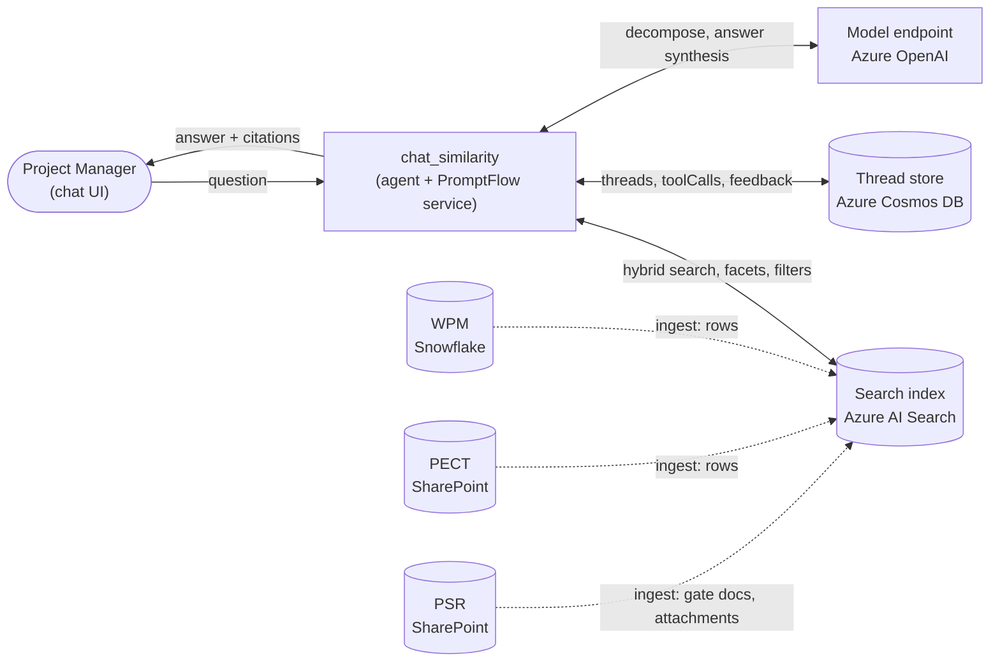

**Next level:** [Containers (C4 L2)](#2-containers-c4-l2)

---

## 2. Containers (C4 L2)

The deployable pieces inside the system, each labeled with its technology.

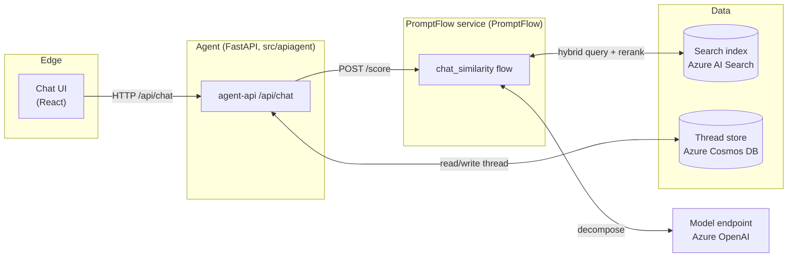

| Container | Technology | Responsibility | Deep-dive |
|---|---|---|---|
| Chat UI | React | Renders the conversation and citation links. | — |
| agent-api | FastAPI | Holds thread history, rewrites the message into a standalone query, decides whether to call a tool, renders the final answer. | — |
| chat_similarity flow | PromptFlow | Decomposes the question into intents, retrieves candidates, ranks them, returns the answering rules and evidence. | [→ Inside the PromptFlow service](#3-inside-the-promptflow-service-c4-l3) |
| Search index | Azure AI Search | Stores document chunks and per-project record rows; serves hybrid search, facets, filters. | [→ Data model](#4-data-model--the-search-index) |
| Thread store | Azure Cosmos DB | Persists each message, the toolCalls, and user feedback. | — |
| Model endpoint | Azure OpenAI | Decomposition, answer synthesis, groundedness check. | — |

**Next level:** [Inside the PromptFlow service](#3-inside-the-promptflow-service-c4-l3)

---

## 3. Inside the PromptFlow service (C4 L3)

**Parent:** [Containers — chat_similarity flow](#2-containers-c4-l2)

The flow decomposes one question into typed intents, runs candidate discovery per intent, and returns the answering rules together with the ranked evidence. It does not write the answer. The orchestrator that called the flow does that, from this payload, in a single model call (see ADR 0008).

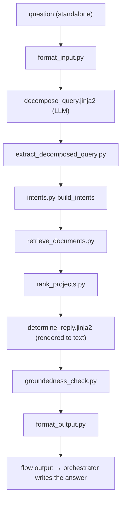

| Component | What it does | Deep-dive |
|---|---|---|
| format_input.py | Injects the live field vocabulary and coverage years into the prompt inputs. | [→ Section 3.1](#31-format_inputpy) |
| decompose_query.jinja2 | LLM prompt: turns the question into a JSON of typed intents. | [→ Section 3.2](#32-decompose_queryjinja2) |
| extract_decomposed_query.py | Parses the decomposer JSON; warns and substitutes a safe default on failure. | [→ Section 3.3](#33-extract_decomposed_querypy) |
| intents.py | Normalizes each intent to a fixed schema (scope, topics, filters, order_by). | [→ Section 3.4](#34-intentspy) |
| retrieve_documents.py | Per-intent loop: find candidates, profile them, fetch their evidence. | [→ Section 3.5](#35-retrieve_documentspy) |
| rank_projects.py | Scores candidates, packs evidence into the token budget, runs the elicit gate. | [→ Section 3.6](#36-rank_projectspy) |
| determine_reply.jinja2 | Renders the answering rules and the ranked evidence to text for the orchestrator to answer from. | [→ Section 3.7](#37-determine_replyjinja2) |
| groundedness_check.py | Verifies the answer against the evidence; replaces it on failure. | [→ Section 3.8](#38-groundedness_checkpy) |
| format_output.py | Emits the rendered payload, citations, and project metadata. | [→ Section 3.9](#39-format_outputpy) |

---

### 3.1 format_input.py

**Parent:** [PromptFlow service](#3-inside-the-promptflow-service-c4-l3)

Injects the live field vocabulary (real `project_solution` values, portfolio names, capability names) and the corpus coverage years into the DAG inputs so the decomposer never guesses a value that does not exist. Linear: one input in, one enriched input out. No sub-components.

---

### 3.2 decompose_query.jinja2

**Parent:** [PromptFlow service](#3-inside-the-promptflow-service-c4-l3)

An LLM prompt that turns the user's question into a JSON array of typed intents. Each intent carries a scope (`named` / `open` / `similar`), topics, structural filters, search fields, and an optional sort. It is a prompt template, not executable code — there is no internal control flow to diagram.

---

### 3.3 extract_decomposed_query.py

**Parent:** [PromptFlow service](#3-inside-the-promptflow-service-c4-l3)

Parses the JSON the decomposer LLM produced. On a malformed result it logs `INTENT_FALLBACK` and substitutes a safe open/general intent so the failure is visible in telemetry instead of looking like a recall gap. Linear.

---

### 3.4 intents.py

**Parent:** [PromptFlow service](#3-inside-the-promptflow-service-c4-l3)

Normalizes each raw intent dict into the fixed schema the retrieval layer expects: `scope`, `topics` (one of 8 values), `filters`, `search_fields`, `order_by`, `explicit_gates`. Linear.

---

### 3.5 retrieve_documents.py

**Parent:** [PromptFlow service](#3-inside-the-promptflow-service-c4-l3)

The per-intent orchestrator. For each intent it runs three steps in sequence: `find_projects` (candidate IDs), `profile_projects` (per-project state and metadata), and `fetch_evidence` (chunks and structured fields). All three sub-steps have enough internal structure to warrant their own diagrams.

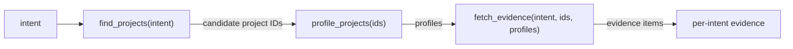

| Sub-step | What it produces | Deep-dive |
|---|---|---|
| find_projects | Candidate project IDs for the intent | [→ Section 3.5.1](#351-find_projects) |
| profile_projects | State, gates present, and metadata per project | [→ Section 3.5.2](#352-profile_projects) |
| fetch_evidence | Chunks and structured-field items per project | [→ Section 3.5.3](#353-fetch_evidence) |

---

#### 3.5.1 find_projects

**Parent:** [retrieve_documents.py](#35-retrieve_documentspy)

Decides which projects are candidates for an intent. Runs four retrieval lanes and returns their union, ordered, capped at `top_k`.

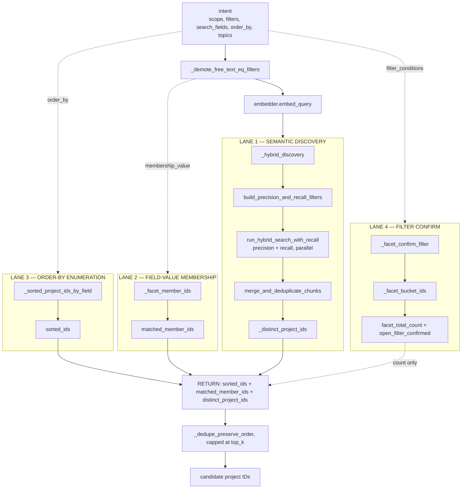

| Lane | Answers | Deep-dive |
|---|---|---|
| Lane 1 | Which projects' documents read like the query | [→ Lane 1 two-stage search](#3511-lane-1--two-stage-search) |
| Lane 2 | Which projects' structured field holds a named value | [→ Lane 2](#3512-lane-2--field-value-membership) |
| Lane 3 | The true top/bottom projects by a numeric field | [→ Lane 3](#3513-lane-3--order-by-enumeration) |
| Lane 4 | How many projects match a structural filter | [→ Lane 4](#3514-lane-4--filter-confirm) |

---

##### 3.5.1.1 Lane 1 — two-stage search

**Parent:** [find_projects](#351-find_projects)

Lane 1 runs two sub-queries in parallel and merges them. The split keeps sparse-tag filters from dropping untagged-but-relevant projects.

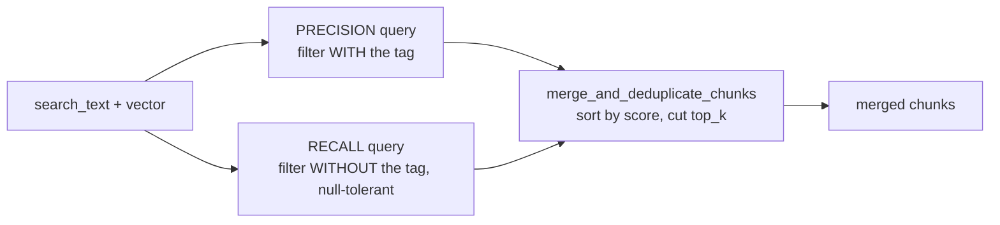

The precision lane applies the tag strictly. The recall lane drops the tag so a project without the tag can still surface on relevance. The merge orders by score and deduplicates.

---

##### 3.5.1.2 Lane 2 — field-value membership

**Parent:** [find_projects](#351-find_projects)

`_facet_member_ids` faceting on `project_id` over the `search_fields` values. When a question names a field value (a vendor, a portfolio, a capability), this lane returns every project whose structured field contains it, bypassing semantic scoring entirely. Projects found here are placed in the candidate pool even if their document text would never rank them.

---

##### 3.5.1.3 Lane 3 — order-by enumeration

**Parent:** [find_projects](#351-find_projects)

`_sorted_project_ids_by_field` answers "the actual top N by cost" by faceting the distinct project set first, then reading each project's real field value in small parallel batches, then sorting by value. Semantic score plays no part. A project whose text reads poorly but whose numeric value is the true highest is returned.

---

##### 3.5.1.4 Lane 4 — filter confirm

**Parent:** [find_projects](#351-find_projects)

`_facet_confirm_filter` answers "does anything match this structural filter, and exactly how many" with a single facet query that ignores search text. It stamps `open_filter_confirmed` and `facet_total_count` on the intent so the answering model can state the true total rather than counting visible rows.

---

#### 3.5.2 profile_projects

**Parent:** [retrieve_documents.py](#35-retrieve_documentspy)

Two HTTP queries per project, batched 16 at a time in parallel: one PSR chunk sample plus a `gate_label` facet, and one read of the WPM/PECT record rows. Returns `state`, `gates_present`, and `metadata` per project. The depth is needed because downstream evidence fetching and the answering model both read from this profile.

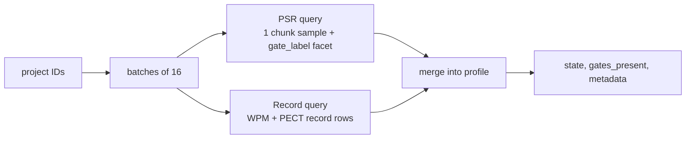

---

#### 3.5.3 fetch_evidence

**Parent:** [retrieve_documents.py](#35-retrieve_documentspy)

Gathers the documents and structured fields for one intent across its candidate projects. Walks every allowed source priority for every project, fetches field evidence from profile metadata (no network) and document evidence from the index (parallel per gate), deduplicates document versions, and emits an `empty_marker` for any project with no evidence so the answering model can say so.

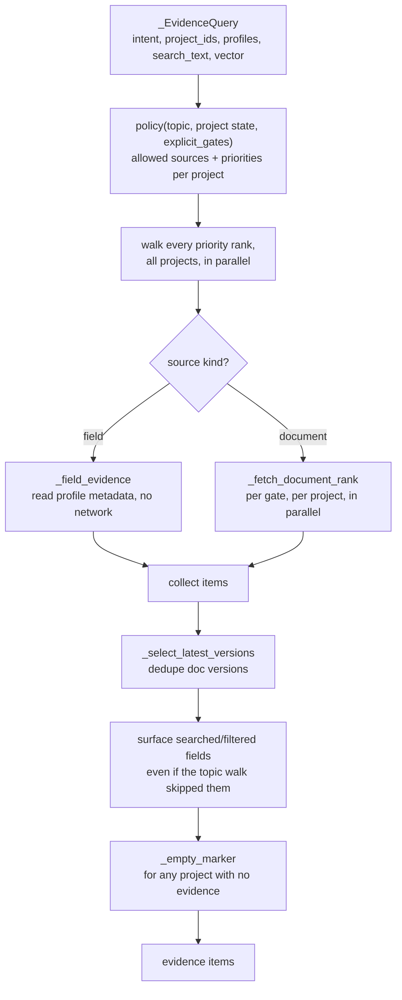

| Sub-step | What it does | Deep-dive |
|---|---|---|
| policy() | Maps topic + project state to allowed sources and priorities | — |
| _field_evidence | Reads structured fields from the profile, no network call | — |
| _fetch_document_rank | Fetches gate documents per project per gate, in parallel | [→ Section 3.5.3.1](#3531-_fetch_document_rank) |
| _select_latest_versions | Drops superseded document versions | — |
| _empty_marker | Emits a "no evidence on file" item for empty projects | — |

---

##### 3.5.3.1 _fetch_document_rank

**Parent:** [fetch_evidence](#353-fetch_evidence)

Fetches the actual document chunks for one gate across a set of projects. Named-scope queries run one project per query so no single named project can crowd out another inside the shared semantic reranker budget. Open-scope queries batch all projects in one query. Each chunk is tagged with the topic and intent it serves so the answering model can attribute it correctly.

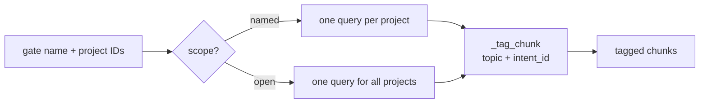

---

### 3.6 rank_projects.py

**Parent:** [PromptFlow service](#3-inside-the-promptflow-service-c4-l3)

Scores candidates, confirms entity matches against stamped metadata, packs evidence into the token budget, and runs the elicit gate. The token-budget fill has enough internal structure to warrant its own diagram.

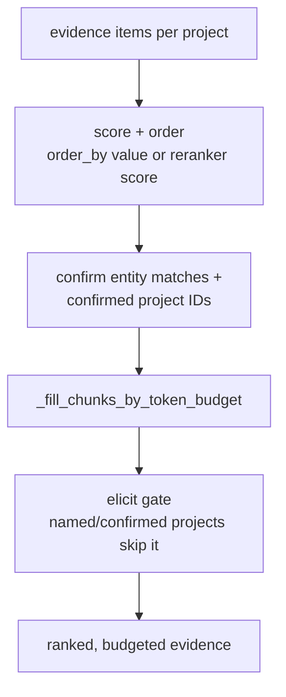

| Sub-step | What it does | Deep-dive |
|---|---|---|
| score + order | Orders projects by order_by value or reranker score | — |
| confirm entity matches | Code-computed check that a named entity is in a project's stamped fields | — |
| _fill_chunks_by_token_budget | Packs chunks into the evidence token budget in three passes | [→ Section 3.6.1](#361-_fill_chunks_by_token_budget) |
| elicit gate | Drops to a clarification prompt when nothing provably matched | — |

---

#### 3.6.1 _fill_chunks_by_token_budget

**Parent:** [rank_projects.py](#36-rank_projectspy)

Packs evidence chunks into the 84K-token budget in three passes, each with a different rule. The order matters: markers first, then topic floors, then greedy fill.

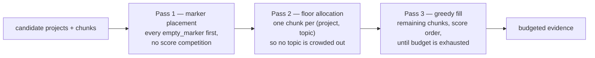

Markers are placed before real content because they carry no reranker score and would always lose. Topic floors ensure a project with evidence on three topics shows all three even when the budget is tight. Greedy fill spends whatever remains on the highest-scoring chunks across all projects.

---

### 3.7 determine_reply.jinja2

**Parent:** [PromptFlow service](#3-inside-the-promptflow-service-c4-l3)

The answering rules and the evidence, rendered to plain text rather than sent to a model. Lays out the ranked evidence, states the authoritative count from `facet_counts`, discloses coverage limits and conflicting fields, labels source systems, and gives the citation format. `render_chat` keeps only the template's system messages: its user message is the question the orchestrator already holds, and its assistant message is an empty seed. The orchestrator reads this payload as a tool result and writes the cited answer. A prompt template — no internal control flow to diagram.

---

### 3.8 groundedness_check.py

**Parent:** [PromptFlow service](#3-inside-the-promptflow-service-c4-l3)

Verifies the answer against the evidence. On a `Not Pass` the answer is replaced with a no-grounding message. Linear.

---

### 3.9 format_output.py

**Parent:** [PromptFlow service](#3-inside-the-promptflow-service-c4-l3)

Emits the final flow output: `answer` (the rendered rules and evidence), `source_references` (citation links for the UI), and `project_metadata` (per-project id, title, score, gate). `followup_questions` is always empty: the flow used to split follow-ups off the model output at a `<<` delimiter, and the orchestrator now generates them instead. Linear.

---

## 4. Data model — the search index

**Parent:** [Containers — Search index](#2-containers-c4-l2)

The index holds two families of rows per project: many chunk rows (the searchable document text) and one record row per source (the structured fields used for profiles, counts, and filters).

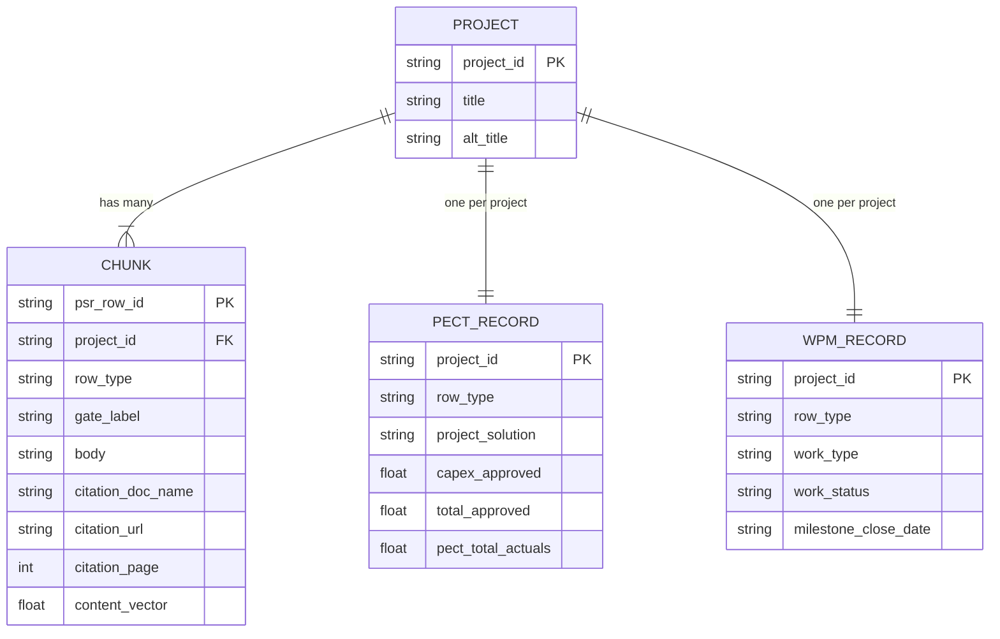

Chunks carry the document body and the stamped metadata the filters read. Record rows carry the per-source structured fields the profile and count/facet paths read.

---

## 5. Cross-cutting concerns

**Stateless PromptFlow service.** The flow never receives conversation history; `chat_history` is always empty. The agent holds the thread and rewrites each message into a standalone query before calling the flow.

**Access control.** Retrieval filters and facets are gated per source system by ACL columns on the index rows. Record rows carry their own ACL; chunk rows are filtered on a separate column.

**Observability.** The flow emits trace lines (`DECOMPOSE_TRACE`, `RANK_RESULT`, `FIND_PROJECTS_FILTERS`) to the service log so any answer can be traced to the intents, candidates, and counts that produced it. The thread store keeps the toolCalls and feedback for reproduction.
